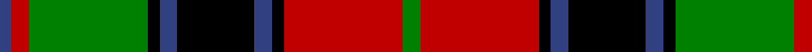

In pattern [BRGKBKBKRG](/patterns/brgkbkbkrg/).

This was sourced from weddslist.  It is a [10 stripes tartan](/stripes/stripes10/).

Original link http://www.weddslist.com/cgi-bin/tartans/pg.pl?source=sts

## Thread count
B/4 R6 G40 K4 B6 K26 B6 K4 R40 G/6

## Palette
Each colour and its ΔE from the base-6 reference it is a variant of.

| Colour | Shade | Base | ΔE (OKLab) |
|---|---|---|---|
| B | <code style="background-color:#304080;">#304080</code> `#304080` | B <code style="background-color:#2A418A;">#2A418A</code> | 0.02 |
| G | <code style="background-color:#008000;">#008000</code> `#008000` | G <code style="background-color:#006100;">#006100</code> | 0.10 |
| K | <code style="background-color:#000000;">#000000</code> `#000000` | K <code style="background-color:#000000;">#000000</code> | 0.00 |
| R | <code style="background-color:#C00000;">#C00000</code> `#C00000` | R <code style="background-color:#CC0000;">#CC0000</code> | 0.03 |

## Nearest tartans

The nearest existing variants by ΔTartan distance.

1. [Duns Pipe Band](/setts/s12/r48k6r6k6r6k30g6k6g40k4g4w6-g006818-k101010-rc80000-wfcfcfc/) — ΔT 0.91
1. [Duns Pipe Band](/setts/s12/r48k6r6k6r6k30g6k6g40k4g4w6-g006400-k000000-rff0000-wf8f8f8/) — ΔT 1.10
1. [Dickie](/setts/s8/g16r4g24k12g6b12r48k8-b00008c-g146400-k000000-rc82800/) — ΔT 1.12
1. [Prince Edward Island #2](/setts/s7/w4k2g32k24r24k2w4-g005020-k101010-rdc0000-we0e0e0/) — ΔT 1.15
1. [Lindsay](/setts/s9/g24ga2g2ga2g2k10r20k2r4-g008000-ga003000-k000000-rc00000/) — ΔT 1.15
1. [Prince Edward Island District Tartan Tartan Number: 1815. Earliest known date: 1960-70 The warmth and glow of the fertile soil, The green field and tree, The yellow and the brown of Autumn, The white of surf or a summer snow, Rust, green, yellow and white, Yes! That's our Island Tartan. See products available Copyright © Blair Urquhart, Comrie, 2015](/setts/s7/w4k2g32k24r24k2w4-g006818-k101010-rc80000-we0e0e0/) — ΔT 1.17
1. [Stevenson Family Tartan Tartan Number: 1558. Earliest known date: 1980 Charles Stevenson of Glasgow emigrated to America in 1861. The Monitoring Committee of the Scottish Tartans Society operated until 1984 when the present system of accreditation was introduced for the 'Register of All Publicly Known Tartans'. The original count has been proportionately increased from the 1980 recording. See products available Copyright © Blair Urquhart, Comrie, 2015](/setts/s9/r4g32y4r8y4r8y4b32y4-b2c2c60-g006818-rc80000-ye8c000/) — ΔT 1.19
1. [Prince Edward Island](/setts/s7/w4k2g32k24r24k2w4-g008000-k000000-rc00000-we0e0e0/) — ΔT 1.20
1. [Rattray of Lude](/setts/s10/k4g32k16r4b32r4b4r32g4w4-b304080-g008000-k000000-rc00000-we0e0e0/) — ΔT 1.21
1. [Manson Family Tartan Tartan Number: 987. Earliest known date: 1983 The official recording of the sett shows the letter G for the dark green stripe. In heraldic terms this means 'Gules' - red. The designer, Hugh Kirkwood Rankine, clearly intended dark green and this is reproduced here. See products available Copyright © Blair Urquhart, Comrie, 2015](/setts/s8/g2r18g6k6g6r2k18w2-g006818-k101010-rc80000-we0e0e0/) — ΔT 1.21

## Neighbour map

Every grey dot is one of 15726 variants placed by the first two principal components of the ΔTartan feature space (44% of its variance). Red is this tartan; blue dots are its nearest — click one to open its page.

<svg viewBox="0 0 640 380" role="img" style="max-width:100%;height:auto;border:1px solid #e0e0e0;border-radius:4px;display:block" xmlns="http://www.w3.org/2000/svg"><image href="/nn/cloud.v1.png" width="640" height="380"/><a href="/setts/s12/r48k6r6k6r6k30g6k6g40k4g4w6-g006818-k101010-rc80000-wfcfcfc/"><circle cx="198.1" cy="144.8" r="4" fill="#3465a4"><title>Duns Pipe Band</title></circle></a><a href="/setts/s12/r48k6r6k6r6k30g6k6g40k4g4w6-g006400-k000000-rff0000-wf8f8f8/"><circle cx="176.0" cy="133.7" r="4" fill="#3465a4"><title>Duns Pipe Band</title></circle></a><a href="/setts/s8/g16r4g24k12g6b12r48k8-b00008c-g146400-k000000-rc82800/"><circle cx="198.6" cy="180.8" r="4" fill="#3465a4"><title>Dickie</title></circle></a><a href="/setts/s7/w4k2g32k24r24k2w4-g005020-k101010-rdc0000-we0e0e0/"><circle cx="188.6" cy="167.5" r="4" fill="#3465a4"><title>Prince Edward Island #2</title></circle></a><a href="/setts/s9/g24ga2g2ga2g2k10r20k2r4-g008000-ga003000-k000000-rc00000/"><circle cx="216.6" cy="156.9" r="4" fill="#3465a4"><title>Lindsay</title></circle></a><a href="/setts/s7/w4k2g32k24r24k2w4-g006818-k101010-rc80000-we0e0e0/"><circle cx="187.4" cy="168.1" r="4" fill="#3465a4"><title>Prince Edward Island District Tartan Tartan Number: 1815. Earliest known date: 1960-70 The warmth and glow of the fertile soil, The green field and tree, The yellow and the brown of Autumn, The white of surf or a summer snow, Rust, green, yellow and white, Yes! That's our Island Tartan. See products available Copyright © Blair Urquhart, Comrie, 2015</title></circle></a><a href="/setts/s9/r4g32y4r8y4r8y4b32y4-b2c2c60-g006818-rc80000-ye8c000/"><circle cx="154.8" cy="175.5" r="4" fill="#3465a4"><title>Stevenson Family Tartan Tartan Number: 1558. Earliest known date: 1980 Charles Stevenson of Glasgow emigrated to America in 1861. The Monitoring Committee of the Scottish Tartans Society operated until 1984 when the present system of accreditation was introduced for the 'Register of All Publicly Known Tartans'. The original count has been proportionately increased from the 1980 recording. See products available Copyright © Blair Urquhart, Comrie, 2015</title></circle></a><a href="/setts/s7/w4k2g32k24r24k2w4-g008000-k000000-rc00000-we0e0e0/"><circle cx="168.8" cy="162.8" r="4" fill="#3465a4"><title>Prince Edward Island</title></circle></a><a href="/setts/s10/k4g32k16r4b32r4b4r32g4w4-b304080-g008000-k000000-rc00000-we0e0e0/"><circle cx="104.1" cy="159.3" r="4" fill="#3465a4"><title>Rattray of Lude</title></circle></a><a href="/setts/s8/g2r18g6k6g6r2k18w2-g006818-k101010-rc80000-we0e0e0/"><circle cx="201.4" cy="192.4" r="4" fill="#3465a4"><title>Manson Family Tartan Tartan Number: 987. Earliest known date: 1983 The official recording of the sett shows the letter G for the dark green stripe. In heraldic terms this means 'Gules' - red. The designer, Hugh Kirkwood Rankine, clearly intended dark green and this is reproduced here. See products available Copyright © Blair Urquhart, Comrie, 2015</title></circle></a><circle cx="153.7" cy="161.3" r="5" fill="#c00000"/></svg>

ID: /setts/s10/g6r40k4b6k26b6k4g40r6b4-b304080-g008000-k000000-rc00000/
