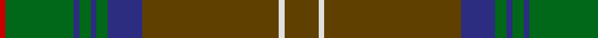

In pattern [GWGBGBGBGR](/patterns/gwgbgbgbgr/).

This was sourced from house-of-tartan.  It is a [10 stripes tartan](/stripes/stripes10/).

Original link http://www.house-of-tartan.scotland.net/house/TartanViewjs.asp?colr=Def&tnam=1458

## Thread count
R/2 G24 DB2 G4 DB2 G4 DB12 T48 LN2 T/12

## Palette
Each colour and its ΔE from the base-6 reference it is a variant of.

| Colour | Shade | Base | ΔE (OKLab) |
|---|---|---|---|
| DB | <code style="background-color:#2C2C80;">#2C2C80</code> `#2C2C80` | B <code style="background-color:#2A418A;">#2A418A</code> | 0.06 |
| G | <code style="background-color:#006818;">#006818</code> `#006818` | G <code style="background-color:#006100;">#006100</code> | 0.02 |
| LN | <code style="background-color:#E0E0E0;">#E0E0E0</code> `#E0E0E0` | W <code style="background-color:#F7F7F7;">#F7F7F7</code> | 0.07 |
| R | <code style="background-color:#C80000;">#C80000</code> `#C80000` | R <code style="background-color:#CC0000;">#CC0000</code> | 0.01 |
| T | <code style="background-color:#604000;">#604000</code> `#604000` | G <code style="background-color:#006100;">#006100</code> | 0.14 |

## Nearest tartans

The nearest existing variants by ΔTartan distance.

1. [Chisholm hunting](/setts/s10/r6w1r24b6g2b1g2b1g12ra1x2~b304080-g008000-r806050-rac00000-we0e0e0/) — ΔT 0.84
1. [Westmeath Irish County Tartan Tartan Number: 2278. Earliest known date: 1996 One of a series of Irish District tartans designed by Polly Wittering of the House of Edgar, with colours reminiscent of the Country with soft warm colours dominating. See products available Copyright © Blair Urquhart, Comrie, 2015](/setts/s14/g11r6b6ga2g3ga2b6r6g36y2ga3y2b5r5x2~b004874-g3c6838-ga28200c-r8c0020-ycc9c10/) — ΔT 1.09
1. [Manitoba Province](/setts/s14/r12g1ga3g20b1g1b3g1b1g20ga3g1r12y3x4~b5c8ca8-g006818-ga285800-r901c38-ybc8c00/) — ΔT 1.15
1. [Sarna (District)](/setts/s13/g8y2ga4b4g3b4ga42g4r3g4ga4b5r3~b780078-g006818-ga604000-rc80000-ye8c000/) — ΔT 1.21
1. [Hickory](/setts/s10/b4g30ba2g2ba14w2ba2w1ba6ga3x2~b141e46-ba4c3428-g786557-ga767e52-wf0e0c8/) — ΔT 1.26
1. [Westmeath (District)](/setts/s14/g11r6b6ba2g3ba2b6r6g36y2ba3y2b5r5x2~b003c64-ba4c3428-g006818-r880000-yd09800/) — ΔT 1.27
1. [Proctor (Name)](/setts/s14/g39k2g2k2g2k3b13k2w4k2b13k3g24y3x2~b2c485c-g2c582c-k101010-wd8d4cc-yc0943c/) — ΔT 1.30
1. [New South Wales Waratah](/setts/s10/g12b2r2b2ba26ga2g3ga3g24r4x2~b1c0070-ba14283c-g5c6428-ga003820-r880000/) — ΔT 1.32
1. [Walker, Gauvin (Personal)](/setts/s12/y1g3b2ga5ba4ga1b14g1b4ga25g2y1x2~b1c1c1c-ba540a59-g5e6d66-ga30644d-ycfa543/) — ΔT 1.32
1. [Inchforth (Personal)](/setts/s9/r4g2r7b30r8b7ga5g1w2x2~b5c5c5c-g003820-ga006818-r888888-wfcfcfc/) — ΔT 1.39

## Neighbour map

Every grey dot is one of 15726 variants placed by the first two principal components of the ΔTartan feature space (44% of its variance). Red is this tartan; blue dots are its nearest — click one to open its page.

<svg viewBox="0 0 640 380" role="img" style="max-width:100%;height:auto;border:1px solid #e0e0e0;border-radius:4px;display:block" xmlns="http://www.w3.org/2000/svg"><image href="/nn/cloud.v1.png" width="640" height="380"/><a href="/setts/s10/r6w1r24b6g2b1g2b1g12ra1x2~b304080-g008000-r806050-rac00000-we0e0e0/"><circle cx="381.6" cy="143.0" r="4" fill="#3465a4"><title>Chisholm hunting</title></circle></a><a href="/setts/s14/g11r6b6ga2g3ga2b6r6g36y2ga3y2b5r5x2~b004874-g3c6838-ga28200c-r8c0020-ycc9c10/"><circle cx="339.4" cy="137.3" r="4" fill="#3465a4"><title>Westmeath Irish County Tartan Tartan Number: 2278. Earliest known date: 1996 One of a series of Irish District tartans designed by Polly Wittering of the House of Edgar, with colours reminiscent of the Country with soft warm colours dominating. See products available Copyright © Blair Urquhart, Comrie, 2015</title></circle></a><a href="/setts/s14/r12g1ga3g20b1g1b3g1b1g20ga3g1r12y3x4~b5c8ca8-g006818-ga285800-r901c38-ybc8c00/"><circle cx="348.9" cy="136.9" r="4" fill="#3465a4"><title>Manitoba Province</title></circle></a><a href="/setts/s13/g8y2ga4b4g3b4ga42g4r3g4ga4b5r3~b780078-g006818-ga604000-rc80000-ye8c000/"><circle cx="387.6" cy="122.0" r="4" fill="#3465a4"><title>Sarna (District)</title></circle></a><a href="/setts/s10/b4g30ba2g2ba14w2ba2w1ba6ga3x2~b141e46-ba4c3428-g786557-ga767e52-wf0e0c8/"><circle cx="364.2" cy="126.1" r="4" fill="#3465a4"><title>Hickory</title></circle></a><a href="/setts/s14/g11r6b6ba2g3ba2b6r6g36y2ba3y2b5r5x2~b003c64-ba4c3428-g006818-r880000-yd09800/"><circle cx="329.5" cy="136.6" r="4" fill="#3465a4"><title>Westmeath (District)</title></circle></a><a href="/setts/s14/g39k2g2k2g2k3b13k2w4k2b13k3g24y3x2~b2c485c-g2c582c-k101010-wd8d4cc-yc0943c/"><circle cx="384.4" cy="139.8" r="4" fill="#3465a4"><title>Proctor (Name)</title></circle></a><a href="/setts/s10/g12b2r2b2ba26ga2g3ga3g24r4x2~b1c0070-ba14283c-g5c6428-ga003820-r880000/"><circle cx="321.8" cy="174.9" r="4" fill="#3465a4"><title>New South Wales Waratah</title></circle></a><a href="/setts/s12/y1g3b2ga5ba4ga1b14g1b4ga25g2y1x2~b1c1c1c-ba540a59-g5e6d66-ga30644d-ycfa543/"><circle cx="340.4" cy="129.7" r="4" fill="#3465a4"><title>Walker, Gauvin (Personal)</title></circle></a><a href="/setts/s9/r4g2r7b30r8b7ga5g1w2x2~b5c5c5c-g003820-ga006818-r888888-wfcfcfc/"><circle cx="408.0" cy="150.7" r="4" fill="#3465a4"><title>Inchforth (Personal)</title></circle></a><circle cx="388.9" cy="149.6" r="5" fill="#c00000"/></svg>

ID: /setts/s10/g6w1g24b6ga2b1ga2b1ga12r1x2~b2c2c80-g604000-ga006818-rc80000-we0e0e0/
