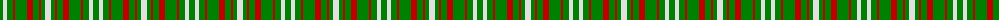

In pattern [GWGRGRGRGW](/patterns/gwgrgrgrgw/).

This was sourced from weddslist.  It is a [10 stripes tartan](/stripes/stripes10/).

Original link http://www.weddslist.com/cgi-bin/tartans/pg.pl?source=sts

## Thread count
G/6 LN4 G6 R2 G12 R6 G6 R2 G4 LN/6

## Palette
Each colour and its ΔE from the base-6 reference it is a variant of.

| Colour | Shade | Base | ΔE (OKLab) |
|---|---|---|---|
| G | <code style="background-color:#008000;">#008000</code> `#008000` | G <code style="background-color:#006400;">#006400</code> | 0.09 |
| LN | <code style="background-color:#E0E0E0;">#E0E0E0</code> `#E0E0E0` | W <code style="background-color:#F4F4F0;">#F4F4F0</code> | 0.06 |
| R | <code style="background-color:#C00000;">#C00000</code> `#C00000` | R <code style="background-color:#C80000;">#C80000</code> | 0.02 |

## Nearest tartans

The nearest existing variants by ΔTartan distance.

1. [Dundee, Green (Fashion)](/setts/s10/g12y8g12r4g24r12g12r4g8y12-g006818-r880000-yb8b8b8/) — ΔT 1.10
1. [Unnamed 7](/setts/s9/g4r6g8w2g2y2g8r6g4-g008000-rc00000-we0e0e0-yf0c000/) — ΔT 1.33
1. [Dundee Green](/setts/s10/g12y8g12r4g24r12g12r4g12y8-g006818-r880000-yb8b8b8/) — ΔT 1.35
1. [Wilson's, No 169](/setts/s9/g10r18g20w4g4y4g20r18g10-g008000-rc00000-we0e0e0-yf0c000/) — ΔT 1.42
1. [Unidentified 24](/setts/s7/y4r12g28r12g28r12y4-g008000-rc00000-yf0c000/) — ΔT 1.72
1. [Unidentified #33](/setts/s9/g4r6g8w2g2y2g8r6g4-g005020-rdc0000-we0e0e0-ye8c000/) — ΔT 1.88
1. [Heritage (Commemorative)](/setts/s7/g40w4g18w4y10w14g20-g006818-we0e0e0-ye8c000/) — ΔT 1.92
1. [Twisted Kilt Society](/setts/s10/g56y24g8y16g8y24g48y8ya8y16-g003c14-ya0a0a0-yae0a126/) — ΔT 1.95
1. [Princess Marina](/setts/s12/r6g36g8r6g8r10g8r10g8r10g4w4-g008000-rc00000-we0e0e0/) — ΔT 1.96
1. [Meath County Crest (Fashion)](/setts/s6/y21g28b24g72w16g20-b2c2c80-g006818-we0e0e0-ybc8c00/) — ΔT 1.97

## Neighbour map

Every grey dot is one of 15726 variants placed by the first two principal components of the ΔTartan feature space (44% of its variance). Red is this tartan; blue dots are its nearest — click one to open its page.

<svg viewBox="0 0 640 380" role="img" style="max-width:100%;height:auto;border:1px solid #e0e0e0;border-radius:4px;display:block" xmlns="http://www.w3.org/2000/svg"><image href="/nn/cloud.v1.png" width="640" height="380"/><a href="/setts/s10/g12y8g12r4g24r12g12r4g8y12-g006818-r880000-yb8b8b8/"><circle cx="304.5" cy="266.4" r="4" fill="#3465a4"><title>Dundee, Green (Fashion)</title></circle></a><a href="/setts/s9/g4r6g8w2g2y2g8r6g4-g008000-rc00000-we0e0e0-yf0c000/"><circle cx="268.3" cy="262.8" r="4" fill="#3465a4"><title>Unnamed 7</title></circle></a><a href="/setts/s10/g12y8g12r4g24r12g12r4g12y8-g006818-r880000-yb8b8b8/"><circle cx="336.6" cy="271.6" r="4" fill="#3465a4"><title>Dundee Green</title></circle></a><a href="/setts/s9/g10r18g20w4g4y4g20r18g10-g008000-rc00000-we0e0e0-yf0c000/"><circle cx="276.6" cy="247.1" r="4" fill="#3465a4"><title>Wilson's, No 169</title></circle></a><a href="/setts/s7/y4r12g28r12g28r12y4-g008000-rc00000-yf0c000/"><circle cx="309.3" cy="250.2" r="4" fill="#3465a4"><title>Unidentified 24</title></circle></a><a href="/setts/s9/g4r6g8w2g2y2g8r6g4-g005020-rdc0000-we0e0e0-ye8c000/"><circle cx="261.3" cy="258.0" r="4" fill="#3465a4"><title>Unidentified #33</title></circle></a><a href="/setts/s7/g40w4g18w4y10w14g20-g006818-we0e0e0-ye8c000/"><circle cx="380.7" cy="230.0" r="4" fill="#3465a4"><title>Heritage (Commemorative)</title></circle></a><a href="/setts/s10/g56y24g8y16g8y24g48y8ya8y16-g003c14-ya0a0a0-yae0a126/"><circle cx="295.5" cy="224.9" r="4" fill="#3465a4"><title>Twisted Kilt Society</title></circle></a><a href="/setts/s12/r6g36g8r6g8r10g8r10g8r10g4w4-g008000-rc00000-we0e0e0/"><circle cx="359.2" cy="206.2" r="4" fill="#3465a4"><title>Princess Marina</title></circle></a><a href="/setts/s6/y21g28b24g72w16g20-b2c2c80-g006818-we0e0e0-ybc8c00/"><circle cx="307.5" cy="268.3" r="4" fill="#3465a4"><title>Meath County Crest (Fashion)</title></circle></a><circle cx="281.3" cy="253.1" r="5" fill="#c00000"/></svg>

ID: /setts/s10/g6w4g6r2g12r6g6r2g4w6-g008000-rc00000-we0e0e0/
