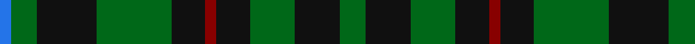

In pattern [BGKGKRKGKG](/patterns/bgkgkrkgkg/).

This was sourced from register-of-tartans.  It is a [10 stripes tartan](/stripes/stripes10/).

Original link https://www.tartanregister.gov.uk/tartanDetails.aspx?ref=1751

## Register references

External register numbers recorded for this tartan.

- Scottish Register of Tartans: [1751](https://www.tartanregister.gov.uk/tartanDetails.aspx?ref=1751)
- Scottish Tartans Authority (ITI): 2646
- Scottish Tartans World Register: 2646

## Thread count
B/6 G14 K32 G40 K18 DR6 K18 G24 K24 G/14

## Palette
Each colour and its ΔE from the base-6 reference it is a variant of.

| Colour | Shade | Base | ΔE (OKLab) |
|---|---|---|---|
| B | <code style="background-color:#2474E8;">#2474E8</code> `#2474E8` | B <code style="background-color:#2A418A;">#2A418A</code> | 0.19 |
| DG | <code style="background-color:#003820;">#003820</code> `#003820` | G <code style="background-color:#006100;">#006100</code> | 0.15 |
| DR | <code style="background-color:#880000;">#880000</code> `#880000` | R <code style="background-color:#CC0000;">#CC0000</code> | 0.15 |
| G | <code style="background-color:#006818;">#006818</code> `#006818` | G <code style="background-color:#006100;">#006100</code> | 0.02 |
| K | <code style="background-color:#101010;">#101010</code> `#101010` | K <code style="background-color:#000000;">#000000</code> | 0.17 |
| O | <code style="background-color:#E86000;">#E86000</code> `#E86000` | R <code style="background-color:#CC0000;">#CC0000</code> | 0.14 |

## Nearest tartans

The nearest existing variants by ΔTartan distance.

1. [Strath Hallidale (Sutherland)](/setts/s14/g13r2g19k15g5k15g5k15g5k15g19r2g13w4~g006818-k101010-rc80000-wa8ace8~x2/) — ΔT 1.13
1. [Strath Hallidale (Fashion)](/setts/s8/g5k15g5k15g19r2g13w4~g006818-k101010-rc80000-wa8ace8~x2/) — ΔT 1.15
1. [Holman (Personal)](/setts/s6/b3g7k16g20k9r3~b2474e8-g006818-k101010-r880000~x2/) — ΔT 1.27
1. [Wilson's No.167](/setts/s10/k20b2k6g16ba4k9ba4g16k6b2~b5c8ca8-ba440044-g006818-k101010~x2/) — ΔT 1.31
1. [Salvation Army Htg (Corporate)](/setts/s7/b5g8k1y2k1g8b4~b1c1c50-g285800-k101010-ycca800~x4/) — ΔT 1.39
1. [Fitzpatrick Hunting](/setts/s9/g5y1g3y2g8k8b1k8g1~b2c2c80-g006818-k101010-ye8c000~x4/) — ΔT 1.40
1. [Edmonstone (Clan)](/setts/s10/g7r4g14b10g5b10w2b10g5b5~b003c64-g006818-rc8002c-we0e0e0~x2/) — ΔT 1.40
1. [Wilson's No.064 #2](/setts/s12/b12k13g12w2g12k13g12w2g12k13b12k2~b440044-g006818-k101010-wc0c0c0~x2/) — ΔT 1.42
1. [MacAlpine Clan Tartan Tartan Number: 2024. Earliest known date: 1908 'The Clans, Sept and Regiments of the Scottish Highlands' (1908) by Frank Adam, is the first document of the tartan. The history of the Clan MacAlpine is obscure. The Siol Alpin is claimed as the origin of a number of clans, but as D.C. Stewart remarks, "belongs rather to mythology than to history." It is considered to be a branch of the royal Clan Alpin, of the Kings of Dalriada. The tartan is similar to the hunting MacLean, but for the yellow lines. Other tartans connected with Siol Alpin are red. See products available Copyright © Blair Urquhart, Comrie, 2015](/setts/s14/k4y1k4g1k4w1k4g1k1g6k1g6k1g1~g006818-k101010-we0e0e0-ye8c000~x4/) — ΔT 1.50
1. [MacAulay of Lewis](/setts/s8/g6k16r3k16g28k4g12w3~g006818-k101010-rc80000-wf8f8f8~x2/) — ΔT 1.50

## Neighbour map

Every grey dot is one of 15726 variants placed by the first two principal components of the ΔTartan feature space (44% of its variance). Red is this tartan; blue dots are its nearest — click one to open its page.

<svg viewBox="0 0 640 380" role="img" style="max-width:100%;height:auto;border:1px solid #e0e0e0;border-radius:4px;display:block" xmlns="http://www.w3.org/2000/svg"><image href="/nn/cloud.v1.png" width="640" height="380"/><a href="/setts/s14/g13r2g19k15g5k15g5k15g5k15g19r2g13w4~g006818-k101010-rc80000-wa8ace8~x2/"><circle cx="274.0" cy="221.5" r="4" fill="#3465a4"><title>Strath Hallidale (Sutherland)</title></circle></a><a href="/setts/s8/g5k15g5k15g19r2g13w4~g006818-k101010-rc80000-wa8ace8~x2/"><circle cx="276.8" cy="237.2" r="4" fill="#3465a4"><title>Strath Hallidale (Fashion)</title></circle></a><a href="/setts/s6/b3g7k16g20k9r3~b2474e8-g006818-k101010-r880000~x2/"><circle cx="249.4" cy="260.5" r="4" fill="#3465a4"><title>Holman (Personal)</title></circle></a><a href="/setts/s10/k20b2k6g16ba4k9ba4g16k6b2~b5c8ca8-ba440044-g006818-k101010~x2/"><circle cx="265.1" cy="219.5" r="4" fill="#3465a4"><title>Wilson's No.167</title></circle></a><a href="/setts/s7/b5g8k1y2k1g8b4~b1c1c50-g285800-k101010-ycca800~x4/"><circle cx="293.1" cy="248.7" r="4" fill="#3465a4"><title>Salvation Army Htg (Corporate)</title></circle></a><a href="/setts/s9/g5y1g3y2g8k8b1k8g1~b2c2c80-g006818-k101010-ye8c000~x4/"><circle cx="229.2" cy="220.2" r="4" fill="#3465a4"><title>Fitzpatrick Hunting</title></circle></a><a href="/setts/s10/g7r4g14b10g5b10w2b10g5b5~b003c64-g006818-rc8002c-we0e0e0~x2/"><circle cx="254.5" cy="265.4" r="4" fill="#3465a4"><title>Edmonstone (Clan)</title></circle></a><a href="/setts/s12/b12k13g12w2g12k13g12w2g12k13b12k2~b440044-g006818-k101010-wc0c0c0~x2/"><circle cx="165.8" cy="248.4" r="4" fill="#3465a4"><title>Wilson's No.064 #2</title></circle></a><a href="/setts/s14/k4y1k4g1k4w1k4g1k1g6k1g6k1g1~g006818-k101010-we0e0e0-ye8c000~x4/"><circle cx="255.6" cy="214.8" r="4" fill="#3465a4"><title>MacAlpine Clan Tartan Tartan Number: 2024. Earliest known date: 1908 'The Clans, Sept and Regiments of the Scottish Highlands' (1908) by Frank Adam, is the first document of the tartan. The history of the Clan MacAlpine is obscure. The Siol Alpin is claimed as the origin of a number of clans, but as D.C. Stewart remarks, &quot;belongs rather to mythology than to history.&quot; It is considered to be a branch of the royal Clan Alpin, of the Kings of Dalriada. The tartan is similar to the hunting MacLean, but for the yellow lines. Other tartans connected with Siol Alpin are red. See products available Copyright © Blair Urquhart, Comrie, 2015</title></circle></a><a href="/setts/s8/g6k16r3k16g28k4g12w3~g006818-k101010-rc80000-wf8f8f8~x2/"><circle cx="277.3" cy="221.6" r="4" fill="#3465a4"><title>MacAulay of Lewis</title></circle></a><circle cx="242.8" cy="257.9" r="5" fill="#c00000"/></svg>

ID: /setts/s10/g7k12g12k9r3k9g20k16g7b3~b2474e8-g006818-k101010-r880000~x2/
