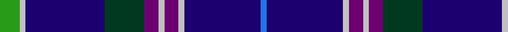

In pattern [BBWBWBGBWG](/stripes/bbwbwbgbwg/).

This was sourced from register-of-tartans.  It is a [10 stripe tartan](/stripes/stripes10/).

Original link https://www.tartanregister.gov.uk/tartanDetails.aspx?ref=1639

## Also known as

This cloth is also recorded under:

- Head of the Lakes District Canada

## Attestations

This cloth appears in 3 source records; the oldest owns this page.

- 01/01/1995 — Head of The Lakes (register-of-tartans, [record](https://www.tartanregister.gov.uk/tartanDetails.aspx?ref=1639))
- Mar. 1995 — Head of The Lakes (District) (tartans-authority, [record](http://www.tartansauthority.com/tartan-ferret/display/2241/))
- undated — Head of the Lakes District Canada Tartan Tartan Number: 2241. Earliest known date: 1996 Designed by Joan Forrester Troniak & Fiona Irwin as a District Tartan to comemorate the 25th anniversary of the Ontario city of Thunder Bay which has adopted it. See products available Copyright © Blair Urquhart, Comrie, 2015 (house-of-tartan, [record](http://www.house-of-tartan.scotland.net/house/TartanViewjs.asp?colr=Def&tnam=2241))

## Register references

External register numbers recorded for this tartan.

- Scottish Register of Tartans: [1639](https://www.tartanregister.gov.uk/tartanDetails.aspx?ref=1639)
- Scottish Tartans Authority (ITI): 2241
- Scottish Tartans World Register: 2241

## Thread count
G/14 N4 DB56 DG28 P10 N4 P10 N4 DB54 B/4

## Palette
Each colour and its ΔE from the base-6 reference it is a variant of.

| Colour | Shade | Base | ΔE (OKLab) |
|---|---|---|---|
| B | <code style="background-color:#2474E8;">#2474E8</code> `#2474E8` | B <code style="background-color:#2A418A;">#2A418A</code> | 0.19 |
| DB | <code style="background-color:#1C0070;">#1C0070</code> `#1C0070` | B <code style="background-color:#2A418A;">#2A418A</code> | 0.14 |
| DG | <code style="background-color:#003820;">#003820</code> `#003820` | G <code style="background-color:#006100;">#006100</code> | 0.15 |
| G | <code style="background-color:#289C18;">#289C18</code> `#289C18` | G <code style="background-color:#006100;">#006100</code> | 0.19 |
| N | <code style="background-color:#C0C0C0;">#C0C0C0</code> `#C0C0C0` | W <code style="background-color:#F7F7F7;">#F7F7F7</code> | 0.17 |
| P | <code style="background-color:#6C0070;">#6C0070</code> `#6C0070` | B <code style="background-color:#2A418A;">#2A418A</code> | 0.16 |

## Nearest tartans

The nearest existing variants by ΔTartan distance.

1. [Meirhaeghe, Van](/setts/s12/db28k6lo2r2k6db12db5db5db5db3r8w3~x2/) — ΔT 0.90
1. [Kansai St Andrews Society](/setts/s10/db30w2r3w2db14lr3dg14db18r2db3~x2/) — ΔT 0.92
1. [Meirhaeghe, Van](/setts/s12/db28k6ly2r2k6db12db5db5db5db3r8w3~x2/) — ΔT 0.93
1. [Amarillo District Tartan Tartan Number: 2190. Earliest known date: 1996 Designed for the city of Amarillo in Texas, USA, by Dr. Phil Smith, at West Chester University in Penn. The tartan has been adopted by the city authorities. See products available Copyright © Blair Urquhart, Comrie, 2015](/setts/s11/db18k2t2db9k4g9r4db9t2k2ly1~x4/) — ΔT 1.11
1. [Stewmann (2009) (Personal)](/setts/s9/dg24b4dg3db11dp8db37k3db2lr4~x2/) — ΔT 1.15
1. [Isle of Harris](/setts/s10/db10k1g2k2t3k2g2k1db10w1~x8/) — ΔT 1.22
1. [Tupper, John Charles (Personal)](/setts/s10/r2w2dg8g2dg2db20t8g2db15w2~x2/) — ΔT 1.26
1. [St. Andrews University (Corporate)](/setts/s10/db6ly3k2ly5db30g2k4g2db6db4~x2/) — ΔT 1.26
1. [Goodwin, Robert Richard (Personal)](/setts/s12/k5lb2b10lb2k5db15k2db15k5db10lb1ly2~x2/) — ΔT 1.31
1. [Cian (Carroll), Clan](/setts/s11/db16k1t1db10k4o8dp4db7t1k1lo2~x2/) — ΔT 1.33

## Neighbour map

Every grey dot is one of 14299 variants placed by the first two principal components of the ΔTartan feature space (44% of its variance). Red is this tartan; blue dots are its nearest — click one to open its page.

<svg viewBox="0 0 640 380" role="img" style="max-width:100%;height:auto;border:1px solid #e0e0e0;border-radius:4px;display:block" xmlns="http://www.w3.org/2000/svg"><image href="/nn/cloud.v1.png" width="640" height="380"/><a href="/setts/s12/db28k6lo2r2k6db12db5db5db5db3r8w3~x2/"><circle cx="251.8" cy="137.5" r="4" fill="#3465a4"><title>Meirhaeghe, Van</title></circle></a><a href="/setts/s10/db30w2r3w2db14lr3dg14db18r2db3~x2/"><circle cx="282.6" cy="148.6" r="4" fill="#3465a4"><title>Kansai St Andrews Society</title></circle></a><a href="/setts/s12/db28k6ly2r2k6db12db5db5db5db3r8w3~x2/"><circle cx="268.2" cy="136.4" r="4" fill="#3465a4"><title>Meirhaeghe, Van</title></circle></a><a href="/setts/s11/db18k2t2db9k4g9r4db9t2k2ly1~x4/"><circle cx="296.4" cy="150.3" r="4" fill="#3465a4"><title>Amarillo District Tartan Tartan Number: 2190. Earliest known date: 1996 Designed for the city of Amarillo in Texas, USA, by Dr. Phil Smith, at West Chester University in Penn. The tartan has been adopted by the city authorities. See products available Copyright © Blair Urquhart, Comrie, 2015</title></circle></a><a href="/setts/s9/dg24b4dg3db11dp8db37k3db2lr4~x2/"><circle cx="287.9" cy="150.2" r="4" fill="#3465a4"><title>Stewmann (2009) (Personal)</title></circle></a><a href="/setts/s10/db10k1g2k2t3k2g2k1db10w1~x8/"><circle cx="285.8" cy="171.9" r="4" fill="#3465a4"><title>Isle of Harris</title></circle></a><a href="/setts/s10/r2w2dg8g2dg2db20t8g2db15w2~x2/"><circle cx="239.8" cy="152.6" r="4" fill="#3465a4"><title>Tupper, John Charles (Personal)</title></circle></a><a href="/setts/s10/db6ly3k2ly5db30g2k4g2db6db4~x2/"><circle cx="301.0" cy="139.8" r="4" fill="#3465a4"><title>St. Andrews University (Corporate)</title></circle></a><a href="/setts/s12/k5lb2b10lb2k5db15k2db15k5db10lb1ly2~x2/"><circle cx="263.2" cy="168.0" r="4" fill="#3465a4"><title>Goodwin, Robert Richard (Personal)</title></circle></a><a href="/setts/s11/db16k1t1db10k4o8dp4db7t1k1lo2~x2/"><circle cx="318.7" cy="152.3" r="4" fill="#3465a4"><title>Cian (Carroll), Clan</title></circle></a><circle cx="286.6" cy="145.1" r="5" fill="#c00000"/></svg>

ID: /setts/s10/g7lb2db28dg14dp5lb2dp5lb2db27b2~x2/
