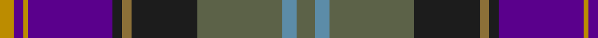

In pattern [GBGBGBBYBY](/patterns/gbgbgbbyby/).

This was sourced from register-of-tartans.  It is a [10 stripes tartan](/stripes/stripes10/).

Original link https://www.tartanregister.gov.uk/tartanDetails.aspx?ref=11331

## Thread count
DY/6 P4 DY2 P36 K4 LT4 K28 N36 B6 N/8

## Palette
Each colour and its ΔE from the base-6 reference it is a variant of.

| Colour | Shade | Base | ΔE (OKLab) |
|---|---|---|---|
| B | <code style="background-color:#5C8CA8;">#5C8CA8</code> `#5C8CA8` | B <code style="background-color:#2C4084;">#2C4084</code> | 0.23 |
| DY | <code style="background-color:#BC8C00;">#BC8C00</code> `#BC8C00` | Y <code style="background-color:#E8C000;">#E8C000</code> | 0.16 |
| K | <code style="background-color:#1C1C1C;">#1C1C1C</code> `#1C1C1C` | B <code style="background-color:#2C4084;">#2C4084</code> | 0.20 |
| LT | <code style="background-color:#8C7038;">#8C7038</code> `#8C7038` | G <code style="background-color:#006400;">#006400</code> | 0.18 |
| N | <code style="background-color:#5C6248;">#5C6248</code> `#5C6248` | G <code style="background-color:#006400;">#006400</code> | 0.12 |
| P | <code style="background-color:#5A008C;">#5A008C</code> `#5A008C` | B <code style="background-color:#2C4084;">#2C4084</code> | 0.12 |

## Nearest tartans

The nearest existing variants by ΔTartan distance.

1. [Accenture](/setts/s10/b6r2ba8g4ra4g42r6b42ba50w6-b780078-ba2c2c80-g006818-r888888-rac80000-we0e0e0/) — ΔT 0.82
1. [Tartan Spirit](/setts/s12/g38r6g38b14ra52k6b14k6ba84k6b14k6-b003c64-ba780078-g006818-k101010-re87878-raa00048/) — ΔT 0.84
1. [ENABLE Scotland](/setts/s13/g6b6ba4bb28g32ba36b4ba6b28bb8y6ya2b4-b5c5c5c-ba440044-bb2c2c80-g408060-ye8c000-yad87c00/) — ΔT 0.94
1. [Lang of Sherbrooke (Personal)](/setts/s11/g20y4b4g4b26g4b4g2k26ba48w4-b780078-ba2c2c80-g00643c-k101010-wfcfcfc-ye8c000/) — ΔT 1.03
1. [ENABLE Scotland](/setts/s13/g6b6ba4bb28g32b36ba4b6ba28bb8y6r2ba4-b440044-ba1c1c1c-bb003c64-g408060-re86000-y9c9c00/) — ΔT 1.06
1. [Beauly Firth and Glens](/setts/s8/b6ba6b6ba54w2bb30k44r6-b5a008c-ba505050-bb067396-k101010-rdc0000-we0e0e0/) — ΔT 1.07
1. [Lang of Sherbrooke (Personal)](/setts/s11/g20y4k4g4k26g4k4g2b26ba48w4-b780078-ba2c2c80-g00643c-k101010-wfcfcfc-ye8c000/) — ΔT 1.08
1. [Creiff Highland Gathering](/setts/s9/k6b32g10b6ba4b4k24bb46w4-b780078-ba9058d8-bb003c64-g006818-k101010-wfcfcfc/) — ΔT 1.09
1. [Livingstone - Australia (Personal)](/setts/s11/g30r50g8k4y2b2y2k4g8b24w2-b2c2c80-g00643c-k101010-r901c38-we0e0e0-ybc8c00/) — ΔT 1.10
1. [United Arrows House Check](/setts/s9/b90r8k40w6ra18ba8ra6ba18k22-b202060-ba4c0000-k1c1714-rdc0000-rab07430-we8ccb8/) — ΔT 1.13

## Neighbour map

Every grey dot is one of 15726 variants placed by the first two principal components of the ΔTartan feature space (44% of its variance). Red is this tartan; blue dots are its nearest — click one to open its page.

<svg viewBox="0 0 640 380" role="img" style="max-width:100%;height:auto;border:1px solid #e0e0e0;border-radius:4px;display:block" xmlns="http://www.w3.org/2000/svg"><image href="/nn/cloud.v1.png" width="640" height="380"/><a href="/setts/s10/b6r2ba8g4ra4g42r6b42ba50w6-b780078-ba2c2c80-g006818-r888888-rac80000-we0e0e0/"><circle cx="198.4" cy="112.0" r="4" fill="#3465a4"><title>Accenture</title></circle></a><a href="/setts/s12/g38r6g38b14ra52k6b14k6ba84k6b14k6-b003c64-ba780078-g006818-k101010-re87878-raa00048/"><circle cx="149.2" cy="130.4" r="4" fill="#3465a4"><title>Tartan Spirit</title></circle></a><a href="/setts/s13/g6b6ba4bb28g32ba36b4ba6b28bb8y6ya2b4-b5c5c5c-ba440044-bb2c2c80-g408060-ye8c000-yad87c00/"><circle cx="147.1" cy="129.6" r="4" fill="#3465a4"><title>ENABLE Scotland</title></circle></a><a href="/setts/s11/g20y4b4g4b26g4b4g2k26ba48w4-b780078-ba2c2c80-g00643c-k101010-wfcfcfc-ye8c000/"><circle cx="169.5" cy="107.9" r="4" fill="#3465a4"><title>Lang of Sherbrooke (Personal)</title></circle></a><a href="/setts/s13/g6b6ba4bb28g32b36ba4b6ba28bb8y6r2ba4-b440044-ba1c1c1c-bb003c64-g408060-re86000-y9c9c00/"><circle cx="153.4" cy="134.6" r="4" fill="#3465a4"><title>ENABLE Scotland</title></circle></a><a href="/setts/s8/b6ba6b6ba54w2bb30k44r6-b5a008c-ba505050-bb067396-k101010-rdc0000-we0e0e0/"><circle cx="228.1" cy="133.0" r="4" fill="#3465a4"><title>Beauly Firth and Glens</title></circle></a><a href="/setts/s11/g20y4k4g4k26g4k4g2b26ba48w4-b780078-ba2c2c80-g00643c-k101010-wfcfcfc-ye8c000/"><circle cx="166.8" cy="108.5" r="4" fill="#3465a4"><title>Lang of Sherbrooke (Personal)</title></circle></a><a href="/setts/s9/k6b32g10b6ba4b4k24bb46w4-b780078-ba9058d8-bb003c64-g006818-k101010-wfcfcfc/"><circle cx="163.0" cy="155.0" r="4" fill="#3465a4"><title>Creiff Highland Gathering</title></circle></a><a href="/setts/s11/g30r50g8k4y2b2y2k4g8b24w2-b2c2c80-g00643c-k101010-r901c38-we0e0e0-ybc8c00/"><circle cx="237.2" cy="105.8" r="4" fill="#3465a4"><title>Livingstone - Australia (Personal)</title></circle></a><a href="/setts/s9/b90r8k40w6ra18ba8ra6ba18k22-b202060-ba4c0000-k1c1714-rdc0000-rab07430-we8ccb8/"><circle cx="219.4" cy="142.2" r="4" fill="#3465a4"><title>United Arrows House Check</title></circle></a><circle cx="182.6" cy="132.6" r="5" fill="#c00000"/></svg>

ID: /setts/s10/g8b6g36ba28ga4ba4bb36y2bb4y6-b5c8ca8-ba1c1c1c-bb5a008c-g5c6248-ga8c7038-ybc8c00/
