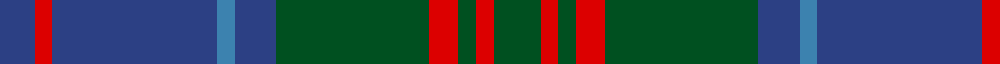

In pattern [BRBBBGRGRG](/patterns/brbbbgrgrg/).

This was sourced from register-of-tartans.  It is a [10 stripes tartan](/stripes/stripes10/).

Original link https://www.tartanregister.gov.uk/tartanDetails.aspx?ref=4011

## Thread count
B/12 R6 B56 Ba6 B14 G52 R10 G6 R6 G/16

## Palette
Each colour and its ΔE from the base-6 reference it is a variant of.

| Colour | Shade | Base | ΔE (OKLab) |
|---|---|---|---|
| B | <code style="background-color:#2C4084;">#2C4084</code> `#2C4084` | B <code style="background-color:#2A418A;">#2A418A</code> | 0.01 |
| Ba | <code style="background-color:#3C82AF;">#3C82AF</code> `#3C82AF` | B <code style="background-color:#2A418A;">#2A418A</code> | 0.19 |
| G | <code style="background-color:#005020;">#005020</code> `#005020` | G <code style="background-color:#006100;">#006100</code> | 0.07 |
| R | <code style="background-color:#DC0000;">#DC0000</code> `#DC0000` | R <code style="background-color:#CC0000;">#CC0000</code> | 0.03 |

## Nearest tartans

The nearest existing variants by ΔTartan distance.

1. [Stuart/Stewart of Appin #2](/setts/s10/g11r4g4r7g41b11ba4b41r4b8~b2c4084-ba3c82af-g005020-rdc0000/) — ΔT 0.24
1. [Stewart of Appin Htg (error)](/setts/s10/g8r3g3r5g26b7ba3b28r3b6~b2c2c80-ba5c8ca8-g006818-rc80000~x2/) — ΔT 0.85
1. [Scottish Monuments (Corporate)](/setts/s9/b3r2b2r3b20ba8k2ba6k3~b14283c-ba5c5c5c-k101010-r888888~x2/) — ΔT 0.89
1. [Gammell Family Tartan Tartan Number: 597. Earliest known date: 1965 Designed (probably by David Thomas and Arthur Mackie of Strathmore Woollen Co) for the Hill family of Angus as a personal tartan. Tommy Gemmell (6.3.05) said "The tartan was designed using the largest Government sett by Mrs Hill's mother - a Mrs Gammell - who was a handweaver." See products available Copyright © Blair Urquhart, Comrie, 2015](/setts/s8/b32ba3b3ba3b3ba10g24r3~b202060-ba441800-g006818-r901c38~x2/) — ΔT 0.92
1. [Antrim, County](/setts/s10/g5b2g18y2b5y2r5b17g2y4~b14283c-g406054-rc04c08-ybc8c00~x2/) — ΔT 0.96
1. [MacHarg, Iain](/setts/s9/g20k2g2k2g2k8b24ba3b3~b2c2c80-ba780078-g006818-k101010~x2/) — ΔT 1.05
1. [Speyside Blue (Fashion)](/setts/s8/b32k3b3k3ba5k8r21k4~b5c5c5c-ba1474b4-k101010-r888888~x2/) — ΔT 1.06
1. [Dama Classic](/setts/s8/g30y3g3y3g12b30k3b5~b2e2e2e-g615e57-k181818-ye2d1a3~x2/) — ΔT 1.06
1. [Shaw](/setts/s10/g24k2b3k2b8r2b8k2b3k2~b2c2c80-g006818-k101010-rc80000~x2/) — ΔT 1.09
1. [Cork Irish County Tartan Tartan Number: 2253. Earliest known date: 1996 One of a series of Irish District tartans designed by Polly Wittering of the House of Edgar, with colours reminiscent of the Country with soft warm colours dominating. See products available Copyright © Blair Urquhart, Comrie, 2015](/setts/s9/g28r12g4b20y2b3y2b3g7~b141c50-g3c6838-r8c0020-yc48800~x2/) — ΔT 1.10

## Neighbour map

Every grey dot is one of 15726 variants placed by the first two principal components of the ΔTartan feature space (44% of its variance). Red is this tartan; blue dots are its nearest — click one to open its page.

<svg viewBox="0 0 640 380" role="img" style="max-width:100%;height:auto;border:1px solid #e0e0e0;border-radius:4px;display:block" xmlns="http://www.w3.org/2000/svg"><image href="/nn/cloud.v1.png" width="640" height="380"/><a href="/setts/s10/g11r4g4r7g41b11ba4b41r4b8~b2c4084-ba3c82af-g005020-rdc0000/"><circle cx="303.1" cy="199.0" r="4" fill="#3465a4"><title>Stuart/Stewart of Appin #2</title></circle></a><a href="/setts/s10/g8r3g3r5g26b7ba3b28r3b6~b2c2c80-ba5c8ca8-g006818-rc80000~x2/"><circle cx="268.7" cy="194.3" r="4" fill="#3465a4"><title>Stewart of Appin Htg (error)</title></circle></a><a href="/setts/s9/b3r2b2r3b20ba8k2ba6k3~b14283c-ba5c5c5c-k101010-r888888~x2/"><circle cx="326.5" cy="211.3" r="4" fill="#3465a4"><title>Scottish Monuments (Corporate)</title></circle></a><a href="/setts/s8/b32ba3b3ba3b3ba10g24r3~b202060-ba441800-g006818-r901c38~x2/"><circle cx="313.0" cy="209.1" r="4" fill="#3465a4"><title>Gammell Family Tartan Tartan Number: 597. Earliest known date: 1965 Designed (probably by David Thomas and Arthur Mackie of Strathmore Woollen Co) for the Hill family of Angus as a personal tartan. Tommy Gemmell (6.3.05) said &quot;The tartan was designed using the largest Government sett by Mrs Hill's mother - a Mrs Gammell - who was a handweaver.&quot; See products available Copyright © Blair Urquhart, Comrie, 2015</title></circle></a><a href="/setts/s10/g5b2g18y2b5y2r5b17g2y4~b14283c-g406054-rc04c08-ybc8c00~x2/"><circle cx="246.9" cy="200.4" r="4" fill="#3465a4"><title>Antrim, County</title></circle></a><a href="/setts/s9/g20k2g2k2g2k8b24ba3b3~b2c2c80-ba780078-g006818-k101010~x2/"><circle cx="270.2" cy="189.1" r="4" fill="#3465a4"><title>MacHarg, Iain</title></circle></a><a href="/setts/s8/b32k3b3k3ba5k8r21k4~b5c5c5c-ba1474b4-k101010-r888888~x2/"><circle cx="264.8" cy="193.0" r="4" fill="#3465a4"><title>Speyside Blue (Fashion)</title></circle></a><a href="/setts/s8/g30y3g3y3g12b30k3b5~b2e2e2e-g615e57-k181818-ye2d1a3~x2/"><circle cx="334.2" cy="207.3" r="4" fill="#3465a4"><title>Dama Classic</title></circle></a><a href="/setts/s10/g24k2b3k2b8r2b8k2b3k2~b2c2c80-g006818-k101010-rc80000~x2/"><circle cx="281.6" cy="179.1" r="4" fill="#3465a4"><title>Shaw</title></circle></a><a href="/setts/s9/g28r12g4b20y2b3y2b3g7~b141c50-g3c6838-r8c0020-yc48800~x2/"><circle cx="301.7" cy="188.0" r="4" fill="#3465a4"><title>Cork Irish County Tartan Tartan Number: 2253. Earliest known date: 1996 One of a series of Irish District tartans designed by Polly Wittering of the House of Edgar, with colours reminiscent of the Country with soft warm colours dominating. See products available Copyright © Blair Urquhart, Comrie, 2015</title></circle></a><circle cx="291.6" cy="204.0" r="5" fill="#c00000"/></svg>

ID: /setts/s10/g8r3g3r5g26b7ba3b28r3b6~b2c4084-ba3c82af-g005020-rdc0000~x2/
