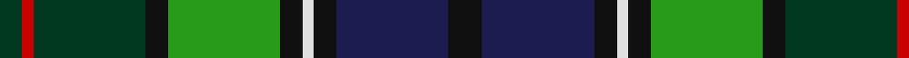

In pattern [GRGKGKWKBK](/patterns/grgkgkwkbk/).

This was sourced from tartans-authority.  It is a [10 stripes tartan](/stripes/stripes10/).

Original link http://www.tartansauthority.com/tartan-ferret/display/4019/

## Thread count
DG/8 R4 DG40 K8 G40 K8 LN4 K8 DB40 K/12

## Palette
Each colour and its ΔE from the base-6 reference it is a variant of.

| Colour | Shade | Base | ΔE (OKLab) |
|---|---|---|---|
| DB | <code style="background-color:#1C1C50;">#1C1C50</code> `#1C1C50` | B <code style="background-color:#2A418A;">#2A418A</code> | 0.14 |
| DG | <code style="background-color:#003820;">#003820</code> `#003820` | G <code style="background-color:#006100;">#006100</code> | 0.15 |
| G | <code style="background-color:#289C18;">#289C18</code> `#289C18` | G <code style="background-color:#006100;">#006100</code> | 0.19 |
| K | <code style="background-color:#101010;">#101010</code> `#101010` | K <code style="background-color:#000000;">#000000</code> | 0.17 |
| LN | <code style="background-color:#E0E0E0;">#E0E0E0</code> `#E0E0E0` | W <code style="background-color:#F7F7F7;">#F7F7F7</code> | 0.07 |
| R | <code style="background-color:#C80000;">#C80000</code> `#C80000` | R <code style="background-color:#CC0000;">#CC0000</code> | 0.01 |

## Nearest tartans

The nearest existing variants by ΔTartan distance.

1. [Rutledge](/setts/s10/k12b40k8w4k8g40k8ga40r4ga4-b2c2c80-g289c18-ga003820-k101010-rc80000-we0e0e0/) — ΔT 0.39
1. [Ithilien Heather (Personal)](/setts/s9/g40r4ga6b24k40r4ba6b8ba6-b003c64-ba5c8ca8-g408060-ga5c6428-k101010-re87878/) — ΔT 0.86
1. [Loch Freuchie (District)](/setts/s10/r6b6k4b36y4k50g40r4g6w6-b003c64-g006818-k101010-rc80000-w98c8e8-yfccc00/) — ΔT 0.90
1. [Trades House](/setts/s9/r8g8b36k40ga48k4g4k4y4-b0c585c-g789484-ga00643c-k101010-rc80000-ye8c000/) — ΔT 0.93
1. [Drennan](/setts/s12/b14w6g6b36y6k30y6g34r12g6r4g14-b1c0070-g006818-k101010-r880000-we0e0e0-ybc8c00/) — ΔT 1.06
1. [Cowan of Inveresk Family Tartan Tartan Number: 1549. Earliest known date: 1979 This is a modern family tartan designed by the representer of the family of Cowan of Inveresk, in the parish of that name in Musselburgh, Mr Robert Cowan of Atlanta, Georgia. Cowans are a Sept of the Colquhouns, variously spelt Macillechomhghain, Comhain, Comhan and Cowen. Cowans not associated with the Inveresk branch of the family may wear the Colquhoun tartan on which this design is based. See products available Copyright © Blair Urquhart, Comrie, 2015](/setts/s8/r8g32w4k30b30k4b4y4-b2c2c80-g006818-k101010-rc80000-we0e0e0-ye8c000/) — ΔT 1.08
1. [Kinloch Anderson Heather (Corporate)](/setts/s12/b8ba8b4ba28g12ga6g12gb4ga8gb4ga30r6-b780078-ba440044-g003820-ga289c18-gb006818-r888888/) — ΔT 1.13
1. [Paisley District Tartan Tartan Number: 640. Earliest known date: 1952 This design won a first prize at Kelso Highland Show for designer, Allan Drennan, in 1952. He regarded it as having 'a motif of the Clan Donald'. It is also worn by members of the Paisley & Allied Families Society and the '100 Pipers' pipe band (in ancient colours). See products available Copyright © Blair Urquhart, Comrie, 2015](/setts/s12/b14w4g6b36y4k30y4g34r10g6r4g14-b2c2c80-g006818-k101010-rc80000-we0e0e0-ye8c000/) — ΔT 1.13
1. [Tindal](/setts/s11/r6k4g36k36b6k6b6k6b36y4w6-b202060-g006818-k101010-rc80000-we0e0e0-ye8c000/) — ΔT 1.13
1. [MacCraig (Clan)](/setts/s9/b16w8g56r8k56g8ba56r8g16-b4c0000-ba1c0070-g006818-k101010-r880000-wa8ace8/) — ΔT 1.15

## Neighbour map

Every grey dot is one of 15726 variants placed by the first two principal components of the ΔTartan feature space (44% of its variance). Red is this tartan; blue dots are its nearest — click one to open its page.

<svg viewBox="0 0 640 380" role="img" style="max-width:100%;height:auto;border:1px solid #e0e0e0;border-radius:4px;display:block" xmlns="http://www.w3.org/2000/svg"><image href="/nn/cloud.v1.png" width="640" height="380"/><a href="/setts/s10/k12b40k8w4k8g40k8ga40r4ga4-b2c2c80-g289c18-ga003820-k101010-rc80000-we0e0e0/"><circle cx="86.8" cy="154.3" r="4" fill="#3465a4"><title>Rutledge</title></circle></a><a href="/setts/s9/g40r4ga6b24k40r4ba6b8ba6-b003c64-ba5c8ca8-g408060-ga5c6428-k101010-re87878/"><circle cx="114.6" cy="159.6" r="4" fill="#3465a4"><title>Ithilien Heather (Personal)</title></circle></a><a href="/setts/s10/r6b6k4b36y4k50g40r4g6w6-b003c64-g006818-k101010-rc80000-w98c8e8-yfccc00/"><circle cx="149.7" cy="139.1" r="4" fill="#3465a4"><title>Loch Freuchie (District)</title></circle></a><a href="/setts/s9/r8g8b36k40ga48k4g4k4y4-b0c585c-g789484-ga00643c-k101010-rc80000-ye8c000/"><circle cx="148.5" cy="156.1" r="4" fill="#3465a4"><title>Trades House</title></circle></a><a href="/setts/s12/b14w6g6b36y6k30y6g34r12g6r4g14-b1c0070-g006818-k101010-r880000-we0e0e0-ybc8c00/"><circle cx="101.3" cy="157.2" r="4" fill="#3465a4"><title>Drennan</title></circle></a><a href="/setts/s8/r8g32w4k30b30k4b4y4-b2c2c80-g006818-k101010-rc80000-we0e0e0-ye8c000/"><circle cx="99.5" cy="171.1" r="4" fill="#3465a4"><title>Cowan of Inveresk Family Tartan Tartan Number: 1549. Earliest known date: 1979 This is a modern family tartan designed by the representer of the family of Cowan of Inveresk, in the parish of that name in Musselburgh, Mr Robert Cowan of Atlanta, Georgia. Cowans are a Sept of the Colquhouns, variously spelt Macillechomhghain, Comhain, Comhan and Cowen. Cowans not associated with the Inveresk branch of the family may wear the Colquhoun tartan on which this design is based. See products available Copyright © Blair Urquhart, Comrie, 2015</title></circle></a><a href="/setts/s12/b8ba8b4ba28g12ga6g12gb4ga8gb4ga30r6-b780078-ba440044-g003820-ga289c18-gb006818-r888888/"><circle cx="92.6" cy="161.8" r="4" fill="#3465a4"><title>Kinloch Anderson Heather (Corporate)</title></circle></a><a href="/setts/s12/b14w4g6b36y4k30y4g34r10g6r4g14-b2c2c80-g006818-k101010-rc80000-we0e0e0-ye8c000/"><circle cx="119.6" cy="150.7" r="4" fill="#3465a4"><title>Paisley District Tartan Tartan Number: 640. Earliest known date: 1952 This design won a first prize at Kelso Highland Show for designer, Allan Drennan, in 1952. He regarded it as having 'a motif of the Clan Donald'. It is also worn by members of the Paisley &amp; Allied Families Society and the '100 Pipers' pipe band (in ancient colours). See products available Copyright © Blair Urquhart, Comrie, 2015</title></circle></a><a href="/setts/s11/r6k4g36k36b6k6b6k6b36y4w6-b202060-g006818-k101010-rc80000-we0e0e0-ye8c000/"><circle cx="135.1" cy="150.3" r="4" fill="#3465a4"><title>Tindal</title></circle></a><a href="/setts/s9/b16w8g56r8k56g8ba56r8g16-b4c0000-ba1c0070-g006818-k101010-r880000-wa8ace8/"><circle cx="122.0" cy="183.9" r="4" fill="#3465a4"><title>MacCraig (Clan)</title></circle></a><circle cx="94.7" cy="160.3" r="5" fill="#c00000"/></svg>

ID: /setts/s10/k12b40k8w4k8g40k8ga40r4ga8-b1c1c50-g289c18-ga003820-k101010-rc80000-we0e0e0/
