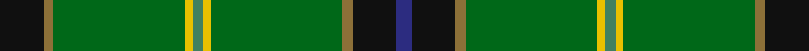

This page is one **sett** — a single exact thread-count. It belongs to the [tartan](/tartans/k17y4gi51ly3g4ly3gi51y4k17db6/)
(the same proportion at any scale), whose colour order is pattern [BKGGYGYGGK](/stripes/bkggygyggk/).

Sourced from register-of-tartans.  It is a [10 stripe tartan](/stripes/stripes10/).

Original link https://www.tartanregister.gov.uk/tartanDetails.aspx?ref=4182

## Register references

External register numbers recorded for this tartan.

- Scottish Register of Tartans: [4182](https://www.tartanregister.gov.uk/tartanDetails.aspx?ref=4182)
- Scottish Tartans Authority (ITI): 6307

## Thread count
K/34 LT8 Gb102 Y6 G8 Y6 Gb102 LT8 K34 DB/12

## Palette

Palette: <strong>Tartan Register</strong>
<table><thead><tr><th>Colour</th><th>Threads</th><th>Shade</th><th>Base</th><th>OKLCh</th></tr></thead><tbody><tr><td>K/</td><td style="text-align:right;font-variant-numeric:tabular-nums">34</td><td><code style="background-color:#101010;">#101010</code> <small style="color:#888">#101010</small></td><td>K <code style="background-color:#000000;">#000000</code></td><td><small style="color:#888">oklch(17.3% 0.000 89.9)</small></td></tr><tr><td>LT</td><td style="text-align:right;font-variant-numeric:tabular-nums">8</td><td><code style="background-color:#8C7038;">#8C7038</code> <small style="color:#888">#8C7038</small></td><td>G <code style="background-color:#006100;">#006100</code></td><td><small style="color:#888">oklch(56.0% 0.082 83.0)</small></td></tr><tr><td>Gb</td><td style="text-align:right;font-variant-numeric:tabular-nums">102</td><td><code style="background-color:#006818;">#006818</code> <small style="color:#888">#006818</small></td><td>G <code style="background-color:#006100;">#006100</code></td><td><small style="color:#888">oklch(45.0% 0.142 145.0)</small></td></tr><tr><td>Y</td><td style="text-align:right;font-variant-numeric:tabular-nums">6</td><td><code style="background-color:#E8C000;">#E8C000</code> <small style="color:#888">#E8C000</small></td><td>Y <code style="background-color:#F2BF00;">#F2BF00</code></td><td><small style="color:#888">oklch(81.9% 0.168 93.7)</small></td></tr><tr><td>G</td><td style="text-align:right;font-variant-numeric:tabular-nums">8</td><td><code style="background-color:#408060;">#408060</code> <small style="color:#888">#408060</small></td><td>G <code style="background-color:#006100;">#006100</code></td><td><small style="color:#888">oklch(54.8% 0.084 160.1)</small></td></tr><tr><td>Y</td><td style="text-align:right;font-variant-numeric:tabular-nums">6</td><td><code style="background-color:#E8C000;">#E8C000</code> <small style="color:#888">#E8C000</small></td><td>Y <code style="background-color:#F2BF00;">#F2BF00</code></td><td><small style="color:#888">oklch(81.9% 0.168 93.7)</small></td></tr><tr><td>Gb</td><td style="text-align:right;font-variant-numeric:tabular-nums">102</td><td><code style="background-color:#006818;">#006818</code> <small style="color:#888">#006818</small></td><td>G <code style="background-color:#006100;">#006100</code></td><td><small style="color:#888">oklch(45.0% 0.142 145.0)</small></td></tr><tr><td>LT</td><td style="text-align:right;font-variant-numeric:tabular-nums">8</td><td><code style="background-color:#8C7038;">#8C7038</code> <small style="color:#888">#8C7038</small></td><td>G <code style="background-color:#006100;">#006100</code></td><td><small style="color:#888">oklch(56.0% 0.082 83.0)</small></td></tr><tr><td>K</td><td style="text-align:right;font-variant-numeric:tabular-nums">34</td><td><code style="background-color:#101010;">#101010</code> <small style="color:#888">#101010</small></td><td>K <code style="background-color:#000000;">#000000</code></td><td><small style="color:#888">oklch(17.3% 0.000 89.9)</small></td></tr><tr><td>DB/</td><td style="text-align:right;font-variant-numeric:tabular-nums">12</td><td><code style="background-color:#2C2C80;">#2C2C80</code> <small style="color:#888">#2C2C80</small></td><td>B <code style="background-color:#2A418A;">#2A418A</code></td><td><small style="color:#888">oklch(35.0% 0.138 276.6)</small></td></tr></tbody></table>

## Nearest tartans

The nearest existing variants by ΔTartan distance, with this tartan at the top so the swatches line up against it.

ΔTartan

Tartan

Sett

—

<a href="/ttd/edit/#slug=k17y4gi51ly3g4ly3gi51y4k17db6~x2">U.S. Army</a> <a class="nn-out" href="/setts/s10/k17y4gi51ly3g4ly3gi51y4k17db6~x2/" title="open its dictionary page">↗</a>

1.02

<a href="/ttd/edit/#slug=g9lo1g2r3g28k16t1g8t1db8r1~x2">New York Caledonian Club Day</a> <a class="nn-out" href="/setts/s11/g9lo1g2r3g28k16t1g8t1db8r1~x2/" title="open its dictionary page">↗</a>

1.19

<a href="/ttd/edit/#slug=w1g12dg1k2b2k1dg16r1dg16g1k1ly1~x2">Walsh</a> <a class="nn-out" href="/setts/s12/w1g12dg1k2b2k1dg16r1dg16g1k1ly1~x2/" title="open its dictionary page">↗</a>

1.19

<a href="/ttd/edit/#slug=db6k17y4gi51ly3g4~x2">U.S. Army (Military)</a> <a class="nn-out" href="/setts/s6/db6k17y4gi51ly3g4~x2/" title="open its dictionary page">↗</a>

1.22

<a href="/ttd/edit/#slug=k3g34b10g5r2k8dy2w3~x2">Lambert Kai (Personal)</a> <a class="nn-out" href="/setts/s8/k3g34b10g5r2k8dy2w3~x2/" title="open its dictionary page">↗</a>

1.25

<a href="/ttd/edit/#slug=g10loi3w2k2g8k22g43lo4~x2">Celtic Pride</a> <a class="nn-out" href="/setts/s8/g10loi3w2k2g8k22g43lo4~x2/" title="open its dictionary page">↗</a>

1.26

<a href="/ttd/edit/#slug=w1db6g4db1g16k1g4k6ly1~x4">Henderson/MacKendrick</a> <a class="nn-out" href="/setts/s9/w1db6g4db1g16k1g4k6ly1~x4/" title="open its dictionary page">↗</a>

1.26

<a href="/ttd/edit/#slug=w1db6g4db1g16k1g4k6ly1~x2">MacKendrick</a> <a class="nn-out" href="/setts/s9/w1db6g4db1g16k1g4k6ly1~x2/" title="open its dictionary page">↗</a>

1.28

<a href="/ttd/edit/#slug=k3g2k3g18r2db2lo1~x4">Selvon-Bruce (Personal)</a> <a class="nn-out" href="/setts/s7/k3g2k3g18r2db2lo1~x4/" title="open its dictionary page">↗</a>

1.30

<a href="/ttd/edit/#slug=dg49k8loi20lo3dg23r6k5t3dg10loi10~x2">State Seal of Maine (Fashion)</a> <a class="nn-out" href="/setts/s10/dg49k8loi20lo3dg23r6k5t3dg10loi10~x2/" title="open its dictionary page">↗</a>

1.34

<a href="/ttd/edit/#slug=r4g40db12lo2db12g30k2g4k2g4lo2g3k3~x2">Bartlett from Winnetka, Illinois</a> <a class="nn-out" href="/setts/s13/r4g40db12lo2db12g30k2g4k2g4lo2g3k3~x2/" title="open its dictionary page">↗</a>

## Neighbour map

Every grey dot is one of 14359 variants placed by the first two principal components of the ΔTartan feature space (44% of its variance). Red is this tartan; blue dots are its nearest — click one to open its page.

<svg viewBox="0 0 640 380" role="img" style="max-width:100%;height:auto;border:1px solid #e0e0e0;border-radius:4px;display:block" xmlns="http://www.w3.org/2000/svg"><image href="/nn/cloud.v1.png" width="640" height="380"/><a href="/setts/s11/g9lo1g2r3g28k16t1g8t1db8r1~x2/"><circle cx="347.3" cy="121.3" r="4" fill="#3465a4"><title>New York Caledonian Club Day</title></circle></a><a href="/setts/s12/w1g12dg1k2b2k1dg16r1dg16g1k1ly1~x2/"><circle cx="323.9" cy="118.0" r="4" fill="#3465a4"><title>Walsh</title></circle></a><a href="/setts/s6/db6k17y4gi51ly3g4~x2/"><circle cx="339.3" cy="159.7" r="4" fill="#3465a4"><title>U.S. Army (Military)</title></circle></a><a href="/setts/s8/k3g34b10g5r2k8dy2w3~x2/"><circle cx="299.9" cy="136.1" r="4" fill="#3465a4"><title>Lambert Kai (Personal)</title></circle></a><a href="/setts/s8/g10loi3w2k2g8k22g43lo4~x2/"><circle cx="382.5" cy="151.5" r="4" fill="#3465a4"><title>Celtic Pride</title></circle></a><a href="/setts/s9/w1db6g4db1g16k1g4k6ly1~x4/"><circle cx="326.6" cy="166.2" r="4" fill="#3465a4"><title>Henderson/MacKendrick</title></circle></a><a href="/setts/s9/w1db6g4db1g16k1g4k6ly1~x2/"><circle cx="326.6" cy="166.2" r="4" fill="#3465a4"><title>MacKendrick</title></circle></a><a href="/setts/s7/k3g2k3g18r2db2lo1~x4/"><circle cx="378.6" cy="155.2" r="4" fill="#3465a4"><title>Selvon-Bruce (Personal)</title></circle></a><a href="/setts/s10/dg49k8loi20lo3dg23r6k5t3dg10loi10~x2/"><circle cx="313.0" cy="147.5" r="4" fill="#3465a4"><title>State Seal of Maine (Fashion)</title></circle></a><a href="/setts/s13/r4g40db12lo2db12g30k2g4k2g4lo2g3k3~x2/"><circle cx="405.3" cy="135.8" r="4" fill="#3465a4"><title>Bartlett from Winnetka, Illinois</title></circle></a><circle cx="353.8" cy="143.9" r="5" fill="#c00000"/></svg>

ID: /setts/s10/k17y4gi51ly3g4ly3gi51y4k17db6~x2/
