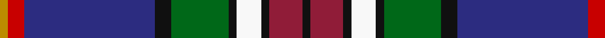

**Bands:** [KRKWKGKBRY](/stripes/krkwkgkbry/) · **Stripes:** [K R K W K G K DB R LO](/stripes/stripes10/) K R K W K G K DB R LO

This was sourced from register-of-tartans.  It is a [10 band tartan](/bands/bands10/).

Original link https://www.tartanregister.gov.uk/tartanDetails.aspx?ref=4171

## Attestations

This cloth appears in 2 source records; the oldest owns this page.

- 10/08/2002 — Twempy (register-of-tartans, [record](https://www.tartanregister.gov.uk/tartanDetails.aspx?ref=4171))
- pre 2005 — Twempy (Fashion) (tartans-authority, [record](http://www.tartansauthority.com/tartan-ferret/display/6739/))

## Register references

External register numbers recorded for this tartan.

- Scottish Register of Tartans: [4171](https://www.tartanregister.gov.uk/tartanDetails.aspx?ref=4171)
- Scottish Tartans Authority (ITI): 6739
- Scottish Tartans World Register: 2916

## Thread count
K/2 DR8 K2 W6 K2 G14 K4 DB32 R4 DY/2

## Palette
Each colour and its ΔE from the base-6 reference it is a variant of.

| Colour | Shade | Base | ΔE (OKLab) |
|---|---|---|---|
| DB | <code style="background-color:#2C2C80;">#2C2C80</code> `#2C2C80` | B <code style="background-color:#2A418A;">#2A418A</code> | 0.06 |
| DR | <code style="background-color:#901C38;">#901C38</code> `#901C38` | R <code style="background-color:#CC0000;">#CC0000</code> | 0.13 |
| DY | <code style="background-color:#BC8C00;">#BC8C00</code> `#BC8C00` | Y <code style="background-color:#F2BF00;">#F2BF00</code> | 0.16 |
| G | <code style="background-color:#006818;">#006818</code> `#006818` | G <code style="background-color:#006100;">#006100</code> | 0.02 |
| K | <code style="background-color:#101010;">#101010</code> `#101010` | K <code style="background-color:#000000;">#000000</code> | 0.17 |
| R | <code style="background-color:#C80000;">#C80000</code> `#C80000` | R <code style="background-color:#CC0000;">#CC0000</code> | 0.01 |
| W | <code style="background-color:#F8F8F8;">#F8F8F8</code> `#F8F8F8` | W <code style="background-color:#F7F7F7;">#F7F7F7</code> | 0.00 |

## Nearest tartans

The nearest existing variants by ΔTartan distance.

1. [Heston (Name)](/setts/s11/lo2k8db48lb9o12m3o9m3o12dg8lo2~x2/) — ΔT 0.84
1. [Loch Lomond & the Trossachs (Fashion](/setts/s10/w2r5k2lo3k4db28r4dg14k4w2~x2/) — ΔT 0.94
1. [Inverclyde, Green (Corporate)](/setts/s11/w3db5b2db9dp10k2dp4k2g10g33w2~x2/) — ΔT 0.96
1. [Unidentified, Lady's kilt](/setts/s8/db39o3k14o3t14ly4w2dr2~x2/) — ΔT 1.06
1. [MacLean (Dress)](/setts/s12/db4r1k3lo1k1lr1k1db8t12r1t2k1~x4/) — ΔT 1.07
1. [Edinburgh](/setts/s9/w8db50k4r8k6r12g17p7k4/) — ΔT 1.07
1. [Carnegie of Skibo (Corporate)](/setts/s11/w3db5t2db9dp10k2dp5k2dg8g29w2~x2/) — ΔT 1.08
1. [Twenty First Century](/setts/s13/g12db3o3w2o3db3g5k8db31t5db8w4r6~x2/) — ΔT 1.09
1. [Bethune](/setts/s12/b2db18ly4k5ly1k1w1k2g8k1r3w1~x4/) — ΔT 1.13
1. [Carnegie of Skibo Corporate Tartan Tartan Number: 8314. Earliest known date: December 2001 Only available from Robert Mathieson, The Kilt Centre, 1 Campbell Lane, Hamilton. ML3 6DB. Scotland. Tel: +44 (0)1698 200 234. e-mail: kiltcentre@btconnect.com Lochcarron swatch. A corporate tartan for use in kilt hire. The name was chosen to imbue the tartan with some relevant provenance - Andrew Carnegie's retirement residence. See products available Copyright © Blair Urquhart, Comrie, 2015](/setts/s11/w3db5lt2db9dp10k2dp5k5dg9g31w2~x2/) — ΔT 1.14

## Neighbour map

Every grey dot is one of 14299 variants placed by the first two principal components of the ΔTartan feature space (44% of its variance). Red is this tartan; blue dots are its nearest — click one to open its page.

<svg viewBox="0 0 640 380" role="img" style="max-width:100%;height:auto;border:1px solid #e0e0e0;border-radius:4px;display:block" xmlns="http://www.w3.org/2000/svg"><image href="/nn/cloud.v1.png" width="640" height="380"/><a href="/setts/s11/lo2k8db48lb9o12m3o9m3o12dg8lo2~x2/"><circle cx="191.7" cy="82.8" r="4" fill="#3465a4"><title>Heston (Name)</title></circle></a><a href="/setts/s10/w2r5k2lo3k4db28r4dg14k4w2~x2/"><circle cx="180.8" cy="120.2" r="4" fill="#3465a4"><title>Loch Lomond &amp; the Trossachs (Fashion</title></circle></a><a href="/setts/s11/w3db5b2db9dp10k2dp4k2g10g33w2~x2/"><circle cx="158.9" cy="97.0" r="4" fill="#3465a4"><title>Inverclyde, Green (Corporate)</title></circle></a><a href="/setts/s8/db39o3k14o3t14ly4w2dr2~x2/"><circle cx="207.9" cy="101.0" r="4" fill="#3465a4"><title>Unidentified, Lady's kilt</title></circle></a><a href="/setts/s12/db4r1k3lo1k1lr1k1db8t12r1t2k1~x4/"><circle cx="143.9" cy="109.4" r="4" fill="#3465a4"><title>MacLean (Dress)</title></circle></a><a href="/setts/s9/w8db50k4r8k6r12g17p7k4/"><circle cx="167.5" cy="125.5" r="4" fill="#3465a4"><title>Edinburgh</title></circle></a><a href="/setts/s11/w3db5t2db9dp10k2dp5k2dg8g29w2~x2/"><circle cx="141.4" cy="111.5" r="4" fill="#3465a4"><title>Carnegie of Skibo (Corporate)</title></circle></a><a href="/setts/s13/g12db3o3w2o3db3g5k8db31t5db8w4r6~x2/"><circle cx="178.5" cy="96.1" r="4" fill="#3465a4"><title>Twenty First Century</title></circle></a><a href="/setts/s12/b2db18ly4k5ly1k1w1k2g8k1r3w1~x4/"><circle cx="124.0" cy="72.4" r="4" fill="#3465a4"><title>Bethune</title></circle></a><a href="/setts/s11/w3db5lt2db9dp10k2dp5k5dg9g31w2~x2/"><circle cx="134.2" cy="108.7" r="4" fill="#3465a4"><title>Carnegie of Skibo Corporate Tartan Tartan Number: 8314. Earliest known date: December 2001 Only available from Robert Mathieson, The Kilt Centre, 1 Campbell Lane, Hamilton. ML3 6DB. Scotland. Tel: +44 (0)1698 200 234. e-mail: kiltcentre@btconnect.com Lochcarron swatch. A corporate tartan for use in kilt hire. The name was chosen to imbue the tartan with some relevant provenance - Andrew Carnegie's retirement residence. See products available Copyright © Blair Urquhart, Comrie, 2015</title></circle></a><circle cx="162.1" cy="95.5" r="5" fill="#c00000"/></svg>

ID: /setts/s10/k1r4k1w3k1g7k2db16r2lo1~x2/
