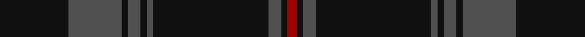

In pattern [KBKBKBKBKR](/stripes/kbkbkbkbkr/).

This was sourced from register-of-tartans.  It is a [10 stripe tartan](/stripes/stripes10/).

Original link https://www.tartanregister.gov.uk/tartanDetails.aspx?ref=11495

## Register references

External register numbers recorded for this tartan.

- Scottish Register of Tartans: [11495](https://www.tartanregister.gov.uk/tartanDetails.aspx?ref=11495)

## Thread count
K/44 N34 K4 N8 K4 N4 K74 N8 K4 DR/6

## Palette
Each colour and the base-6 reference it is a variant of.

| Colour | Shade | Base |
|---|---|---|
| DR | <code style="background-color:#A00000;">#A00000</code> `oklch(44.3% 0.182 29.2)` <small>#A00000</small> | R <code style="background-color:#CC0000;">#CC0000</code> |
| K | <code style="background-color:#101010;">#101010</code> `oklch(17.3% 0.000 89.9)` <small>#101010</small> | K <code style="background-color:#000000;">#000000</code> |
| N | <code style="background-color:#505050;">#505050</code> `oklch(43.1% 0.000 89.9)` <small>#505050</small> | B <code style="background-color:#2A418A;">#2A418A</code> |

## Nearest tartans

The nearest existing variants by ΔTartan distance.

1. [Langhein, Alex (Personal)](/setts/s8/k40dg15k10r2k10lo2k10lo2~x2/) — ΔT 1.50
1. [Nightstalker (Corporate)](/setts/s8/k1g1k8n1k1n2k1n1~x8/) — ΔT 1.55
1. [Spirit of Glyndwr Gold (Fashion)](/setts/s8/k24n18k11n4k11n18k53r4/) — ΔT 1.56
1. [City Building (Glasgow) LLP](/setts/s10/k3n6k8lr2k8n3k5n36k2n3~x2/) — ΔT 1.57
1. [Holden Black (Corporate)](/setts/s7/n13k3n3k3n3k35r3~x2/) — ΔT 1.57
1. [Milne of Corstorphine #1 (Personal)](/setts/s12/k20dg1k2dg1k20ly1dg16r2dg16ly1k30dg1~x2/) — ΔT 1.59
1. [CI (Corporate)](/setts/s9/k100dp8o4k4o4dp8k25db10o4/) — ΔT 1.63
1. [Pride of Scotland, Muted (Fashion)](/setts/s10/do8k2do2k14do2k2ly1do19k27ly2~x2/) — ΔT 1.65
1. [Lochnagar Dark Fashion Tartan Tartan Number: 7327. Earliest known date: 01/01/1999 Inspired by the original works of Fenton Wyness, Dark Lochnagar tartan was designed to encapsulate Lochnagar in all its glory, including the Royal connections. Black & Grey are the primary colours of the tartan and were chosen to reflect 'The steep frowning glories of Dark Lochnagar', a line from Byron's verse. Purple was used for the Royal connections i.e. Queen Victoria's love of the district and Prince Charles book 'The Old Man of Lochnagar'. For the red we used a dye which we have called 'Red Granite' which Lochnagar has an abundance.'/Threadcount and colours aren't 100% original. Generated manually./ See products available Copyright © Blair Urquhart, Comrie, 2015](/setts/s10/k8n1k40n1k16n16dt6n3r3n6~x2/) — ΔT 1.67
1. [Racing Stewart, Stealth (Corporate)](/setts/s10/k86n5k5n3k3n3k3dy11dr11n4~x2/) — ΔT 1.68

## Neighbour map

Every grey dot is one of 14299 variants placed by the first two principal components of the ΔTartan feature space (44% of its variance). Red is this tartan; blue dots are its nearest — click one to open its page.

<svg viewBox="0 0 640 380" role="img" style="max-width:100%;height:auto;border:1px solid #e0e0e0;border-radius:4px;display:block" xmlns="http://www.w3.org/2000/svg"><image href="/nn/cloud.v1.png" width="640" height="380"/><a href="/setts/s8/k40dg15k10r2k10lo2k10lo2~x2/"><circle cx="544.5" cy="212.9" r="4" fill="#3465a4"><title>Langhein, Alex (Personal)</title></circle></a><a href="/setts/s8/k1g1k8n1k1n2k1n1~x8/"><circle cx="459.8" cy="237.8" r="4" fill="#3465a4"><title>Nightstalker (Corporate)</title></circle></a><a href="/setts/s8/k24n18k11n4k11n18k53r4/"><circle cx="461.1" cy="239.3" r="4" fill="#3465a4"><title>Spirit of Glyndwr Gold (Fashion)</title></circle></a><a href="/setts/s10/k3n6k8lr2k8n3k5n36k2n3~x2/"><circle cx="452.9" cy="179.3" r="4" fill="#3465a4"><title>City Building (Glasgow) LLP</title></circle></a><a href="/setts/s7/n13k3n3k3n3k35r3~x2/"><circle cx="451.5" cy="215.0" r="4" fill="#3465a4"><title>Holden Black (Corporate)</title></circle></a><a href="/setts/s12/k20dg1k2dg1k20ly1dg16r2dg16ly1k30dg1~x2/"><circle cx="462.2" cy="168.4" r="4" fill="#3465a4"><title>Milne of Corstorphine #1 (Personal)</title></circle></a><a href="/setts/s9/k100dp8o4k4o4dp8k25db10o4/"><circle cx="587.5" cy="172.9" r="4" fill="#3465a4"><title>CI (Corporate)</title></circle></a><a href="/setts/s10/do8k2do2k14do2k2ly1do19k27ly2~x2/"><circle cx="458.9" cy="202.1" r="4" fill="#3465a4"><title>Pride of Scotland, Muted (Fashion)</title></circle></a><a href="/setts/s10/k8n1k40n1k16n16dt6n3r3n6~x2/"><circle cx="469.4" cy="159.2" r="4" fill="#3465a4"><title>Lochnagar Dark Fashion Tartan Tartan Number: 7327. Earliest known date: 01/01/1999 Inspired by the original works of Fenton Wyness, Dark Lochnagar tartan was designed to encapsulate Lochnagar in all its glory, including the Royal connections. Black &amp; Grey are the primary colours of the tartan and were chosen to reflect 'The steep frowning glories of Dark Lochnagar', a line from Byron's verse. Purple was used for the Royal connections i.e. Queen Victoria's love of the district and Prince Charles book 'The Old Man of Lochnagar'. For the red we used a dye which we have called 'Red Granite' which Lochnagar has an abundance.'/Threadcount and colours aren't 100% original. Generated manually./ See products available Copyright © Blair Urquhart, Comrie, 2015</title></circle></a><a href="/setts/s10/k86n5k5n3k3n3k3dy11dr11n4~x2/"><circle cx="568.0" cy="155.6" r="4" fill="#3465a4"><title>Racing Stewart, Stealth (Corporate)</title></circle></a><circle cx="514.7" cy="206.5" r="5" fill="#c00000"/></svg>

ID: /setts/s10/k22n17k2n4k2n2k37n4k2r3~x2/
