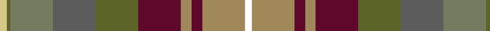

**Bands:** [KYBYBGBGGY](/stripes/kybybgbggy/) · **Stripes:** [K LO DR LO DR Y N Y Y LY](/stripes/stripes10/) K LO DR LO DR Y N Y Y LY

This was sourced from house-of-tartan.  It is a [10 band tartan](/bands/bands10/).

Original link http://www.house-of-tartan.scotland.net/house/TartanViewjs.asp?colr=Def&tnam=7303

## Thread count
LG/4 Ga2 G24 N24 Ga24 DR24 LT6 DR6 LT24 R/4

## Palette
Each colour and its ΔE from the base-6 reference it is a variant of.

| Colour | Shade | Base | ΔE (OKLab) |
|---|---|---|---|
| DR | <code style="background-color:#60082C;">#60082C</code> `#60082C` | B <code style="background-color:#2A418A;">#2A418A</code> | 0.20 |
| G | <code style="background-color:#747C60;">#747C60</code> `#747C60` | G <code style="background-color:#006100;">#006100</code> | 0.18 |
| Ga | <code style="background-color:#5C6428;">#5C6428</code> `#5C6428` | G <code style="background-color:#006100;">#006100</code> | 0.10 |
| LG | <code style="background-color:#D8C888;">#D8C888</code> `#D8C888` | Y <code style="background-color:#F2BF00;">#F2BF00</code> | 0.09 |
| LGa | <code style="background-color:#789484;">#789484</code> `#789484` | G <code style="background-color:#006100;">#006100</code> | 0.24 |
| LT | <code style="background-color:#A08858;">#A08858</code> `#A08858` | Y <code style="background-color:#F2BF00;">#F2BF00</code> | 0.21 |
| N | <code style="background-color:#5C5C5C;">#5C5C5C</code> `#5C5C5C` | B <code style="background-color:#2A418A;">#2A418A</code> | 0.15 |

## Nearest tartans

The nearest existing variants by ΔTartan distance.

1. [Teallach](/setts/s9/ly4r24dy19w3y23y13dy3n13dy3~x2/) — ΔT 1.06
1. [Teallach Family Tartan Tartan Number: 832. Earliest known date: pre 2003 The tartan of the present chairman of the Scottish Tartans Society, Dr Gordon Teall of Teallach. See products available Copyright © Blair Urquhart, Comrie, 2015](/setts/s9/ly4r24dy19w3y23o13dy3n13dy3~x2/) — ΔT 1.09
1. [Auld Scotland](/setts/s10/dr2lo12dr3lo3dr12y12n12y12y1ly2~x2/) — ΔT 1.13
1. [Grewar (Name)](/setts/s10/o2g2o16g2dp17dg10g10g15dg1w2~x2/) — ΔT 1.43
1. [Bracken (WCWM)](/setts/s11/dy30k6dy6r6lo6o14k4o3n14k6n16~x2/) — ΔT 1.50
1. [Meath](/setts/s12/o5db2r14dr9g8t3r3t3r3t3g19w3~x2/) — ΔT 1.74
1. [YPO Dress](/setts/s8/k3y16k2dp12dg12k2o16lb3~x2/) — ΔT 1.77
1. [Kildare County, Crest Range](/setts/s11/o40k5y48k5r20k5t14k10w4r28t10/) — ΔT 1.79
1. [Scotland Forever Antique (Fashion)](/setts/s11/o6k3n19k6n4k3o12lr4o12w2o5~x2/) — ΔT 1.82
1. [Bruce of Kinnaird (Vivienne Westwood Design)](/setts/s10/dy22y22dr2lb6dr2lo2dr16g5dy8lb2~x2/) — ΔT 1.83

## Neighbour map

Every grey dot is one of 14313 variants placed by the first two principal components of the ΔTartan feature space (44% of its variance). Red is this tartan; blue dots are its nearest — click one to open its page.

<svg viewBox="0 0 640 380" role="img" style="max-width:100%;height:auto;border:1px solid #e0e0e0;border-radius:4px;display:block" xmlns="http://www.w3.org/2000/svg"><image href="/nn/cloud.v1.png" width="640" height="380"/><a href="/setts/s9/ly4r24dy19w3y23y13dy3n13dy3~x2/"><circle cx="93.6" cy="181.5" r="4" fill="#3465a4"><title>Teallach</title></circle></a><a href="/setts/s9/ly4r24dy19w3y23o13dy3n13dy3~x2/"><circle cx="93.6" cy="180.7" r="4" fill="#3465a4"><title>Teallach Family Tartan Tartan Number: 832. Earliest known date: pre 2003 The tartan of the present chairman of the Scottish Tartans Society, Dr Gordon Teall of Teallach. See products available Copyright © Blair Urquhart, Comrie, 2015</title></circle></a><a href="/setts/s10/dr2lo12dr3lo3dr12y12n12y12y1ly2~x2/"><circle cx="129.6" cy="188.8" r="4" fill="#3465a4"><title>Auld Scotland</title></circle></a><a href="/setts/s10/o2g2o16g2dp17dg10g10g15dg1w2~x2/"><circle cx="129.9" cy="155.3" r="4" fill="#3465a4"><title>Grewar (Name)</title></circle></a><a href="/setts/s11/dy30k6dy6r6lo6o14k4o3n14k6n16~x2/"><circle cx="149.6" cy="177.4" r="4" fill="#3465a4"><title>Bracken (WCWM)</title></circle></a><a href="/setts/s12/o5db2r14dr9g8t3r3t3r3t3g19w3~x2/"><circle cx="131.0" cy="141.1" r="4" fill="#3465a4"><title>Meath</title></circle></a><a href="/setts/s8/k3y16k2dp12dg12k2o16lb3~x2/"><circle cx="91.4" cy="194.5" r="4" fill="#3465a4"><title>YPO Dress</title></circle></a><a href="/setts/s11/o40k5y48k5r20k5t14k10w4r28t10/"><circle cx="109.4" cy="142.7" r="4" fill="#3465a4"><title>Kildare County, Crest Range</title></circle></a><a href="/setts/s11/o6k3n19k6n4k3o12lr4o12w2o5~x2/"><circle cx="120.8" cy="173.4" r="4" fill="#3465a4"><title>Scotland Forever Antique (Fashion)</title></circle></a><a href="/setts/s10/dy22y22dr2lb6dr2lo2dr16g5dy8lb2~x2/"><circle cx="170.4" cy="159.8" r="4" fill="#3465a4"><title>Bruce of Kinnaird (Vivienne Westwood Design)</title></circle></a><circle cx="79.5" cy="163.7" r="5" fill="#c00000"/></svg>

ID: /setts/s10/k2lo12dr3lo3dr12y12n12y12y1ly2~x2/
