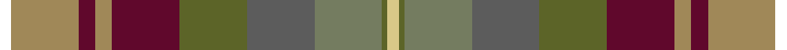

This page is one **sett** — a single exact thread-count. It belongs to the [tartan](/tartans/k2lo12dr3lo3dr12yi12n12y12yi1ly2/)
(the same proportion at any scale), whose colour order is pattern [KYBYBGBGGY](/stripes/kybybgbggy/).

Sourced from house-of-tartan.  It is a [10 stripe tartan](/stripes/stripes10/).

Original link http://www.house-of-tartan.scotland.net/house/TartanViewjs.asp?colr=Def&tnam=7303

## Thread count
R/4 LT24 DR6 LT6 DR24 Ga24 N24 G24 Ga2 LG/4

## Palette

Palette: <strong>Tartan Register</strong> <small style="color:#888">(3 of 7 colours)</small>
<table><thead><tr><th>Colour</th><th>Threads</th><th>Shade</th><th>Base</th><th>OKLCh</th></tr></thead><tbody><tr><td>/</td><td style="text-align:right;font-variant-numeric:tabular-nums">4</td><td><code style="background-color:;"></code> <small style="color:#888"></small></td><td> <code style="background-color:;"></code></td><td><small style="color:#888"></small></td></tr><tr><td>LT</td><td style="text-align:right;font-variant-numeric:tabular-nums">24</td><td><code style="background-color:#A08858;">#A08858</code> <small style="color:#888">#A08858</small></td><td>Y <code style="background-color:#F2BF00;">#F2BF00</code></td><td><small style="color:#888">oklch(63.7% 0.071 84.0)</small></td></tr><tr><td>DR</td><td style="text-align:right;font-variant-numeric:tabular-nums">6</td><td><code style="background-color:#60082C;">#60082C</code> <small style="color:#888">#60082C</small></td><td>B <code style="background-color:#2A418A;">#2A418A</code></td><td><small style="color:#888">oklch(32.1% 0.121 3.9)</small></td></tr><tr><td>LT</td><td style="text-align:right;font-variant-numeric:tabular-nums">6</td><td><code style="background-color:#A08858;">#A08858</code> <small style="color:#888">#A08858</small></td><td>Y <code style="background-color:#F2BF00;">#F2BF00</code></td><td><small style="color:#888">oklch(63.7% 0.071 84.0)</small></td></tr><tr><td>DR</td><td style="text-align:right;font-variant-numeric:tabular-nums">24</td><td><code style="background-color:#60082C;">#60082C</code> <small style="color:#888">#60082C</small></td><td>B <code style="background-color:#2A418A;">#2A418A</code></td><td><small style="color:#888">oklch(32.1% 0.121 3.9)</small></td></tr><tr><td>Ga</td><td style="text-align:right;font-variant-numeric:tabular-nums">24</td><td><code style="background-color:#5C6428;">#5C6428</code> <small style="color:#888">#5C6428</small></td><td>G <code style="background-color:#006100;">#006100</code></td><td><small style="color:#888">oklch(48.3% 0.084 116.0)</small></td></tr><tr><td>N</td><td style="text-align:right;font-variant-numeric:tabular-nums">24</td><td><code style="background-color:#5C5C5C;">#5C5C5C</code> <small style="color:#888">#5C5C5C</small></td><td>B <code style="background-color:#2A418A;">#2A418A</code></td><td><small style="color:#888">oklch(47.5% 0.000 89.9)</small></td></tr><tr><td>G</td><td style="text-align:right;font-variant-numeric:tabular-nums">24</td><td><code style="background-color:#747C60;">#747C60</code> <small style="color:#888">#747C60</small></td><td>G <code style="background-color:#006100;">#006100</code></td><td><small style="color:#888">oklch(57.2% 0.042 120.7)</small></td></tr><tr><td>Ga</td><td style="text-align:right;font-variant-numeric:tabular-nums">2</td><td><code style="background-color:#5C6428;">#5C6428</code> <small style="color:#888">#5C6428</small></td><td>G <code style="background-color:#006100;">#006100</code></td><td><small style="color:#888">oklch(48.3% 0.084 116.0)</small></td></tr><tr><td>LG/</td><td style="text-align:right;font-variant-numeric:tabular-nums">4</td><td><code style="background-color:#D8C888;">#D8C888</code> <small style="color:#888">#D8C888</small></td><td>Y <code style="background-color:#F2BF00;">#F2BF00</code></td><td><small style="color:#888">oklch(83.1% 0.085 95.8)</small></td></tr></tbody></table>

## Nearest tartans

The nearest existing variants by ΔTartan distance, with this tartan at the top so the swatches line up against it.

ΔTartan

Tartan

Sett

—

<a href="/ttd/edit/#slug=k2lo12dr3lo3dr12yi12n12y12yi1ly2~x2">Auld Scotland Weavers Tartan Tartan Number: 7303. Earliest known date: September 2007 A new design from Lochcarron for the 2008 season. See products available Copyright © Blair Urquhart, Comrie, 2015</a> <a class="nn-out" href="/setts/s10/k2lo12dr3lo3dr12yi12n12y12yi1ly2~x2/" title="open its dictionary page">↗</a>

1.06

<a href="/ttd/edit/#slug=ly4r24dy19w3y23yi13dy3n13dy3~x2">Teallach</a> <a class="nn-out" href="/setts/s9/ly4r24dy19w3y23yi13dy3n13dy3~x2/" title="open its dictionary page">↗</a>

1.09

<a href="/ttd/edit/#slug=ly4r24dy19w3y23o13dy3n13dy3~x2">Teallach Family Tartan Tartan Number: 832. Earliest known date: pre 2003 The tartan of the present chairman of the Scottish Tartans Society, Dr Gordon Teall of Teallach. See products available Copyright © Blair Urquhart, Comrie, 2015</a> <a class="nn-out" href="/setts/s9/ly4r24dy19w3y23o13dy3n13dy3~x2/" title="open its dictionary page">↗</a>

1.13

<a href="/ttd/edit/#slug=dr2lo12dr3lo3dr12yi12n12y12yi1ly2~x2">Auld Scotland</a> <a class="nn-out" href="/setts/s10/dr2lo12dr3lo3dr12yi12n12y12yi1ly2~x2/" title="open its dictionary page">↗</a>

1.43

<a href="/ttd/edit/#slug=o2g2o16g2dp17dg10gi10g15dg1w2~x2">Grewar (Name)</a> <a class="nn-out" href="/setts/s10/o2g2o16g2dp17dg10gi10g15dg1w2~x2/" title="open its dictionary page">↗</a>

1.45

<a href="/ttd/edit/#slug=k3dy14o4dy9o14k14y14yi14k1n3~x2">Dutch Friendship (Fashion)</a> <a class="nn-out" href="/setts/s10/k3dy14o4dy9o14k14y14yi14k1n3~x2/" title="open its dictionary page">↗</a>

1.50

<a href="/ttd/edit/#slug=dy30k6dy6r6lo6o14k4o3n14k6n16~x2">Bracken (WCWM)</a> <a class="nn-out" href="/setts/s11/dy30k6dy6r6lo6o14k4o3n14k6n16~x2/" title="open its dictionary page">↗</a>

1.74

<a href="/ttd/edit/#slug=o5db2r14dr9g8t3r3t3r3t3g19w3~x2">Meath</a> <a class="nn-out" href="/setts/s12/o5db2r14dr9g8t3r3t3r3t3g19w3~x2/" title="open its dictionary page">↗</a>

1.77

<a href="/ttd/edit/#slug=k3y16k2dp12dg12k2o16lb3~x2">YPO Dress</a> <a class="nn-out" href="/setts/s8/k3y16k2dp12dg12k2o16lb3~x2/" title="open its dictionary page">↗</a>

1.79

<a href="/ttd/edit/#slug=o40k5y48k5r20k5t14k10w4r28t10">Kildare County, Crest Range</a> <a class="nn-out" href="/setts/s11/o40k5y48k5r20k5t14k10w4r28t10/" title="open its dictionary page">↗</a>

1.81

<a href="/ttd/edit/#slug=oi6k3n19k6n4k3o12lr4o12w2oi5~x2">Scotland Forever Antique (Fashion)</a> <a class="nn-out" href="/setts/s11/oi6k3n19k6n4k3o12lr4o12w2oi5~x2/" title="open its dictionary page">↗</a>

## Neighbour map

Every grey dot is one of 14359 variants placed by the first two principal components of the ΔTartan feature space (44% of its variance). Red is this tartan; blue dots are its nearest — click one to open its page.

<svg viewBox="0 0 640 380" role="img" style="max-width:100%;height:auto;border:1px solid #e0e0e0;border-radius:4px;display:block" xmlns="http://www.w3.org/2000/svg"><image href="/nn/cloud.v1.png" width="640" height="380"/><a href="/setts/s9/ly4r24dy19w3y23yi13dy3n13dy3~x2/"><circle cx="93.5" cy="182.6" r="4" fill="#3465a4"><title>Teallach</title></circle></a><a href="/setts/s9/ly4r24dy19w3y23o13dy3n13dy3~x2/"><circle cx="93.4" cy="181.8" r="4" fill="#3465a4"><title>Teallach Family Tartan Tartan Number: 832. Earliest known date: pre 2003 The tartan of the present chairman of the Scottish Tartans Society, Dr Gordon Teall of Teallach. See products available Copyright © Blair Urquhart, Comrie, 2015</title></circle></a><a href="/setts/s10/dr2lo12dr3lo3dr12yi12n12y12yi1ly2~x2/"><circle cx="129.5" cy="189.8" r="4" fill="#3465a4"><title>Auld Scotland</title></circle></a><a href="/setts/s10/o2g2o16g2dp17dg10gi10g15dg1w2~x2/"><circle cx="129.8" cy="156.2" r="4" fill="#3465a4"><title>Grewar (Name)</title></circle></a><a href="/setts/s10/k3dy14o4dy9o14k14y14yi14k1n3~x2/"><circle cx="92.7" cy="179.1" r="4" fill="#3465a4"><title>Dutch Friendship (Fashion)</title></circle></a><a href="/setts/s11/dy30k6dy6r6lo6o14k4o3n14k6n16~x2/"><circle cx="149.4" cy="178.4" r="4" fill="#3465a4"><title>Bracken (WCWM)</title></circle></a><a href="/setts/s12/o5db2r14dr9g8t3r3t3r3t3g19w3~x2/"><circle cx="130.5" cy="142.0" r="4" fill="#3465a4"><title>Meath</title></circle></a><a href="/setts/s8/k3y16k2dp12dg12k2o16lb3~x2/"><circle cx="91.5" cy="195.8" r="4" fill="#3465a4"><title>YPO Dress</title></circle></a><a href="/setts/s11/o40k5y48k5r20k5t14k10w4r28t10/"><circle cx="108.9" cy="143.6" r="4" fill="#3465a4"><title>Kildare County, Crest Range</title></circle></a><a href="/setts/s11/oi6k3n19k6n4k3o12lr4o12w2oi5~x2/"><circle cx="120.6" cy="174.4" r="4" fill="#3465a4"><title>Scotland Forever Antique (Fashion)</title></circle></a><circle cx="79.4" cy="164.8" r="5" fill="#c00000"/></svg>

ID: /setts/s10/k2lo12dr3lo3dr12yi12n12y12yi1ly2~x2/
