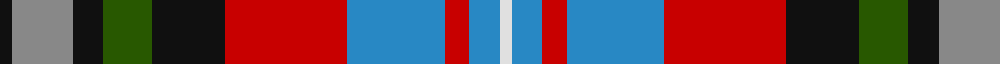

In pattern [KRKGKRBRBW](/patterns/krkgkrbrbw/).

This was sourced from register-of-tartans.  It is a [10 stripes tartan](/stripes/stripes10/).

Original link https://www.tartanregister.gov.uk/tartanDetails.aspx?ref=2802

## Attestations

This cloth appears in 2 source records; the oldest owns this page.

- undated — Manderson #2 (register-of-tartans, [record](https://www.tartanregister.gov.uk/tartanDetails.aspx?ref=2802))
- Unknown — Manderson #2 (Personal) (tartans-authority, [record](http://www.tartansauthority.com/tartan-ferret/display/5713/))

## Thread count
K/4 N20 K10 G16 K24 R40 B32 R8 B10 LN/4

## Palette
Each colour and its ΔE from the base-6 reference it is a variant of.

| Colour | Shade | Base | ΔE (OKLab) |
|---|---|---|---|
| B | <code style="background-color:#2888C4;">#2888C4</code> `#2888C4` | B <code style="background-color:#2A418A;">#2A418A</code> | 0.21 |
| G | <code style="background-color:#285800;">#285800</code> `#285800` | G <code style="background-color:#006100;">#006100</code> | 0.03 |
| K | <code style="background-color:#101010;">#101010</code> `#101010` | K <code style="background-color:#000000;">#000000</code> | 0.17 |
| LN | <code style="background-color:#E0E0E0;">#E0E0E0</code> `#E0E0E0` | W <code style="background-color:#F7F7F7;">#F7F7F7</code> | 0.07 |
| N | <code style="background-color:#888888;">#888888</code> `#888888` | R <code style="background-color:#CC0000;">#CC0000</code> | 0.24 |
| R | <code style="background-color:#C80000;">#C80000</code> `#C80000` | R <code style="background-color:#CC0000;">#CC0000</code> | 0.01 |

## Nearest tartans

The nearest existing variants by ΔTartan distance.

1. [Comyn/Cumming](/setts/s9/b4k2b4k10y1g10r4w1r4x4~b3c82af-g005020-k101010-rdc0000-we0e0e0-ye8c000/) — ΔT 0.80
1. [Black Hills (Corporate)](/setts/s9/b3w2g14r14k2b7k9y2k2x2~b2c2c80-g408060-k101010-rc80000-we0e0e0-ye8c000/) — ΔT 0.81
1. [Black Hills](/setts/s9/b3w2g14r14k2b7k9y2k2x2~b2c2c80-g408060-k101010-rc80000-wffffff-ye8c000/) — ΔT 0.82
1. [Alberta Caledonia (Corporate)](/setts/s13/r6b9k2b2k2b9k10y4ba17r5k2r5w4x2~b2c2c80-ba5c5c5c-k101010-rc80000-we0e0e0-ye8c000/) — ΔT 0.85
1. [Unidentified No 14](/setts/s9/r22b6ba10y4r4w4g22ba8y3~b3c82af-ba2c4084-g005020-rdc0000-we0e0e0-ye8c000/) — ΔT 0.88
1. [Scottish National - 1934 (Fashion)](/setts/s9/w2r3b6b8g12k1r4b2w2x4~b2c2c80-g006818-k101010-rc80000-we0e0e0/) — ΔT 0.89
1. [Unnamed No 14 Tartan Tartan Number: 1326. Earliest known date: 1870 This sett is taken from the records of Messrs Bolingbroke and Jones of Norwich, who were weavers around 1870. Some of the tartans have been adopted or modified in recent times as the copyright of the designs is now in the public domain. See products available Copyright © Blair Urquhart, Comrie, 2015](/setts/s9/r22b6ba10y4r4w4g22ba8y3~b5c8ca8-ba2c2c80-g006818-rc80000-we0e0e0-ye8c000/) — ΔT 0.91
1. [Nicolson of Taransay (Personal)](/setts/s7/w6g10r22b16ga2k4k5x2~b2c2c80-g006818-ga289c18-k101010-rc80000-we0e0e0/) — ΔT 0.97
1. [Jones-MacGregor (Name)](/setts/s14/b2g2b3g8ga4b4ga3b8r12ga7r3ga2k1w1x2~b2c2c80-g789484-ga006818-k101010-rc80000-wfcfcfc/) — ΔT 1.02
1. [Prince Albert](/setts/s13/b23r6b6k10y3k2w2k2g11r12k2r10w2x2~b2c4084-g005020-k101010-rdc0000-we0e0e0-ye8c000/) — ΔT 1.03

## Neighbour map

Every grey dot is one of 15726 variants placed by the first two principal components of the ΔTartan feature space (44% of its variance). Red is this tartan; blue dots are its nearest — click one to open its page.

<svg viewBox="0 0 640 380" role="img" style="max-width:100%;height:auto;border:1px solid #e0e0e0;border-radius:4px;display:block" xmlns="http://www.w3.org/2000/svg"><image href="/nn/cloud.v1.png" width="640" height="380"/><a href="/setts/s9/b4k2b4k10y1g10r4w1r4x4~b3c82af-g005020-k101010-rdc0000-we0e0e0-ye8c000/"><circle cx="83.3" cy="160.3" r="4" fill="#3465a4"><title>Comyn/Cumming</title></circle></a><a href="/setts/s9/b3w2g14r14k2b7k9y2k2x2~b2c2c80-g408060-k101010-rc80000-we0e0e0-ye8c000/"><circle cx="59.9" cy="162.2" r="4" fill="#3465a4"><title>Black Hills (Corporate)</title></circle></a><a href="/setts/s9/b3w2g14r14k2b7k9y2k2x2~b2c2c80-g408060-k101010-rc80000-wffffff-ye8c000/"><circle cx="56.8" cy="160.9" r="4" fill="#3465a4"><title>Black Hills</title></circle></a><a href="/setts/s13/r6b9k2b2k2b9k10y4ba17r5k2r5w4x2~b2c2c80-ba5c5c5c-k101010-rc80000-we0e0e0-ye8c000/"><circle cx="53.3" cy="148.1" r="4" fill="#3465a4"><title>Alberta Caledonia (Corporate)</title></circle></a><a href="/setts/s9/r22b6ba10y4r4w4g22ba8y3~b3c82af-ba2c4084-g005020-rdc0000-we0e0e0-ye8c000/"><circle cx="85.7" cy="159.6" r="4" fill="#3465a4"><title>Unidentified No 14</title></circle></a><a href="/setts/s9/w2r3b6b8g12k1r4b2w2x4~b2c2c80-g006818-k101010-rc80000-we0e0e0/"><circle cx="90.5" cy="150.5" r="4" fill="#3465a4"><title>Scottish National - 1934 (Fashion)</title></circle></a><a href="/setts/s9/r22b6ba10y4r4w4g22ba8y3~b5c8ca8-ba2c2c80-g006818-rc80000-we0e0e0-ye8c000/"><circle cx="84.8" cy="160.1" r="4" fill="#3465a4"><title>Unnamed No 14 Tartan Tartan Number: 1326. Earliest known date: 1870 This sett is taken from the records of Messrs Bolingbroke and Jones of Norwich, who were weavers around 1870. Some of the tartans have been adopted or modified in recent times as the copyright of the designs is now in the public domain. See products available Copyright © Blair Urquhart, Comrie, 2015</title></circle></a><a href="/setts/s7/w6g10r22b16ga2k4k5x2~b2c2c80-g006818-ga289c18-k101010-rc80000-we0e0e0/"><circle cx="102.6" cy="159.8" r="4" fill="#3465a4"><title>Nicolson of Taransay (Personal)</title></circle></a><a href="/setts/s14/b2g2b3g8ga4b4ga3b8r12ga7r3ga2k1w1x2~b2c2c80-g789484-ga006818-k101010-rc80000-wfcfcfc/"><circle cx="97.6" cy="138.4" r="4" fill="#3465a4"><title>Jones-MacGregor (Name)</title></circle></a><a href="/setts/s13/b23r6b6k10y3k2w2k2g11r12k2r10w2x2~b2c4084-g005020-k101010-rdc0000-we0e0e0-ye8c000/"><circle cx="107.4" cy="123.8" r="4" fill="#3465a4"><title>Prince Albert</title></circle></a><circle cx="71.9" cy="154.4" r="5" fill="#c00000"/></svg>

ID: /setts/s10/k2r10k5g8k12ra20b16ra4b5w2x2~b2888c4-g285800-k101010-r888888-rac80000-we0e0e0/
