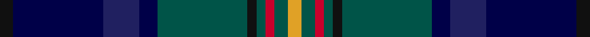

In pattern [KBBBGKGRGY](/stripes/kbbbgkgrgy/).

This was sourced from register-of-tartans.  It is a [10 stripe tartan](/stripes/stripes10/).

Original link https://www.tartanregister.gov.uk/tartanDetails.aspx?ref=11046

## Register references

External register numbers recorded for this tartan.

- Scottish Register of Tartans: [11046](https://www.tartanregister.gov.uk/tartanDetails.aspx?ref=11046)

## Thread count
K/6 DB40 DBa16 DB8 G40 K4 G4 R4 G6 Y/6

## Palette
Each colour and its ΔE from the base-6 reference it is a variant of.

| Colour | Shade | Base | ΔE (OKLab) |
|---|---|---|---|
| DB | <code style="background-color:#000048;">#000048</code> `#000048` | B <code style="background-color:#2A418A;">#2A418A</code> | 0.22 |
| DBa | <code style="background-color:#202060;">#202060</code> `#202060` | B <code style="background-color:#2A418A;">#2A418A</code> | 0.11 |
| G | <code style="background-color:#005448;">#005448</code> `#005448` | G <code style="background-color:#006100;">#006100</code> | 0.10 |
| K | <code style="background-color:#101010;">#101010</code> `#101010` | K <code style="background-color:#000000;">#000000</code> | 0.17 |
| R | <code style="background-color:#C8002C;">#C8002C</code> `#C8002C` | R <code style="background-color:#CC0000;">#CC0000</code> | 0.03 |
| Y | <code style="background-color:#E0A126;">#E0A126</code> `#E0A126` | Y <code style="background-color:#F2BF00;">#F2BF00</code> | 0.08 |

## Nearest tartans

The nearest existing variants by ΔTartan distance.

1. [Leung (Personal)](/setts/s9/dp4db7dp2db25k19w2dg23k2lo3~x2/) — ΔT 0.79
1. [Robert Burns Legacy](/setts/s9/db10g42db8t8db8k24db8db71r10/) — ΔT 0.81
1. [State Seal of North Dakota (Fashion)](/setts/s11/g37dp5g5dp12b10db5b5db40dy4db4lo4~x2/) — ΔT 0.93
1. [Remember the Somme 1916](/setts/s8/dg5g2b2db15r2t2dg5r2~x4/) — ΔT 0.94
1. [Boyle (Personal)](/setts/s10/db4db3r2db26k3db3g3db3g17lo3~x2/) — ΔT 0.95
1. [Suzugamine (Corporate)](/setts/s9/db4dy5g19dp5dy5k5dy5db36ly3~x2/) — ΔT 1.03
1. [Blairmore House](/setts/s8/db17w2db2r2db2do12dg16lo3~x4/) — ΔT 1.04
1. [Damm, Alexander (Personal)](/setts/s9/db11k1db1k1db1k7dg8r1lg6~x4/) — ΔT 1.07
1. [Loch Freuchie District Tartan Tartan Number: 10725. Earliest known date: 25 October 2012 A tartan for the area around Loch Freuchie near Crieff. The tartan is based on the Murray of Atholl and Breadalbane setts, with differences, to relate the tartan to the particular Loch Freuchie area. Mr MacArthur-Fox has created a tartan for anyone to wear without fear of offending another person or group. See products available Copyright © Blair Urquhart, Comrie, 2015](/setts/s10/n3dg3r2dg20k25k2n13k2n3r3~x2/) — ΔT 1.08
1. [Schmidt (2014)](/setts/s10/k3db20db8db4g20k2g2r2g3ly3~x2/) — ΔT 1.08

## Neighbour map

Every grey dot is one of 14299 variants placed by the first two principal components of the ΔTartan feature space (44% of its variance). Red is this tartan; blue dots are its nearest — click one to open its page.

<svg viewBox="0 0 640 380" role="img" style="max-width:100%;height:auto;border:1px solid #e0e0e0;border-radius:4px;display:block" xmlns="http://www.w3.org/2000/svg"><image href="/nn/cloud.v1.png" width="640" height="380"/><a href="/setts/s9/dp4db7dp2db25k19w2dg23k2lo3~x2/"><circle cx="195.7" cy="176.5" r="4" fill="#3465a4"><title>Leung (Personal)</title></circle></a><a href="/setts/s9/db10g42db8t8db8k24db8db71r10/"><circle cx="193.6" cy="176.3" r="4" fill="#3465a4"><title>Robert Burns Legacy</title></circle></a><a href="/setts/s11/g37dp5g5dp12b10db5b5db40dy4db4lo4~x2/"><circle cx="194.7" cy="162.0" r="4" fill="#3465a4"><title>State Seal of North Dakota (Fashion)</title></circle></a><a href="/setts/s8/dg5g2b2db15r2t2dg5r2~x4/"><circle cx="190.0" cy="188.1" r="4" fill="#3465a4"><title>Remember the Somme 1916</title></circle></a><a href="/setts/s10/db4db3r2db26k3db3g3db3g17lo3~x2/"><circle cx="243.8" cy="156.9" r="4" fill="#3465a4"><title>Boyle (Personal)</title></circle></a><a href="/setts/s9/db4dy5g19dp5dy5k5dy5db36ly3~x2/"><circle cx="224.3" cy="156.1" r="4" fill="#3465a4"><title>Suzugamine (Corporate)</title></circle></a><a href="/setts/s8/db17w2db2r2db2do12dg16lo3~x4/"><circle cx="176.9" cy="189.6" r="4" fill="#3465a4"><title>Blairmore House</title></circle></a><a href="/setts/s9/db11k1db1k1db1k7dg8r1lg6~x4/"><circle cx="181.2" cy="191.0" r="4" fill="#3465a4"><title>Damm, Alexander (Personal)</title></circle></a><a href="/setts/s10/n3dg3r2dg20k25k2n13k2n3r3~x2/"><circle cx="193.9" cy="156.7" r="4" fill="#3465a4"><title>Loch Freuchie District Tartan Tartan Number: 10725. Earliest known date: 25 October 2012 A tartan for the area around Loch Freuchie near Crieff. The tartan is based on the Murray of Atholl and Breadalbane setts, with differences, to relate the tartan to the particular Loch Freuchie area. Mr MacArthur-Fox has created a tartan for anyone to wear without fear of offending another person or group. See products available Copyright © Blair Urquhart, Comrie, 2015</title></circle></a><a href="/setts/s10/k3db20db8db4g20k2g2r2g3ly3~x2/"><circle cx="175.0" cy="158.9" r="4" fill="#3465a4"><title>Schmidt (2014)</title></circle></a><circle cx="192.6" cy="171.7" r="5" fill="#c00000"/></svg>

ID: /setts/s10/k3db20db8db4dg20k2dg2r2dg3lo3~x2/
