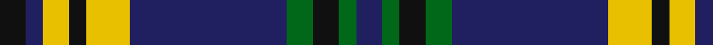

**Bands:** [KBYKYBGKGB](/stripes/kbykybgkgb/) · **Stripes:** [K DB LY K LY DB G K G DB](/stripes/stripes10/) K DB LY K LY DB G K G DB

This was sourced from house-of-tartan.  It is a [10 band tartan](/bands/bands10/).

Original link http://www.house-of-tartan.scotland.net/house/TartanViewjs.asp?colr=Def&tnam=2398

## Thread count
K/6 DBa4 Y6 K4 Y10 DBa36 G6 K6 G4 DBa/6

## Palette
Each colour and its ΔE from the base-6 reference it is a variant of.

| Colour | Shade | Base | ΔE (OKLab) |
|---|---|---|---|
| DB | <code style="background-color:#2C2C80;">#2C2C80</code> `#2C2C80` | B <code style="background-color:#2A418A;">#2A418A</code> | 0.06 |
| DBa | <code style="background-color:#202060;">#202060</code> `#202060` | B <code style="background-color:#2A418A;">#2A418A</code> | 0.11 |
| G | <code style="background-color:#006818;">#006818</code> `#006818` | G <code style="background-color:#006100;">#006100</code> | 0.02 |
| K | <code style="background-color:#101010;">#101010</code> `#101010` | K <code style="background-color:#000000;">#000000</code> | 0.17 |
| Y | <code style="background-color:#E8C000;">#E8C000</code> `#E8C000` | Y <code style="background-color:#F2BF00;">#F2BF00</code> | 0.02 |

## Nearest tartans

The nearest existing variants by ΔTartan distance.

1. [Australian Police](/setts/s8/k5w5k5t11k3y17k30t3~x2/) — ΔT 0.74
1. [Tweedside Hunting](/setts/s9/db18g2k2g5w2g2w2g2k2~x4/) — ΔT 0.95
1. [Guthrie (Name)](/setts/s9/k1g12k12r1k1r1k12b12r1~x4/) — ΔT 0.95
1. [Murray of Elibank](/setts/s13/db56k6g24k6db8k21ly6k21db8k6g24k6db56/) — ΔT 1.01
1. [Clan Iain Mhor (Name)](/setts/s13/dg22w2dg2dr3dt2w2dt19w2dt2dr3dt2w2dt19~x2/) — ΔT 1.08
1. [Auld Lang Syne, Grey Weavers Tartan Tartan Number: 8081. Earliest known date: pre 2007 From a woven sample from the weavers, Marton Mills. See products available Copyright © Blair Urquhart, Comrie, 2015](/setts/s12/w4k2o9o3r3k3r3k23o10k2o6k2~x2/) — ΔT 1.08
1. [State Seal of Oregon (Fashion)](/setts/s13/b4k7lo3k3b34k17b4k5b4k7lo11b5lo4~x2/) — ΔT 1.12
1. [Dunbog Primary School](/setts/s10/r12db3g5db16ly2g2~x2/) — ΔT 1.12
1. [Laing of Archiestown Clan/Family Tartan Tartan Number: 2544. Earliest known date: 1783 Said to have been woven in 1783 in Knockando Morayshire, by William Donald Laing of Queensland, Australia who donated a sample to the Tartans Society in 1996. The dark line in the centre of the red band is either blue or black. Apparently William Laing acquired the piece of tartan in 1961 from a Mr Jack Garden whose g.g. grandfather was John Laing (dob 1767) who wove the tartan. In the 1810 census he lived in his shop in the Square at Archiestown. See products available Copyright © Blair Urquhart, Comrie, 2015](/setts/s8/b8r1k1r1k1~x8/) — ΔT 1.14
1. [Kells Irish Pubs](/setts/s12/k17lr2k3g2k3g2k24b8g4b4g3b8~x2/) — ΔT 1.15

## Neighbour map

Every grey dot is one of 14299 variants placed by the first two principal components of the ΔTartan feature space (44% of its variance). Red is this tartan; blue dots are its nearest — click one to open its page.

<svg viewBox="0 0 640 380" role="img" style="max-width:100%;height:auto;border:1px solid #e0e0e0;border-radius:4px;display:block" xmlns="http://www.w3.org/2000/svg"><image href="/nn/cloud.v1.png" width="640" height="380"/><a href="/setts/s8/k5w5k5t11k3y17k30t3~x2/"><circle cx="258.0" cy="188.9" r="4" fill="#3465a4"><title>Australian Police</title></circle></a><a href="/setts/s9/db18g2k2g5w2g2w2g2k2~x4/"><circle cx="243.9" cy="167.9" r="4" fill="#3465a4"><title>Tweedside Hunting</title></circle></a><a href="/setts/s9/k1g12k12r1k1r1k12b12r1~x4/"><circle cx="256.3" cy="186.7" r="4" fill="#3465a4"><title>Guthrie (Name)</title></circle></a><a href="/setts/s13/db56k6g24k6db8k21ly6k21db8k6g24k6db56/"><circle cx="241.6" cy="178.9" r="4" fill="#3465a4"><title>Murray of Elibank</title></circle></a><a href="/setts/s13/dg22w2dg2dr3dt2w2dt19w2dt2dr3dt2w2dt19~x2/"><circle cx="283.0" cy="151.6" r="4" fill="#3465a4"><title>Clan Iain Mhor (Name)</title></circle></a><a href="/setts/s12/w4k2o9o3r3k3r3k23o10k2o6k2~x2/"><circle cx="238.4" cy="154.7" r="4" fill="#3465a4"><title>Auld Lang Syne, Grey Weavers Tartan Tartan Number: 8081. Earliest known date: pre 2007 From a woven sample from the weavers, Marton Mills. See products available Copyright © Blair Urquhart, Comrie, 2015</title></circle></a><a href="/setts/s13/b4k7lo3k3b34k17b4k5b4k7lo11b5lo4~x2/"><circle cx="245.0" cy="163.4" r="4" fill="#3465a4"><title>State Seal of Oregon (Fashion)</title></circle></a><a href="/setts/s10/r12db3g5db16ly2g2~x2/"><circle cx="264.6" cy="194.2" r="4" fill="#3465a4"><title>Dunbog Primary School</title></circle></a><a href="/setts/s8/b8r1k1r1k1~x8/"><circle cx="273.1" cy="168.6" r="4" fill="#3465a4"><title>Laing of Archiestown Clan/Family Tartan Tartan Number: 2544. Earliest known date: 1783 Said to have been woven in 1783 in Knockando Morayshire, by William Donald Laing of Queensland, Australia who donated a sample to the Tartans Society in 1996. The dark line in the centre of the red band is either blue or black. Apparently William Laing acquired the piece of tartan in 1961 from a Mr Jack Garden whose g.g. grandfather was John Laing (dob 1767) who wove the tartan. In the 1810 census he lived in his shop in the Square at Archiestown. See products available Copyright © Blair Urquhart, Comrie, 2015</title></circle></a><a href="/setts/s12/k17lr2k3g2k3g2k24b8g4b4g3b8~x2/"><circle cx="305.6" cy="167.4" r="4" fill="#3465a4"><title>Kells Irish Pubs</title></circle></a><circle cx="246.7" cy="172.6" r="5" fill="#c00000"/></svg>

ID: /setts/s10/k3db2ly3k2ly5db18g3k3g2db3~x2/
