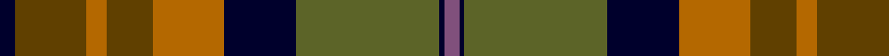

**Bands:** [KGRGRKGGKB](/stripes/kgrgrkggkb/) · **Stripes:** [K DY O DY O K Y Y K N](/stripes/stripes10/) K DY O DY O K Y Y K N

This was sourced from register-of-tartans.  It is a [10 band tartan](/bands/bands10/).

Original link https://www.tartanregister.gov.uk/tartanDetails.aspx?ref=1056

## Attestations

This cloth appears in 2 source records; the oldest owns this page.

- 01/07/2006 — Dutch Friendship (register-of-tartans, [record](https://www.tartanregister.gov.uk/tartanDetails.aspx?ref=1056))
- July 2006 — Dutch Friendship (Fashion) (tartans-authority, [record](http://www.tartansauthority.com/tartan-ferret/display/6960/))

## Register references

External register numbers recorded for this tartan.

- Scottish Register of Tartans: [1056](https://www.tartanregister.gov.uk/tartanDetails.aspx?ref=1056)
- Scottish Tartans Authority (ITI): 6960

## Thread count
DB/6 T28 DO8 T18 DO28 DB28 G28 G28 DB2 N/6

## Palette
Each colour and its ΔE from the base-6 reference it is a variant of.

| Colour | Shade | Base | ΔE (OKLab) |
|---|---|---|---|
| DB | <code style="background-color:#00002C;">#00002C</code> `#00002C` | K <code style="background-color:#000000;">#000000</code> | 0.16 |
| DO | <code style="background-color:#B46800;">#B46800</code> `#B46800` | R <code style="background-color:#CC0000;">#CC0000</code> | 0.14 |
| G | <code style="background-color:#5C6428;">#5C6428</code> `#5C6428` | G <code style="background-color:#006100;">#006100</code> | 0.10 |
| N | <code style="background-color:#80507C;">#80507C</code> `#80507C` | B <code style="background-color:#2A418A;">#2A418A</code> | 0.15 |
| T | <code style="background-color:#604000;">#604000</code> `#604000` | G <code style="background-color:#006100;">#006100</code> | 0.14 |

## Nearest tartans

The nearest existing variants by ΔTartan distance.

1. [Teddy Bear 111th Anniversary](/setts/s11/n26k6dy32y14dy11k19w2o16y11n19k2/) — ΔT 1.12
1. [Fitzsimmons](/setts/s10/y3k2dg18k4y15k4o6k4y2ly3~x2/) — ΔT 1.38
1. [Castlefield (Personal)](/setts/s12/o3k15n10dy10k1g5k1lo10k10g8k1n2~x2/) — ΔT 1.40
1. [MacAart Family Tartan Tartan Number: 1477. Earliest known date: pre 2003 Restricted See products available Copyright © Blair Urquhart, Comrie, 2015](/setts/s10/dy9k2dy2r2g6k1ly1k1g6r3~x2/) — ΔT 1.40
1. [Monaghan Irish County Tartan Tartan Number: 2267. Earliest known date: 1996 One of a series of Irish District tartans designed by Polly Wittering of the House of Edgar, with colours reminiscent of the Country with soft warm colours dominating. See products available Copyright © Blair Urquhart, Comrie, 2015](/setts/s9/lo3dy2o14dg17dy14lo8o14dy2lo3~x2/) — ΔT 1.42
1. [Wicklow County Crest (Fashion)](/setts/s9/db16db7lo4db2lo16db2y24db8lr11~x2/) — ΔT 1.44
1. [Roscommon, County](/setts/s10/r5ly3r19do6ly5do6dg12db5dg12db3~x2/) — ΔT 1.44
1. [Humble, Gordon (Personal)](/setts/s14/o4dy2o14dy4o4p1k8dg13ly3dg13k8dy10k3dy3~x2/) — ΔT 1.45
1. [Bracken (WCWM)](/setts/s11/dy30k6dy6r6lo6o14k4o3n14k6n16~x2/) — ΔT 1.46
1. [McEachem (Name)](/setts/s6/n7w1r6dt10g10w1~x4/) — ΔT 1.47

## Neighbour map

Every grey dot is one of 14299 variants placed by the first two principal components of the ΔTartan feature space (44% of its variance). Red is this tartan; blue dots are its nearest — click one to open its page.

<svg viewBox="0 0 640 380" role="img" style="max-width:100%;height:auto;border:1px solid #e0e0e0;border-radius:4px;display:block" xmlns="http://www.w3.org/2000/svg"><image href="/nn/cloud.v1.png" width="640" height="380"/><a href="/setts/s11/n26k6dy32y14dy11k19w2o16y11n19k2/"><circle cx="107.0" cy="162.2" r="4" fill="#3465a4"><title>Teddy Bear 111th Anniversary</title></circle></a><a href="/setts/s10/y3k2dg18k4y15k4o6k4y2ly3~x2/"><circle cx="163.5" cy="186.7" r="4" fill="#3465a4"><title>Fitzsimmons</title></circle></a><a href="/setts/s12/o3k15n10dy10k1g5k1lo10k10g8k1n2~x2/"><circle cx="136.5" cy="152.2" r="4" fill="#3465a4"><title>Castlefield (Personal)</title></circle></a><a href="/setts/s10/dy9k2dy2r2g6k1ly1k1g6r3~x2/"><circle cx="190.5" cy="198.7" r="4" fill="#3465a4"><title>MacAart Family Tartan Tartan Number: 1477. Earliest known date: pre 2003 Restricted See products available Copyright © Blair Urquhart, Comrie, 2015</title></circle></a><a href="/setts/s9/lo3dy2o14dg17dy14lo8o14dy2lo3~x2/"><circle cx="187.0" cy="221.3" r="4" fill="#3465a4"><title>Monaghan Irish County Tartan Tartan Number: 2267. Earliest known date: 1996 One of a series of Irish District tartans designed by Polly Wittering of the House of Edgar, with colours reminiscent of the Country with soft warm colours dominating. See products available Copyright © Blair Urquhart, Comrie, 2015</title></circle></a><a href="/setts/s9/db16db7lo4db2lo16db2y24db8lr11~x2/"><circle cx="106.5" cy="181.7" r="4" fill="#3465a4"><title>Wicklow County Crest (Fashion)</title></circle></a><a href="/setts/s10/r5ly3r19do6ly5do6dg12db5dg12db3~x2/"><circle cx="116.9" cy="208.2" r="4" fill="#3465a4"><title>Roscommon, County</title></circle></a><a href="/setts/s14/o4dy2o14dy4o4p1k8dg13ly3dg13k8dy10k3dy3~x2/"><circle cx="105.0" cy="154.7" r="4" fill="#3465a4"><title>Humble, Gordon (Personal)</title></circle></a><a href="/setts/s11/dy30k6dy6r6lo6o14k4o3n14k6n16~x2/"><circle cx="149.6" cy="177.6" r="4" fill="#3465a4"><title>Bracken (WCWM)</title></circle></a><a href="/setts/s6/n7w1r6dt10g10w1~x4/"><circle cx="130.8" cy="222.5" r="4" fill="#3465a4"><title>McEachem (Name)</title></circle></a><circle cx="147.3" cy="196.3" r="5" fill="#c00000"/></svg>

ID: /setts/s10/k3dy14o4dy9o14k14y14y14k1n3~x2/
