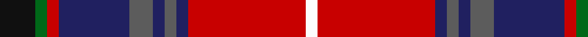

**Bands:** [KGRBBBBBRW](/stripes/kgrbbbbbrw/) · **Stripes:** [K G R DB N DB N DB R W](/stripes/stripes10/) K G R DB N DB N DB R W

This was sourced from tartans-authority.  It is a [10 band tartan](/bands/bands10/).

Original link http://www.tartansauthority.com/tartan-ferret/display/11011/

## Thread count
K/12 G4 R4 DB24 N8 DB4 N4 DB4 R40 W/4

## Palette
Each colour and its ΔE from the base-6 reference it is a variant of.

| Colour | Shade | Base | ΔE (OKLab) |
|---|---|---|---|
| DB | <code style="background-color:#202060;">#202060</code> `#202060` | B <code style="background-color:#2A418A;">#2A418A</code> | 0.11 |
| G | <code style="background-color:#006818;">#006818</code> `#006818` | G <code style="background-color:#006100;">#006100</code> | 0.02 |
| K | <code style="background-color:#101010;">#101010</code> `#101010` | K <code style="background-color:#000000;">#000000</code> | 0.17 |
| N | <code style="background-color:#5C5C5C;">#5C5C5C</code> `#5C5C5C` | B <code style="background-color:#2A418A;">#2A418A</code> | 0.15 |
| R | <code style="background-color:#C80000;">#C80000</code> `#C80000` | R <code style="background-color:#CC0000;">#CC0000</code> | 0.01 |
| W | <code style="background-color:#FCFCFC;">#FCFCFC</code> `#FCFCFC` | W <code style="background-color:#F7F7F7;">#F7F7F7</code> | 0.01 |

## Nearest tartans

The nearest existing variants by ΔTartan distance.

1. [Asman Family](/setts/s10/db4ly3db17g6w2dr6w2r24dr3r4~x2/) — ΔT 0.65
1. [Asman Red (Personal)](/setts/s10/db4ly3db22o6w2k6w2r26k3r4~x2/) — ΔT 0.74
1. [Asman Dress Family Tartan Tartan Number: 2552. Earliest known date: 1989 Designed for David I Asman by Dr. Philip D. Smith, 1989. David Asman was an English armiger and lived at one time in New jersey, USA. The tartan was first woven by Peter MacDonald in the weaving shed at the Scottish Tartan Society's Comrie museum in the 1989. See products available Copyright © Blair Urquhart, Comrie, 2015](/setts/s11/db4ly3db22o6w2k6w2r6r20k3r4~x2/) — ΔT 0.74
1. [MacCreary (Personal)](/setts/s9/k4db12lb3db4g8lo2r24db4r4~x2/) — ΔT 0.87
1. [MacLean Variation](/setts/s11/dp45k12ly4k4w6k4dg50r57dp4r10k4~x2/) — ΔT 0.89
1. [Norwell](/setts/s11/r4k4r32g4w3g4k13g3db18r2ly3~x2/) — ΔT 0.91
1. [Kilmorie](/setts/s11/k3r30g10k3ly2k3w2k6r2db12w2~x2/) — ΔT 0.99
1. [MacLeod Society of Scotland Clan Tartan Tartan Number: 2375. Earliest known date: 1991 Designed by Rosemary Flemming and Derek MacLeod to celebrate the centenary of the Clan MacLeod Society of Scotland. Trudi Mann of Wick, a TECA scholar, also played a part in the design which was accepted by the Chief as the Society sett. Thread count from Trudi Mann March 2004. See products available Copyright © Blair Urquhart, Comrie, 2015](/setts/s10/g3r22k5dt22ly2dt22k5r22g3g3~x2/) — ΔT 1.05
1. [Brown of Castledean (Artefact)](/setts/s14/db12r30db2lb2k8lb2k4ly2k4dg15r8k2r4lb2~x2/) — ΔT 1.08
1. [Gordon of Abergeldie](/setts/s10/r63w4k4dp18ly4dg50ly4dp18k4w4~x2/) — ΔT 1.09

## Neighbour map

Every grey dot is one of 14313 variants placed by the first two principal components of the ΔTartan feature space (44% of its variance). Red is this tartan; blue dots are its nearest — click one to open its page.

<svg viewBox="0 0 640 380" role="img" style="max-width:100%;height:auto;border:1px solid #e0e0e0;border-radius:4px;display:block" xmlns="http://www.w3.org/2000/svg"><image href="/nn/cloud.v1.png" width="640" height="380"/><a href="/setts/s10/db4ly3db17g6w2dr6w2r24dr3r4~x2/"><circle cx="176.6" cy="126.2" r="4" fill="#3465a4"><title>Asman Family</title></circle></a><a href="/setts/s10/db4ly3db22o6w2k6w2r26k3r4~x2/"><circle cx="169.3" cy="111.3" r="4" fill="#3465a4"><title>Asman Red (Personal)</title></circle></a><a href="/setts/s11/db4ly3db22o6w2k6w2r6r20k3r4~x2/"><circle cx="153.6" cy="120.9" r="4" fill="#3465a4"><title>Asman Dress Family Tartan Tartan Number: 2552. Earliest known date: 1989 Designed for David I Asman by Dr. Philip D. Smith, 1989. David Asman was an English armiger and lived at one time in New jersey, USA. The tartan was first woven by Peter MacDonald in the weaving shed at the Scottish Tartan Society's Comrie museum in the 1989. See products available Copyright © Blair Urquhart, Comrie, 2015</title></circle></a><a href="/setts/s9/k4db12lb3db4g8lo2r24db4r4~x2/"><circle cx="182.8" cy="134.8" r="4" fill="#3465a4"><title>MacCreary (Personal)</title></circle></a><a href="/setts/s11/dp45k12ly4k4w6k4dg50r57dp4r10k4~x2/"><circle cx="153.2" cy="104.4" r="4" fill="#3465a4"><title>MacLean Variation</title></circle></a><a href="/setts/s11/r4k4r32g4w3g4k13g3db18r2ly3~x2/"><circle cx="189.8" cy="101.6" r="4" fill="#3465a4"><title>Norwell</title></circle></a><a href="/setts/s11/k3r30g10k3ly2k3w2k6r2db12w2~x2/"><circle cx="190.2" cy="96.2" r="4" fill="#3465a4"><title>Kilmorie</title></circle></a><a href="/setts/s10/g3r22k5dt22ly2dt22k5r22g3g3~x2/"><circle cx="191.3" cy="150.1" r="4" fill="#3465a4"><title>MacLeod Society of Scotland Clan Tartan Tartan Number: 2375. Earliest known date: 1991 Designed by Rosemary Flemming and Derek MacLeod to celebrate the centenary of the Clan MacLeod Society of Scotland. Trudi Mann of Wick, a TECA scholar, also played a part in the design which was accepted by the Chief as the Society sett. Thread count from Trudi Mann March 2004. See products available Copyright © Blair Urquhart, Comrie, 2015</title></circle></a><a href="/setts/s14/db12r30db2lb2k8lb2k4ly2k4dg15r8k2r4lb2~x2/"><circle cx="190.7" cy="96.4" r="4" fill="#3465a4"><title>Brown of Castledean (Artefact)</title></circle></a><a href="/setts/s10/r63w4k4dp18ly4dg50ly4dp18k4w4~x2/"><circle cx="183.5" cy="100.3" r="4" fill="#3465a4"><title>Gordon of Abergeldie</title></circle></a><circle cx="179.5" cy="128.5" r="5" fill="#c00000"/></svg>

ID: /setts/s10/k3g1r1db6n2db1n1db1r10w1~x4/
