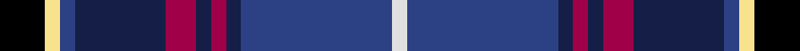

This page is one **sett** — a single exact thread-count. It belongs to the [tartan](/tartans/k3ly1b1db6r2db1r1db1b10ln1/)
(the same proportion at any scale), whose colour order is pattern [KYBBRBRBBW](/stripes/kybbrbrbbw/).

Sourced from register-of-tartans.  It is a [10 stripe tartan](/stripes/stripes10/).

Original link https://www.tartanregister.gov.uk/tartanDetails.aspx?ref=11494

## Register references

External register numbers recorded for this tartan.

- Scottish Register of Tartans: [11494](https://www.tartanregister.gov.uk/tartanDetails.aspx?ref=11494)

## Thread count
K/12 LY4 B4 DB24 R8 DB4 R4 DB4 B40 LN/4

## Palette
Each colour and the base-6 reference it is a variant of.

| Colour | Shade | Base |
|---|---|---|
| B | <code style="background-color:#2C4084;">#2C4084</code> `oklch(39.4% 0.117 268.3)` <small>#2C4084</small> | B <code style="background-color:#2A418A;">#2A418A</code> |
| DB | <code style="background-color:#141E46;">#141E46</code> `oklch(25.2% 0.076 269.7)` <small>#141E46</small> | B <code style="background-color:#2A418A;">#2A418A</code> |
| K | <code style="background-color:#000000;">#000000</code> `oklch(0.0% 0.000 0.0)` <small>#000000</small> | K <code style="background-color:#000000;">#000000</code> |
| LN | <code style="background-color:#E0E0E0;">#E0E0E0</code> `oklch(90.7% 0.000 89.9)` <small>#E0E0E0</small> | W <code style="background-color:#F7F7F7;">#F7F7F7</code> |
| LY | <code style="background-color:#F8E38C;">#F8E38C</code> `oklch(91.4% 0.110 96.2)` <small>#F8E38C</small> | Y <code style="background-color:#F2BF00;">#F2BF00</code> |
| R | <code style="background-color:#A00048;">#A00048</code> `oklch(45.4% 0.182 5.3)` <small>#A00048</small> | R <code style="background-color:#CC0000;">#CC0000</code> |

## Nearest tartans

The nearest existing variants by ΔTartan distance, with this tartan at the top so the swatches line up against it.

ΔTartan

Tartan

Sett

—

<a href="/ttd/edit/#slug=k3ly1db1db6m2db1m1db1db10w1~x4">Ertico</a> <a class="nn-out" href="/setts/s10/k3ly1db1db6m2db1m1db1db10w1~x4/" title="open its dictionary page">↗</a>

0.93

<a href="/ttd/edit/#slug=db53g10k20ly5k5w5k7r18db10k6db6w6">Broager (Name)</a> <a class="nn-out" href="/setts/s12/db53g10k20ly5k5w5k7r18db10k6db6w6/" title="open its dictionary page">↗</a>

0.99

<a href="/ttd/edit/#slug=db4ly2db24k2db5r3k14g14w3r3db3~x2">Czech National (District)</a> <a class="nn-out" href="/setts/s11/db4ly2db24k2db5r3k14g14w3r3db3~x2/" title="open its dictionary page">↗</a>

1.01

<a href="/ttd/edit/#slug=b11db5g4w3r3k16db28b2~x2">Scottish Italian</a> <a class="nn-out" href="/setts/s8/b11db5g4w3r3k16db28b2~x2/" title="open its dictionary page">↗</a>

1.01

<a href="/ttd/edit/#slug=db50k10db6k10db6dg5lp5dg5p8dg23w5~x2">Scottish Hockey Union (Sports)</a> <a class="nn-out" href="/setts/s11/db50k10db6k10db6dg5lp5dg5p8dg23w5~x2/" title="open its dictionary page">↗</a>

1.05

<a href="/ttd/edit/#slug=db40r4k16w3dy8r4dy3r8k10~x2">United Arrows House Check</a> <a class="nn-out" href="/setts/s9/db40r4k16w3dy8r4dy3r8k10~x2/" title="open its dictionary page">↗</a>

1.06

<a href="/ttd/edit/#slug=k4r3k20k6w2r6w2o6db22ly3db4~x2">Asman, Dress (Name)</a> <a class="nn-out" href="/setts/s11/k4r3k20k6w2r6w2o6db22ly3db4~x2/" title="open its dictionary page">↗</a>

1.11

<a href="/ttd/edit/#slug=m4k7m2db25k19w2g13k2ly3~x2">Leung (Personal)</a> <a class="nn-out" href="/setts/s9/m4k7m2db25k19w2g13k2ly3~x2/" title="open its dictionary page">↗</a>

1.11

<a href="/ttd/edit/#slug=k3dp16g5dp3p2dp2k12dt23w2~x2">Creiff Highland Gathering</a> <a class="nn-out" href="/setts/s9/k3dp16g5dp3p2dp2k12dt23w2~x2/" title="open its dictionary page">↗</a>

1.12

<a href="/ttd/edit/#slug=k37r4db30n7k10w5n10y7~x2">Yates</a> <a class="nn-out" href="/setts/s8/k37r4db30n7k10w5n10y7~x2/" title="open its dictionary page">↗</a>

1.14

<a href="/ttd/edit/#slug=db33r8k12ly2k4w4k4g12db8k4db4w2~x2">MacLulich</a> <a class="nn-out" href="/setts/s12/db33r8k12ly2k4w4k4g12db8k4db4w2~x2/" title="open its dictionary page">↗</a>

## Neighbour map

Every grey dot is one of 14299 variants placed by the first two principal components of the ΔTartan feature space (44% of its variance). Red is this tartan; blue dots are its nearest — click one to open its page.

<svg viewBox="0 0 640 380" role="img" style="max-width:100%;height:auto;border:1px solid #e0e0e0;border-radius:4px;display:block" xmlns="http://www.w3.org/2000/svg"><image href="/nn/cloud.v1.png" width="640" height="380"/><a href="/setts/s12/db53g10k20ly5k5w5k7r18db10k6db6w6/"><circle cx="173.7" cy="124.5" r="4" fill="#3465a4"><title>Broager (Name)</title></circle></a><a href="/setts/s11/db4ly2db24k2db5r3k14g14w3r3db3~x2/"><circle cx="199.3" cy="140.4" r="4" fill="#3465a4"><title>Czech National (District)</title></circle></a><a href="/setts/s8/b11db5g4w3r3k16db28b2~x2/"><circle cx="208.4" cy="156.1" r="4" fill="#3465a4"><title>Scottish Italian</title></circle></a><a href="/setts/s11/db50k10db6k10db6dg5lp5dg5p8dg23w5~x2/"><circle cx="192.4" cy="140.4" r="4" fill="#3465a4"><title>Scottish Hockey Union (Sports)</title></circle></a><a href="/setts/s9/db40r4k16w3dy8r4dy3r8k10~x2/"><circle cx="206.8" cy="147.8" r="4" fill="#3465a4"><title>United Arrows House Check</title></circle></a><a href="/setts/s11/k4r3k20k6w2r6w2o6db22ly3db4~x2/"><circle cx="146.3" cy="132.7" r="4" fill="#3465a4"><title>Asman, Dress (Name)</title></circle></a><a href="/setts/s9/m4k7m2db25k19w2g13k2ly3~x2/"><circle cx="152.4" cy="147.8" r="4" fill="#3465a4"><title>Leung (Personal)</title></circle></a><a href="/setts/s9/k3dp16g5dp3p2dp2k12dt23w2~x2/"><circle cx="168.6" cy="159.6" r="4" fill="#3465a4"><title>Creiff Highland Gathering</title></circle></a><a href="/setts/s8/k37r4db30n7k10w5n10y7~x2/"><circle cx="174.6" cy="178.7" r="4" fill="#3465a4"><title>Yates</title></circle></a><a href="/setts/s12/db33r8k12ly2k4w4k4g12db8k4db4w2~x2/"><circle cx="205.6" cy="119.2" r="4" fill="#3465a4"><title>MacLulich</title></circle></a><circle cx="172.0" cy="143.5" r="5" fill="#c00000"/></svg>

ID: /setts/s10/k3ly1db1db6m2db1m1db1db10w1~x4/
