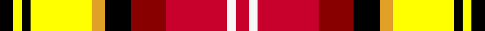

This page is one **sett** — a single exact thread-count. It belongs to the [tartan](/tartans/k3y2k2y14ya3k6dr8r14w2r3/)
(the same proportion at any scale), whose colour order is pattern [KYKYYKRRWR](/stripes/kykyykrrwr/).

Sourced from register-of-tartans.  It is a [10 stripe tartan](/stripes/stripes10/).

Original link https://www.tartanregister.gov.uk/tartanDetails.aspx?ref=11161

2 attestations — the source records this cloth was collapsed from (oldest owns this page)

<ul>
<li>25/03/2014 — Walls, Steve C (Personal) (register-of-tartans, <a href="https://www.tartanregister.gov.uk/tartanDetails.aspx?ref=11161">record</a>)</li>
<li>2014 — Walls, Steve C (Personal) (tartans-authority, <a href="http://www.tartansauthority.com/tartan-ferret/display/11161/">record</a>)</li>
</ul>

## Register references

External register numbers recorded for this tartan.

- Scottish Register of Tartans: [11161](https://www.tartanregister.gov.uk/tartanDetails.aspx?ref=11161)

## Thread count
K/6 Y4 K4 Y28 Ya6 K12 DR16 R28 W4 R/6

## Palette
Each colour and the base-6 reference it is a variant of.

| Colour | Shade | Base |
|---|---|---|
| DR | <code style="background-color:#880000;">#880000</code> `oklch(39.4% 0.162 29.2)` <small>#880000</small> | R <code style="background-color:#CC0000;">#CC0000</code> |
| K | <code style="background-color:#000000;">#000000</code> `oklch(0.0% 0.000 0.0)` <small>#000000</small> | K <code style="background-color:#000000;">#000000</code> |
| R | <code style="background-color:#C8002C;">#C8002C</code> `oklch(52.6% 0.212 22.0)` <small>#C8002C</small> | R <code style="background-color:#CC0000;">#CC0000</code> |
| W | <code style="background-color:#F8F8F8;">#F8F8F8</code> `oklch(97.9% 0.000 89.9)` <small>#F8F8F8</small> | W <code style="background-color:#F7F7F7;">#F7F7F7</code> |
| Y | <code style="background-color:#FFFF00;">#FFFF00</code> `oklch(96.8% 0.211 109.8)` <small>#FFFF00</small> | Y <code style="background-color:#F2BF00;">#F2BF00</code> |
| Ya | <code style="background-color:#E0A126;">#E0A126</code> `oklch(75.1% 0.146 78.3)` <small>#E0A126</small> | Y <code style="background-color:#F2BF00;">#F2BF00</code> |

## Nearest tartans

The nearest existing variants by ΔTartan distance, with this tartan at the top so the swatches line up against it.

ΔTartan

Tartan

Sett

—

<a href="/ttd/edit/#slug=k3ly2k2ly14lo3k6r8r14w2r3~x2">Walls, Steve C (Personal)</a> <a class="nn-out" href="/setts/s10/k3ly2k2ly14lo3k6r8r14w2r3~x2/" title="open its dictionary page">↗</a>

1.42

<a href="/ttd/edit/#slug=w2r8dy5ly6w5dg21w6r8r4w2">Jacobite Silk sash</a> <a class="nn-out" href="/setts/s10/w2r8dy5ly6w5dg21w6r8r4w2/" title="open its dictionary page">↗</a>

1.52

<a href="/ttd/edit/#slug=ly6k2r15g5r8k12w24t2w4t2~x2">Gillies, dress Red</a> <a class="nn-out" href="/setts/s10/ly6k2r15g5r8k12w24t2w4t2~x2/" title="open its dictionary page">↗</a>

1.56

<a href="/ttd/edit/#slug=r30ly30db5w5g5k5g3db3k3w3ly3~x2">Aguilar Gorrondona Family (Personal)</a> <a class="nn-out" href="/setts/s11/r30ly30db5w5g5k5g3db3k3w3ly3~x2/" title="open its dictionary page">↗</a>

1.59

<a href="/ttd/edit/#slug=w4k2r15k2r5y7dg7k2ly4~x2">Thirkill</a> <a class="nn-out" href="/setts/s9/w4k2r15k2r5y7dg7k2ly4~x2/" title="open its dictionary page">↗</a>

1.65

<a href="/ttd/edit/#slug=r5t2m14w2k13ly13k2ly3~x2">Culloden (Old and Rare) District Tartan Tartan Number: 1328. Earliest known date: 1746 Worn by a member of Prince Charles' staff during the battle but it is not known with which family or district it was first connected. It was first illustrated in Old &amp; Rare in 1893 by D W Stewart whose son D C Stewart was a founder member of the Scottish Tartans Society. Now firmly established as a district tartan. See products available Copyright © Blair Urquhart, Comrie, 2015</a> <a class="nn-out" href="/setts/s8/r5t2m14w2k13ly13k2ly3~x2/" title="open its dictionary page">↗</a>

1.65

<a href="/ttd/edit/#slug=r6k2r12dg10k3w2k3ly2k8w4db6w12r4">Victoria (Patons)</a> <a class="nn-out" href="/setts/s13/r6k2r12dg10k3w2k3ly2k8w4db6w12r4/" title="open its dictionary page">↗</a>

1.67

<a href="/ttd/edit/#slug=r6k2r12g10k3w2k3ly2k8w4db6w12r4">Victoria</a> <a class="nn-out" href="/setts/s13/r6k2r12g10k3w2k3ly2k8w4db6w12r4/" title="open its dictionary page">↗</a>

1.67

<a href="/ttd/edit/#slug=k2w1ly6r6w1k2w2k3w2k1w2g3w2~x4">Hovington (2014)</a> <a class="nn-out" href="/setts/s13/k2w1ly6r6w1k2w2k3w2k1w2g3w2~x4/" title="open its dictionary page">↗</a>

1.68

<a href="/ttd/edit/#slug=k14db22k5lo11k5ly24k11lo11r54lo8k10">Derry County Crest (Fashion)</a> <a class="nn-out" href="/setts/s11/k14db22k5lo11k5ly24k11lo11r54lo8k10/" title="open its dictionary page">↗</a>

1.69

<a href="/ttd/edit/#slug=r6ly15do4db12g12dy4r25w5~x2">Young Presidents Organisation Dress</a> <a class="nn-out" href="/setts/s8/r6ly15do4db12g12dy4r25w5~x2/" title="open its dictionary page">↗</a>

## Neighbour map

Every grey dot is one of 14299 variants placed by the first two principal components of the ΔTartan feature space (44% of its variance). Red is this tartan; blue dots are its nearest — click one to open its page.

<svg viewBox="0 0 640 380" role="img" style="max-width:100%;height:auto;border:1px solid #e0e0e0;border-radius:4px;display:block" xmlns="http://www.w3.org/2000/svg"><image href="/nn/cloud.v1.png" width="640" height="380"/><a href="/setts/s10/w2r8dy5ly6w5dg21w6r8r4w2/"><circle cx="81.2" cy="133.0" r="4" fill="#3465a4"><title>Jacobite Silk sash</title></circle></a><a href="/setts/s10/ly6k2r15g5r8k12w24t2w4t2~x2/"><circle cx="93.0" cy="111.2" r="4" fill="#3465a4"><title>Gillies, dress Red</title></circle></a><a href="/setts/s11/r30ly30db5w5g5k5g3db3k3w3ly3~x2/"><circle cx="119.1" cy="95.9" r="4" fill="#3465a4"><title>Aguilar Gorrondona Family (Personal)</title></circle></a><a href="/setts/s9/w4k2r15k2r5y7dg7k2ly4~x2/"><circle cx="121.0" cy="157.4" r="4" fill="#3465a4"><title>Thirkill</title></circle></a><a href="/setts/s8/r5t2m14w2k13ly13k2ly3~x2/"><circle cx="31.4" cy="137.0" r="4" fill="#3465a4"><title>Culloden (Old and Rare) District Tartan Tartan Number: 1328. Earliest known date: 1746 Worn by a member of Prince Charles' staff during the battle but it is not known with which family or district it was first connected. It was first illustrated in Old &amp; Rare in 1893 by D W Stewart whose son D C Stewart was a founder member of the Scottish Tartans Society. Now firmly established as a district tartan. See products available Copyright © Blair Urquhart, Comrie, 2015</title></circle></a><a href="/setts/s13/r6k2r12dg10k3w2k3ly2k8w4db6w12r4/"><circle cx="25.9" cy="151.7" r="4" fill="#3465a4"><title>Victoria (Patons)</title></circle></a><a href="/setts/s13/r6k2r12g10k3w2k3ly2k8w4db6w12r4/"><circle cx="17.7" cy="151.1" r="4" fill="#3465a4"><title>Victoria</title></circle></a><a href="/setts/s13/k2w1ly6r6w1k2w2k3w2k1w2g3w2~x4/"><circle cx="14.0" cy="141.6" r="4" fill="#3465a4"><title>Hovington (2014)</title></circle></a><a href="/setts/s11/k14db22k5lo11k5ly24k11lo11r54lo8k10/"><circle cx="108.6" cy="139.5" r="4" fill="#3465a4"><title>Derry County Crest (Fashion)</title></circle></a><a href="/setts/s8/r6ly15do4db12g12dy4r25w5~x2/"><circle cx="65.3" cy="156.3" r="4" fill="#3465a4"><title>Young Presidents Organisation Dress</title></circle></a><circle cx="47.3" cy="129.7" r="5" fill="#c00000"/></svg>

ID: /setts/s10/k3ly2k2ly14lo3k6r8r14w2r3~x2/
