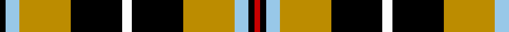

In pattern [KWYKWKYWKR](/patterns/kwykwkywkr/).

This was sourced from register-of-tartans.  It is a [10 stripes tartan](/stripes/stripes10/).

Original link https://www.tartanregister.gov.uk/tartanDetails.aspx?ref=766

## Thread count
K/6 LB14 DY52 K52 W10 K52 DY52 LB14 K6 R/6

## Palette
Each colour and its ΔE from the base-6 reference it is a variant of.

| Colour | Shade | Base | ΔE (OKLab) |
|---|---|---|---|
| DY | <code style="background-color:#BC8C00;">#BC8C00</code> `#BC8C00` | Y <code style="background-color:#F2BF00;">#F2BF00</code> | 0.16 |
| K | <code style="background-color:#000000;">#000000</code> `#000000` | K <code style="background-color:#000000;">#000000</code> | 0.00 |
| LB | <code style="background-color:#98C8E8;">#98C8E8</code> `#98C8E8` | W <code style="background-color:#F7F7F7;">#F7F7F7</code> | 0.18 |
| R | <code style="background-color:#C80000;">#C80000</code> `#C80000` | R <code style="background-color:#CC0000;">#CC0000</code> | 0.01 |
| W | <code style="background-color:#FCFCFC;">#FCFCFC</code> `#FCFCFC` | W <code style="background-color:#F7F7F7;">#F7F7F7</code> | 0.01 |

## Nearest tartans

The nearest existing variants by ΔTartan distance.

1. [Tyrone County Crest (Fashion)](/setts/s12/r4k2y13ya3k22r2k2w13k7r3k7w4~k101010-r880000-we0e0e0-y909c3c-yabc8c00~x2/) — ΔT 1.01
1. [Unnamed No 5](/setts/s8/k10y2g11r11w1r1w1k9~g008000-k000000-rc00000-we0e0e0-yf0c000~x2/) — ΔT 1.07
1. [Confessore (Personal)](/setts/s15/k6g1k1g4y1r1y4r1y2g4k1g1k8w1k2~g5c6428-k101010-rc80000-we0e0e0-yfccc00~x4/) — ΔT 1.08
1. [Cornish National (District)](/setts/s6/w5k26y26b7k3r3~b4c809c-k000000-rc80000-wfcfcfc-ybc8c00~x2/) — ΔT 1.14
1. [Cornish, National](/setts/s6/w5k26y26b7k3r3~b5480b0-k000000-rc00000-we0e0e0-yf0c000~x2/) — ΔT 1.24
1. [Cornish, National](/setts/s6/w2k11y11b3k1r1~b304080-k000000-rc00000-we0e0e0-yf0c000~x2/) — ΔT 1.26
1. [Unnamed No 5 Tartan Tartan Number: 1257. Earliest known date: 1870 This sett is taken from the records of Messrs Bolingbroke and Jones of Norwich, who were weavers around 1870. Some of the tartans have been adopted or modified in recent times as the copyright of the designs is now in the public domain. See products available Copyright © Blair Urquhart, Comrie, 2015](/setts/s8/k10y2g11r11w1r1w1k9~g006818-k101010-rc80000-we0e0e0-ye8c000~x2/) — ΔT 1.26
1. [Niagara Celtic Heritage Festival](/setts/s13/r3w2g8r8k16w2k3w2k16k8w8k2w3~g006400-k000000-rdc0000-wffffff~x2/) — ΔT 1.29
1. [Fountain of the Strong](/setts/s11/r6k3g3k6ra2k2ra2k6g3r14rb2~g184800-k000000-rc06430-ra880000-rbb82c28~x2/) — ΔT 1.30
1. [MacLamroc](/setts/s10/y4k1g16k16r1w3k16r16k1y4~g008000-k000000-rc00000-we0e0e0-yf0c000~x2/) — ΔT 1.30

## Neighbour map

Every grey dot is one of 15726 variants placed by the first two principal components of the ΔTartan feature space (44% of its variance). Red is this tartan; blue dots are its nearest — click one to open its page.

<svg viewBox="0 0 640 380" role="img" style="max-width:100%;height:auto;border:1px solid #e0e0e0;border-radius:4px;display:block" xmlns="http://www.w3.org/2000/svg"><image href="/nn/cloud.v1.png" width="640" height="380"/><a href="/setts/s12/r4k2y13ya3k22r2k2w13k7r3k7w4~k101010-r880000-we0e0e0-y909c3c-yabc8c00~x2/"><circle cx="178.7" cy="141.4" r="4" fill="#3465a4"><title>Tyrone County Crest (Fashion)</title></circle></a><a href="/setts/s8/k10y2g11r11w1r1w1k9~g008000-k000000-rc00000-we0e0e0-yf0c000~x2/"><circle cx="153.4" cy="168.4" r="4" fill="#3465a4"><title>Unnamed No 5</title></circle></a><a href="/setts/s15/k6g1k1g4y1r1y4r1y2g4k1g1k8w1k2~g5c6428-k101010-rc80000-we0e0e0-yfccc00~x4/"><circle cx="166.4" cy="149.6" r="4" fill="#3465a4"><title>Confessore (Personal)</title></circle></a><a href="/setts/s6/w5k26y26b7k3r3~b4c809c-k000000-rc80000-wfcfcfc-ybc8c00~x2/"><circle cx="159.7" cy="178.3" r="4" fill="#3465a4"><title>Cornish National (District)</title></circle></a><a href="/setts/s6/w5k26y26b7k3r3~b5480b0-k000000-rc00000-we0e0e0-yf0c000~x2/"><circle cx="153.4" cy="173.9" r="4" fill="#3465a4"><title>Cornish, National</title></circle></a><a href="/setts/s6/w2k11y11b3k1r1~b304080-k000000-rc00000-we0e0e0-yf0c000~x2/"><circle cx="167.8" cy="164.0" r="4" fill="#3465a4"><title>Cornish, National</title></circle></a><a href="/setts/s8/k10y2g11r11w1r1w1k9~g006818-k101010-rc80000-we0e0e0-ye8c000~x2/"><circle cx="171.5" cy="171.9" r="4" fill="#3465a4"><title>Unnamed No 5 Tartan Tartan Number: 1257. Earliest known date: 1870 This sett is taken from the records of Messrs Bolingbroke and Jones of Norwich, who were weavers around 1870. Some of the tartans have been adopted or modified in recent times as the copyright of the designs is now in the public domain. See products available Copyright © Blair Urquhart, Comrie, 2015</title></circle></a><a href="/setts/s13/r3w2g8r8k16w2k3w2k16k8w8k2w3~g006400-k000000-rdc0000-wffffff~x2/"><circle cx="117.3" cy="156.2" r="4" fill="#3465a4"><title>Niagara Celtic Heritage Festival</title></circle></a><a href="/setts/s11/r6k3g3k6ra2k2ra2k6g3r14rb2~g184800-k000000-rc06430-ra880000-rbb82c28~x2/"><circle cx="144.6" cy="173.0" r="4" fill="#3465a4"><title>Fountain of the Strong</title></circle></a><a href="/setts/s10/y4k1g16k16r1w3k16r16k1y4~g008000-k000000-rc00000-we0e0e0-yf0c000~x2/"><circle cx="170.3" cy="137.9" r="4" fill="#3465a4"><title>MacLamroc</title></circle></a><circle cx="162.8" cy="164.5" r="5" fill="#c00000"/></svg>

ID: /setts/s10/k3w7y26k26wa5k26y26w7k3r3~k000000-rc80000-w98c8e8-wafcfcfc-ybc8c00~x2/
