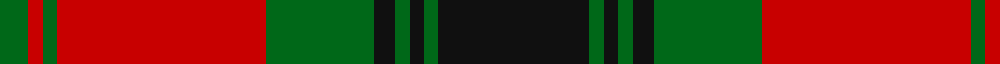

In pattern [GRGRGKGKGK](/patterns/grgrgkgkgk/).

This was sourced from register-of-tartans.  It is a [10 stripes tartan](/stripes/stripes10/).

Original link https://www.tartanregister.gov.uk/tartanDetails.aspx?ref=654

## Attestations

This cloth appears in 2 source records; the oldest owns this page.

- 01/01/2003 — City of Armadale (register-of-tartans, [record](https://www.tartanregister.gov.uk/tartanDetails.aspx?ref=654))
- pre 2003 — City of Armadale (District) (tartans-authority, [record](http://www.tartansauthority.com/tartan-ferret/display/5868/))

## Thread count
G/8 Ra4 G4 Ra58 G30 K6 G4 K4 G4 K/42

## Palette
Each colour and its ΔE from the base-6 reference it is a variant of.

| Colour | Shade | Base | ΔE (OKLab) |
|---|---|---|---|
| G | <code style="background-color:#006818;">#006818</code> `#006818` | G <code style="background-color:#006400;">#006400</code> | 0.02 |
| K | <code style="background-color:#101010;">#101010</code> `#101010` | K <code style="background-color:#000000;">#000000</code> | 0.17 |
| N | <code style="background-color:#808080;">#808080</code> `#808080` | G <code style="background-color:#006400;">#006400</code> | 0.22 |
| R | <code style="background-color:#C80028;">#C80028</code> `#C80028` | R <code style="background-color:#C80000;">#C80000</code> | 0.02 |
| Ra | <code style="background-color:#C80000;">#C80000</code> `#C80000` | R <code style="background-color:#C80000;">#C80000</code> | 0.00 |

ID: /setts/s10/k42g4k4g4k6g30r58g4r4g8-g006818-k101010-rc80000/
