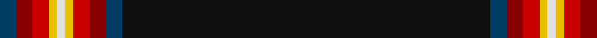

In pattern [BRRYWYRRBK](/patterns/brrywyrrbk/).

This was sourced from house-of-tartan.  It is a [10 stripes tartan](/stripes/stripes10/).

Original link http://www.house-of-tartan.scotland.net/house/TartanViewjs.asp?colr=Def&tnam=5917

## Thread count
DB/4 DR4 R4 Y2 LN2 Y2 R4 DR4 DB4 K/90

## Palette
Each colour and its ΔE from the base-6 reference it is a variant of.

| Colour | Shade | Base | ΔE (OKLab) |
|---|---|---|---|
| DB | <code style="background-color:#003C64;">#003C64</code> `#003C64` | B <code style="background-color:#2A418A;">#2A418A</code> | 0.08 |
| DR | <code style="background-color:#880000;">#880000</code> `#880000` | R <code style="background-color:#CC0000;">#CC0000</code> | 0.15 |
| K | <code style="background-color:#101010;">#101010</code> `#101010` | K <code style="background-color:#000000;">#000000</code> | 0.17 |
| LN | <code style="background-color:#E0E0E0;">#E0E0E0</code> `#E0E0E0` | W <code style="background-color:#F7F7F7;">#F7F7F7</code> | 0.07 |
| R | <code style="background-color:#C80000;">#C80000</code> `#C80000` | R <code style="background-color:#CC0000;">#CC0000</code> | 0.01 |
| Y | <code style="background-color:#E8C000;">#E8C000</code> `#E8C000` | Y <code style="background-color:#F2BF00;">#F2BF00</code> | 0.02 |

## Nearest tartans

The nearest existing variants by ΔTartan distance.

1. [New World Celts (Corporate)](/setts/s13/k75b2w2k2y2g4r3k2r4k1w4k2b5x2~b2888c4-g003820-k101010-rc80000-we0e0e0-ye8c000/) — ΔT 1.01
1. [Watt (Corporate/Name)](/setts/s12/k96b8k12ba3k3ba3k3g20r8k3r4w4~b2c2c80-ba780078-g006818-k101010-rc80000-we0e0e0/) — ΔT 1.10
1. [Western Australia-Pending (District)](/setts/s13/k114b2k3b3k5b5k2g5w6r5y3k3ba14~b2888c4-ba2c2c80-g006818-k101010-rc80000-we0e0e0-yfccc00/) — ΔT 1.24
1. [Spirit of Lanarkshire (Corporate)](/setts/s8/k83y2b4r2k8g5r4w3x2~b2c2c80-g006818-k101010-rc80000-we0e0e0-ye8c000/) — ΔT 1.32
1. [Stewart/Stuart (Black)](/setts/s12/k24b2k3y1k1ya1k1g4r2k1r2ya1x4~b2474e8-g006818-k101010-r880000-ybc8c00-yab8b8b8/) — ΔT 1.46
1. [Hawes (Personal)](/setts/s10/w2b3g5k50g4b3w2ba3k2y2x2~b480800-ba5c8ca8-g006818-k101010-we0e0e0-ybc8c00/) — ΔT 1.53
1. [Wedding Day](/setts/s9/r4w1b48ra2rb3ra2b3w1r4x2~b2b2241-r975e11-ra8e130e-rbad5176-wffffff/) — ΔT 1.59
1. [Initial City Link #2](/setts/s11/k50g7k4w2k2y2k2g7k2ga3y2x2~g003c14-ga005020-k101010-we0e0e0-ye8c000/) — ΔT 1.61
1. [Hawks (2014)](/setts/s10/w2b3g5k50g4b3w2ba3k2y2x2~b441800-ba2c2c80-g006818-k101010-wfcfcfc-yfccc00/) — ΔT 1.61
1. [Mohammed, Abu Hassan (Personal)](/setts/s9/b60w1b6g10r1g7k2y2w2x2~b1c1c50-g006818-k101010-rc80000-wfcfcec-ybc8c00/) — ΔT 1.65

## Neighbour map

Every grey dot is one of 15726 variants placed by the first two principal components of the ΔTartan feature space (44% of its variance). Red is this tartan; blue dots are its nearest — click one to open its page.

<svg viewBox="0 0 640 380" role="img" style="max-width:100%;height:auto;border:1px solid #e0e0e0;border-radius:4px;display:block" xmlns="http://www.w3.org/2000/svg"><image href="/nn/cloud.v1.png" width="640" height="380"/><a href="/setts/s13/k75b2w2k2y2g4r3k2r4k1w4k2b5x2~b2888c4-g003820-k101010-rc80000-we0e0e0-ye8c000/"><circle cx="496.2" cy="35.5" r="4" fill="#3465a4"><title>New World Celts (Corporate)</title></circle></a><a href="/setts/s12/k96b8k12ba3k3ba3k3g20r8k3r4w4~b2c2c80-ba780078-g006818-k101010-rc80000-we0e0e0/"><circle cx="443.9" cy="76.2" r="4" fill="#3465a4"><title>Watt (Corporate/Name)</title></circle></a><a href="/setts/s13/k114b2k3b3k5b5k2g5w6r5y3k3ba14~b2888c4-ba2c2c80-g006818-k101010-rc80000-we0e0e0-yfccc00/"><circle cx="475.4" cy="26.3" r="4" fill="#3465a4"><title>Western Australia-Pending (District)</title></circle></a><a href="/setts/s8/k83y2b4r2k8g5r4w3x2~b2c2c80-g006818-k101010-rc80000-we0e0e0-ye8c000/"><circle cx="562.8" cy="89.9" r="4" fill="#3465a4"><title>Spirit of Lanarkshire (Corporate)</title></circle></a><a href="/setts/s12/k24b2k3y1k1ya1k1g4r2k1r2ya1x4~b2474e8-g006818-k101010-r880000-ybc8c00-yab8b8b8/"><circle cx="419.0" cy="85.6" r="4" fill="#3465a4"><title>Stewart/Stuart (Black)</title></circle></a><a href="/setts/s10/w2b3g5k50g4b3w2ba3k2y2x2~b480800-ba5c8ca8-g006818-k101010-we0e0e0-ybc8c00/"><circle cx="410.7" cy="85.1" r="4" fill="#3465a4"><title>Hawes (Personal)</title></circle></a><a href="/setts/s9/r4w1b48ra2rb3ra2b3w1r4x2~b2b2241-r975e11-ra8e130e-rbad5176-wffffff/"><circle cx="540.9" cy="88.9" r="4" fill="#3465a4"><title>Wedding Day</title></circle></a><a href="/setts/s11/k50g7k4w2k2y2k2g7k2ga3y2x2~g003c14-ga005020-k101010-we0e0e0-ye8c000/"><circle cx="476.0" cy="111.7" r="4" fill="#3465a4"><title>Initial City Link #2</title></circle></a><a href="/setts/s10/w2b3g5k50g4b3w2ba3k2y2x2~b441800-ba2c2c80-g006818-k101010-wfcfcfc-yfccc00/"><circle cx="403.7" cy="82.7" r="4" fill="#3465a4"><title>Hawks (2014)</title></circle></a><a href="/setts/s9/b60w1b6g10r1g7k2y2w2x2~b1c1c50-g006818-k101010-rc80000-wfcfcec-ybc8c00/"><circle cx="485.9" cy="76.8" r="4" fill="#3465a4"><title>Mohammed, Abu Hassan (Personal)</title></circle></a><circle cx="509.9" cy="61.8" r="5" fill="#c00000"/></svg>

ID: /setts/s10/k45b2r2ra2y1w1y1ra2r2b2x2~b003c64-k101010-r880000-rac80000-we0e0e0-ye8c000/
