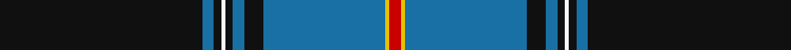

In pattern [KBKWKBKBYR](/stripes/kbkwkbkbyr/).

This was sourced from tartans-authority.  It is a [10 stripe tartan](/stripes/stripes10/).

Original link http://www.tartansauthority.com/tartan-ferret/display/6777/

## Thread count
K/106 B6 K4 W2 K4 B6 K10 B64 Y2 R/6

## Palette
Each colour and the base-6 reference it is a variant of.

| Colour | Shade | Base |
|---|---|---|
| B | <code style="background-color:#1870A4;">#1870A4</code> `oklch(52.2% 0.113 241.2)` <small>#1870A4</small> | B <code style="background-color:#2A418A;">#2A418A</code> |
| K | <code style="background-color:#101010;">#101010</code> `oklch(17.3% 0.000 89.9)` <small>#101010</small> | K <code style="background-color:#000000;">#000000</code> |
| R | <code style="background-color:#C80000;">#C80000</code> `oklch(52.3% 0.215 29.2)` <small>#C80000</small> | R <code style="background-color:#CC0000;">#CC0000</code> |
| W | <code style="background-color:#F8F8F8;">#F8F8F8</code> `oklch(97.9% 0.000 89.9)` <small>#F8F8F8</small> | W <code style="background-color:#F7F7F7;">#F7F7F7</code> |
| Y | <code style="background-color:#E8C000;">#E8C000</code> `oklch(81.9% 0.168 93.7)` <small>#E8C000</small> | Y <code style="background-color:#F2BF00;">#F2BF00</code> |

## Nearest tartans

The nearest existing variants by ΔTartan distance.

1. [Park](/setts/s10/db62r1db2r1db4k14g4k2g6k4~x2/) — ΔT 1.02
1. [Parr](/setts/s10/db62r1db2r1db4k14g4w2g6k4~x2/) — ΔT 1.03
1. [Marsa Scout Group](/setts/s11/r4k1db8k1r2k44g8k1ly2k1g4~x2/) — ΔT 1.09
1. [Marsa Scout Group](/setts/s11/r4k1k1db8r2k44g8k1ly2k1g4~x2/) — ΔT 1.21
1. [Italian American](/setts/s9/r4k2w6k2db40k80dg10w6r3/) — ΔT 1.24
1. [Italian American (Corporate)](/setts/s9/r4k2w6k2b40k80g10w6r3/) — ΔT 1.30
1. [Skye](/setts/s11/db45k10y2k2ly2k2y10db5k1db5ly1~x2/) — ΔT 1.31
1. [Llewellyn (Welsh Name)](/setts/s9/k74o4k7o4k9o40k2o4k2/) — ΔT 1.32
1. [MacLaurin, of Brioch](/setts/s7/db36k10g3r3g6k1ly2~x2/) — ΔT 1.32
1. [Cumnock](/setts/s8/g3db16k3p2k45r1k2lo3~x2/) — ΔT 1.33

## Neighbour map

Every grey dot is one of 14299 variants placed by the first two principal components of the ΔTartan feature space (44% of its variance). Red is this tartan; blue dots are its nearest — click one to open its page.

<svg viewBox="0 0 640 380" role="img" style="max-width:100%;height:auto;border:1px solid #e0e0e0;border-radius:4px;display:block" xmlns="http://www.w3.org/2000/svg"><image href="/nn/cloud.v1.png" width="640" height="380"/><a href="/setts/s10/db62r1db2r1db4k14g4k2g6k4~x2/"><circle cx="458.0" cy="82.1" r="4" fill="#3465a4"><title>Park</title></circle></a><a href="/setts/s10/db62r1db2r1db4k14g4w2g6k4~x2/"><circle cx="451.4" cy="78.0" r="4" fill="#3465a4"><title>Parr</title></circle></a><a href="/setts/s11/r4k1db8k1r2k44g8k1ly2k1g4~x2/"><circle cx="399.7" cy="73.6" r="4" fill="#3465a4"><title>Marsa Scout Group</title></circle></a><a href="/setts/s11/r4k1k1db8r2k44g8k1ly2k1g4~x2/"><circle cx="421.0" cy="84.2" r="4" fill="#3465a4"><title>Marsa Scout Group</title></circle></a><a href="/setts/s9/r4k2w6k2db40k80dg10w6r3/"><circle cx="341.6" cy="97.0" r="4" fill="#3465a4"><title>Italian American</title></circle></a><a href="/setts/s9/r4k2w6k2b40k80g10w6r3/"><circle cx="328.8" cy="88.7" r="4" fill="#3465a4"><title>Italian American (Corporate)</title></circle></a><a href="/setts/s11/db45k10y2k2ly2k2y10db5k1db5ly1~x2/"><circle cx="429.8" cy="96.0" r="4" fill="#3465a4"><title>Skye</title></circle></a><a href="/setts/s9/k74o4k7o4k9o40k2o4k2/"><circle cx="422.9" cy="116.1" r="4" fill="#3465a4"><title>Llewellyn (Welsh Name)</title></circle></a><a href="/setts/s7/db36k10g3r3g6k1ly2~x2/"><circle cx="353.3" cy="115.7" r="4" fill="#3465a4"><title>MacLaurin, of Brioch</title></circle></a><a href="/setts/s8/g3db16k3p2k45r1k2lo3~x2/"><circle cx="415.7" cy="86.4" r="4" fill="#3465a4"><title>Cumnock</title></circle></a><circle cx="409.6" cy="86.1" r="5" fill="#c00000"/></svg>

ID: /setts/s10/k53b3k2w1k2b3k5b32ly1r3~x2/
