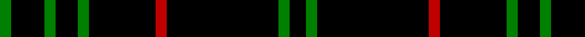

In pattern [GKGKGKRKGK](/patterns/gkgkgkrkgk/).

This was sourced from weddslist.  It is a [10 stripes tartan](/stripes/stripes10/).

Original link http://www.weddslist.com/cgi-bin/tartans/pg.pl?source=sts

## Thread count
G/4 K12 G4 K8 G4 K24 R4 K40 G4 K/6

## Palette
Each colour and its ΔE from the base-6 reference it is a variant of.

| Colour | Shade | Base | ΔE (OKLab) |
|---|---|---|---|
| G | <code style="background-color:#008000;">#008000</code> `#008000` | G <code style="background-color:#006100;">#006100</code> | 0.10 |
| K | <code style="background-color:#000000;">#000000</code> `#000000` | K <code style="background-color:#000000;">#000000</code> | 0.00 |
| R | <code style="background-color:#C00000;">#C00000</code> `#C00000` | R <code style="background-color:#CC0000;">#CC0000</code> | 0.03 |

## Nearest tartans

The nearest existing variants by ΔTartan distance.

1. [Unidentified 11](/setts/s7/k24g3r3k24r2k2r2-g008000-k000000-rc00000/) — ΔT 1.05
1. [Justus](/setts/s6/k96y12k12r12k48b12-b304080-k000000-rc00000-yf0c000/) — ΔT 1.58
1. [Hebridean 7](/setts/s14/b4k20r4g4r4k20r4k20r2k4r2k20r2k4-b304080-g008000-k000000-rc00000/) — ΔT 1.59
1. [Stewart Mourning](/setts/s11/k68g11k16g4k4g4k4g19k14w4k14-g808080-k000000-we0e0e0/) — ΔT 1.73
1. [Gwynn](/setts/s8/k90y8k8y18k8y8k90r8-k101010-rc80000-ye8c000/) — ΔT 1.75
1. [Hebridean 6](/setts/s18/b4k20r4g4r4k20r4k20r2k4r2k20r2k4r2k20r2k4-b304080-g003000-k000000-rc00000/) — ΔT 1.78
1. [St. Mirren Football Club (Sports)](/setts/s9/k14w4k42r4k68w10k6w4k14-k101010-rc80000-wfcfcfc/) — ΔT 2.03
1. [Aberdeen-Angus Cattle Society (Corp)](/setts/s8/g16y6k120g6k6g6k6g8-g247800-k000000-ybc8c00/) — ΔT 2.05
1. [Unidentified #45](/setts/s7/k24g3r3k24r2k2r2-g005020-k101010-rdc0000/) — ΔT 2.05
1. [GOLF (Wonderland Publications) Corporate Tartan Tartan Number: 10698. Earliest known date: 13 September 2012 This tartan was created for the designers’ limited edition publication, GOLF, a registered trademark of Wonderland Publications, a division of Bad Halo Ltd. The tartan is intended to capture the soul and the spirit of the book - and the game. See products available Copyright © Blair Urquhart, Comrie, 2015](/setts/s9/k20b6k12g2k12g2k12g4k12-baa00ff-g008b00-k101010/) — ΔT 2.08

## Neighbour map

Every grey dot is one of 15726 variants placed by the first two principal components of the ΔTartan feature space (44% of its variance). Red is this tartan; blue dots are its nearest — click one to open its page.

<svg viewBox="0 0 640 380" role="img" style="max-width:100%;height:auto;border:1px solid #e0e0e0;border-radius:4px;display:block" xmlns="http://www.w3.org/2000/svg"><image href="/nn/cloud.v1.png" width="640" height="380"/><a href="/setts/s7/k24g3r3k24r2k2r2-g008000-k000000-rc00000/"><circle cx="548.8" cy="217.5" r="4" fill="#3465a4"><title>Unidentified 11</title></circle></a><a href="/setts/s6/k96y12k12r12k48b12-b304080-k000000-rc00000-yf0c000/"><circle cx="472.2" cy="225.3" r="4" fill="#3465a4"><title>Justus</title></circle></a><a href="/setts/s14/b4k20r4g4r4k20r4k20r2k4r2k20r2k4-b304080-g008000-k000000-rc00000/"><circle cx="436.2" cy="185.5" r="4" fill="#3465a4"><title>Hebridean 7</title></circle></a><a href="/setts/s11/k68g11k16g4k4g4k4g19k14w4k14-g808080-k000000-we0e0e0/"><circle cx="456.3" cy="167.0" r="4" fill="#3465a4"><title>Stewart Mourning</title></circle></a><a href="/setts/s8/k90y8k8y18k8y8k90r8-k101010-rc80000-ye8c000/"><circle cx="517.1" cy="196.4" r="4" fill="#3465a4"><title>Gwynn</title></circle></a><a href="/setts/s18/b4k20r4g4r4k20r4k20r2k4r2k20r2k4r2k20r2k4-b304080-g003000-k000000-rc00000/"><circle cx="455.7" cy="176.8" r="4" fill="#3465a4"><title>Hebridean 6</title></circle></a><a href="/setts/s9/k14w4k42r4k68w10k6w4k14-k101010-rc80000-wfcfcfc/"><circle cx="560.1" cy="181.5" r="4" fill="#3465a4"><title>St. Mirren Football Club (Sports)</title></circle></a><a href="/setts/s8/g16y6k120g6k6g6k6g8-g247800-k000000-ybc8c00/"><circle cx="513.4" cy="159.3" r="4" fill="#3465a4"><title>Aberdeen-Angus Cattle Society (Corp)</title></circle></a><a href="/setts/s7/k24g3r3k24r2k2r2-g005020-k101010-rdc0000/"><circle cx="578.7" cy="222.7" r="4" fill="#3465a4"><title>Unidentified #45</title></circle></a><a href="/setts/s9/k20b6k12g2k12g2k12g4k12-baa00ff-g008b00-k101010/"><circle cx="497.9" cy="254.4" r="4" fill="#3465a4"><title>GOLF (Wonderland Publications) Corporate Tartan Tartan Number: 10698. Earliest known date: 13 September 2012 This tartan was created for the designers’ limited edition publication, GOLF, a registered trademark of Wonderland Publications, a division of Bad Halo Ltd. The tartan is intended to capture the soul and the spirit of the book - and the game. See products available Copyright © Blair Urquhart, Comrie, 2015</title></circle></a><circle cx="508.5" cy="216.4" r="5" fill="#c00000"/></svg>

ID: /setts/s10/k6g4k40r4k24g4k8g4k12g4-g008000-k000000-rc00000/
