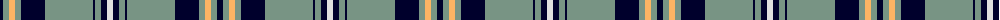

In pattern [KGYGKGKGKW](/patterns/kgygkgkgkw/).

This was sourced from tartans-authority.  It is a [10 stripes tartan](/stripes/stripes10/).

Original link http://www.tartansauthority.com/tartan-ferret/display/8460/

## Thread count
DB/6 LG6 LGa6 LG6 DB24 LG48 DB2 LG6 DB6 LN/6

## Palette
Each colour and its ΔE from the base-6 reference it is a variant of.

| Colour | Shade | Base | ΔE (OKLab) |
|---|---|---|---|
| DB | <code style="background-color:#00002C;">#00002C</code> `#00002C` | K <code style="background-color:#000000;">#000000</code> | 0.16 |
| LG | <code style="background-color:#789484;">#789484</code> `#789484` | G <code style="background-color:#006400;">#006400</code> | 0.23 |
| LGa | <code style="background-color:#FCB464;">#FCB464</code> `#FCB464` | Y <code style="background-color:#E8C000;">#E8C000</code> | 0.08 |
| LN | <code style="background-color:#E0E0E0;">#E0E0E0</code> `#E0E0E0` | W <code style="background-color:#F4F4F0;">#F4F4F0</code> | 0.06 |

ID: /setts/s10/k6g6y6g6k24g48k2g6k6w6-g789484-k00002c-we0e0e0-yfcb464/
