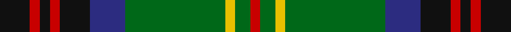

In pattern [KRKRKBGYGR](/stripes/krkrkbgygr/).

This was sourced from tartans-authority.  It is a [10 stripe tartan](/stripes/stripes10/).

Original link http://www.tartansauthority.com/tartan-ferret/display/7357/

## Attestations

This cloth appears in 2 source records; the oldest owns this page.

- pre 2007 — Connolly Hunting (Name) (tartans-authority, [record](http://www.tartansauthority.com/tartan-ferret/display/7357/))
- undated — Connolly Hunting (register-of-tartans, [record](https://www.tartanregister.gov.uk/tartanDetails.aspx?ref=4929))

## Register references

External register numbers recorded for this tartan.

- Scottish Register of Tartans: [4929](https://www.tartanregister.gov.uk/tartanDetails.aspx?ref=4929)
- Scottish Tartans Authority (ITI): 7357
- Scottish Tartans World Register: 3051

## Thread count
K/12 R4 K4 R4 K12 DB14 G40 Y4 G6 R/4

## Palette
Each colour and the base-6 reference it is a variant of.

| Colour | Shade | Base |
|---|---|---|
| DB | <code style="background-color:#2C2C80;">#2C2C80</code> `oklch(35.0% 0.138 276.6)` <small>#2C2C80</small> | B <code style="background-color:#2A418A;">#2A418A</code> |
| G | <code style="background-color:#006818;">#006818</code> `oklch(45.0% 0.142 145.0)` <small>#006818</small> | G <code style="background-color:#006100;">#006100</code> |
| K | <code style="background-color:#101010;">#101010</code> `oklch(17.3% 0.000 89.9)` <small>#101010</small> | K <code style="background-color:#000000;">#000000</code> |
| R | <code style="background-color:#C80000;">#C80000</code> `oklch(52.3% 0.215 29.2)` <small>#C80000</small> | R <code style="background-color:#CC0000;">#CC0000</code> |
| Y | <code style="background-color:#E8C000;">#E8C000</code> `oklch(81.9% 0.168 93.7)` <small>#E8C000</small> | Y <code style="background-color:#F2BF00;">#F2BF00</code> |

## Nearest tartans

The nearest existing variants by ΔTartan distance, with this tartan at the top so the swatches line up against it.

ΔTartan

Tartan

Sett

—

<a href="/ttd/edit/#slug=k6r2k2r2k6db7g20ly2g3r2~x2">Connolly Hunting (Name)</a> <a class="nn-out" href="/setts/s10/k6r2k2r2k6db7g20ly2g3r2~x2/" title="open its dictionary page">↗</a>

0.79

<a href="/ttd/edit/#slug=g23r3k9r3db18r3k9r3g23ly3~x2">Royal College of Physicians Corporate Tartan Tartan Number: 2350. Earliest known date: September 1996 Full name is Royal College of Physicians, Edinburgh. Designed for the Royal College of Physicians (founded in 1681 for post graduate students), by Donald Fraser Weavers as a corporate tartan. Woven by Lochcarron, May 1997. Silk sample in STA Johnston Collection. See products available Copyright © Blair Urquhart, Comrie, 2015</a> <a class="nn-out" href="/setts/s10/g23r3k9r3db18r3k9r3g23ly3~x2/" title="open its dictionary page">↗</a>

0.86

<a href="/ttd/edit/#slug=g6k2g24k10dt2p2dt2p2dt10k2lb3~x2">Scottish Rugby Union (City of Nagasaki)</a> <a class="nn-out" href="/setts/s11/g6k2g24k10dt2p2dt2p2dt10k2lb3~x2/" title="open its dictionary page">↗</a>

0.89

<a href="/ttd/edit/#slug=dg22r4dg2r2dg2r4dg12k12r2db10r4db4ly3~x2">Cochrane (1974)</a> <a class="nn-out" href="/setts/s13/dg22r4dg2r2dg2r4dg12k12r2db10r4db4ly3~x2/" title="open its dictionary page">↗</a>

0.91

<a href="/ttd/edit/#slug=g3n5k4n33g12k4w2k18lo3~x2">Smoke Showing (UFES)</a> <a class="nn-out" href="/setts/s9/g3n5k4n33g12k4w2k18lo3~x2/" title="open its dictionary page">↗</a>

0.93

<a href="/ttd/edit/#slug=r4b11k3b3k3b4k15g36w3~x2">Semple (Name)</a> <a class="nn-out" href="/setts/s9/r4b11k3b3k3b4k15g36w3~x2/" title="open its dictionary page">↗</a>

0.93

<a href="/ttd/edit/#slug=dp3k2n6k2n2k18g13lb2g2k6dp2~x2">Dama Resort (Fashion)</a> <a class="nn-out" href="/setts/s11/dp3k2n6k2n2k18g13lb2g2k6dp2~x2/" title="open its dictionary page">↗</a>

0.94

<a href="/ttd/edit/#slug=w1r2g10r2g2k8g2db8g2r2g10r2w1~x2">Reid Family Tartan Tartan Number: 2066. Earliest known date: 1991 Designed for Mr. William Reid, President of DELCO Scottish games. See products available Copyright © Blair Urquhart, Comrie, 2015</a> <a class="nn-out" href="/setts/s13/w1r2g10r2g2k8g2db8g2r2g10r2w1~x2/" title="open its dictionary page">↗</a>

0.95

<a href="/ttd/edit/#slug=w1r2g10r2g2k8g2db8g2r2g10r2w1~x4">Reid, Green</a> <a class="nn-out" href="/setts/s13/w1r2g10r2g2k8g2db8g2r2g10r2w1~x4/" title="open its dictionary page">↗</a>

0.96

<a href="/ttd/edit/#slug=p3k2n6k2n2k18y13lb2y2k6p2~x2">Dama Resort</a> <a class="nn-out" href="/setts/s11/p3k2n6k2n2k18y13lb2y2k6p2~x2/" title="open its dictionary page">↗</a>

0.97

<a href="/ttd/edit/#slug=dy4k2lo3k2dy7k9g20k2t3k2g4~x2">Choinka Family (Personal)</a> <a class="nn-out" href="/setts/s11/dy4k2lo3k2dy7k9g20k2t3k2g4~x2/" title="open its dictionary page">↗</a>

## Neighbour map

Every grey dot is one of 14299 variants placed by the first two principal components of the ΔTartan feature space (44% of its variance). Red is this tartan; blue dots are its nearest — click one to open its page.

<svg viewBox="0 0 640 380" role="img" style="max-width:100%;height:auto;border:1px solid #e0e0e0;border-radius:4px;display:block" xmlns="http://www.w3.org/2000/svg"><image href="/nn/cloud.v1.png" width="640" height="380"/><a href="/setts/s10/g23r3k9r3db18r3k9r3g23ly3~x2/"><circle cx="201.2" cy="191.0" r="4" fill="#3465a4"><title>Royal College of Physicians Corporate Tartan Tartan Number: 2350. Earliest known date: September 1996 Full name is Royal College of Physicians, Edinburgh. Designed for the Royal College of Physicians (founded in 1681 for post graduate students), by Donald Fraser Weavers as a corporate tartan. Woven by Lochcarron, May 1997. Silk sample in STA Johnston Collection. See products available Copyright © Blair Urquhart, Comrie, 2015</title></circle></a><a href="/setts/s11/g6k2g24k10dt2p2dt2p2dt10k2lb3~x2/"><circle cx="235.3" cy="160.4" r="4" fill="#3465a4"><title>Scottish Rugby Union (City of Nagasaki)</title></circle></a><a href="/setts/s13/dg22r4dg2r2dg2r4dg12k12r2db10r4db4ly3~x2/"><circle cx="209.1" cy="158.7" r="4" fill="#3465a4"><title>Cochrane (1974)</title></circle></a><a href="/setts/s9/g3n5k4n33g12k4w2k18lo3~x2/"><circle cx="240.3" cy="148.3" r="4" fill="#3465a4"><title>Smoke Showing (UFES)</title></circle></a><a href="/setts/s9/r4b11k3b3k3b4k15g36w3~x2/"><circle cx="215.9" cy="155.2" r="4" fill="#3465a4"><title>Semple (Name)</title></circle></a><a href="/setts/s11/dp3k2n6k2n2k18g13lb2g2k6dp2~x2/"><circle cx="233.2" cy="176.5" r="4" fill="#3465a4"><title>Dama Resort (Fashion)</title></circle></a><a href="/setts/s13/w1r2g10r2g2k8g2db8g2r2g10r2w1~x2/"><circle cx="214.4" cy="165.1" r="4" fill="#3465a4"><title>Reid Family Tartan Tartan Number: 2066. Earliest known date: 1991 Designed for Mr. William Reid, President of DELCO Scottish games. See products available Copyright © Blair Urquhart, Comrie, 2015</title></circle></a><a href="/setts/s13/w1r2g10r2g2k8g2db8g2r2g10r2w1~x4/"><circle cx="208.8" cy="162.8" r="4" fill="#3465a4"><title>Reid, Green</title></circle></a><a href="/setts/s11/p3k2n6k2n2k18y13lb2y2k6p2~x2/"><circle cx="230.2" cy="171.5" r="4" fill="#3465a4"><title>Dama Resort</title></circle></a><a href="/setts/s11/dy4k2lo3k2dy7k9g20k2t3k2g4~x2/"><circle cx="212.1" cy="177.5" r="4" fill="#3465a4"><title>Choinka Family (Personal)</title></circle></a><circle cx="207.7" cy="165.5" r="5" fill="#c00000"/></svg>

ID: /setts/s10/k6r2k2r2k6db7g20ly2g3r2~x2/
