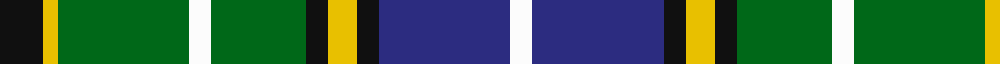

In pattern [KYGWGKYKBW](/patterns/kygwgkykbw/).

This was sourced from register-of-tartans.  It is a [10 stripes tartan](/stripes/stripes10/).

Original link https://www.tartanregister.gov.uk/tartanDetails.aspx?ref=5106

## Register references

External register numbers recorded for this tartan.

- Scottish Register of Tartans: [5106](https://www.tartanregister.gov.uk/tartanDetails.aspx?ref=5106)
- Scottish Tartans Authority (ITI): 3215

## Thread count
K/12 Y4 G36 W6 G26 K6 Y8 K6 DB36 W/6

## Palette
Each colour and its ΔE from the base-6 reference it is a variant of.

| Colour | Shade | Base | ΔE (OKLab) |
|---|---|---|---|
| DB | <code style="background-color:#2C2C80;">#2C2C80</code> `#2C2C80` | B <code style="background-color:#2A418A;">#2A418A</code> | 0.06 |
| G | <code style="background-color:#006818;">#006818</code> `#006818` | G <code style="background-color:#006100;">#006100</code> | 0.02 |
| K | <code style="background-color:#101010;">#101010</code> `#101010` | K <code style="background-color:#000000;">#000000</code> | 0.17 |
| W | <code style="background-color:#FCFCFC;">#FCFCFC</code> `#FCFCFC` | W <code style="background-color:#F7F7F7;">#F7F7F7</code> | 0.01 |
| Y | <code style="background-color:#E8C000;">#E8C000</code> `#E8C000` | Y <code style="background-color:#F2BF00;">#F2BF00</code> | 0.02 |

## Nearest tartans

The nearest existing variants by ΔTartan distance.

1. [Antrim Irish County Tartan Tartan Number: 2282. Earliest known date: 1993 One of a series of Irish District tartans designed by Polly Wittering of the House of Edgar, with colours reminiscent of the Country with soft warm colours dominating. See products available Copyright © Blair Urquhart, Comrie, 2015](/setts/s10/g5b2g17y2ba5y2r5ba17g2y4~b043c48-ba101448-g4c9864-rb03000-yf4bc3c~x2/) — ΔT 0.70
1. [Wellecomme, Bernard (Personal)](/setts/s10/b4g8k8b4y3g21k3w4k3w4~b000080-g004c00-k1c1714-we8ccb8-yffff00~x2/) — ΔT 0.72
1. [Allon/Allan](/setts/s10/g8w1g1r1g4k4b8k1b1k1~b304080-g008000-k000000-rc00000-we0e0e0~x2/) — ΔT 0.75
1. [MacMillan, hunting](/setts/s10/b3y1b12k4y2k4g8r2g8r1~b304080-g008000-k000000-rc00000-yf0c000~x2/) — ΔT 0.87
1. [Unidentified #46](/setts/s9/w16g2k5r2k10g11y2g11k2~g005020-k101010-rdc0000-we0e0e0-ye8c000~x2/) — ΔT 0.88
1. [Ayrshire](/setts/s8/b2r1b10w1g4ga8ga1ga2~b1c0070-g785000-ga30ac38-r880000-we0e0e0~x4/) — ΔT 0.90
1. [MacMillan, hunting](/setts/s9/b10y3b30y5k8g16r4g16r2~b304080-g008000-k000000-rd03030-yf0c000~x2/) — ΔT 0.93
1. [MacInnes Dress (Dalgliesh)](/setts/s12/g4w24g3k3g3k3g24w4k4b24g16r4~b2c2c80-g006818-k101010-rc80000-wf8f8f8/) — ΔT 0.94
1. [Lotus Elan (Corporate)](/setts/s13/k3y4k3y4k3g16k16w3b16k2w2k2y2~b2474e8-g289c18-k101010-we0e0e0-yfccc00~x2/) — ΔT 0.98
1. [Wilson's No.111](/setts/s8/b19w2g12ba3k4ba3g12w2~b440044-ba5c8ca8-g006818-k101010-we0e0e0~x2/) — ΔT 1.01

## Neighbour map

Every grey dot is one of 15726 variants placed by the first two principal components of the ΔTartan feature space (44% of its variance). Red is this tartan; blue dots are its nearest — click one to open its page.

<svg viewBox="0 0 640 380" role="img" style="max-width:100%;height:auto;border:1px solid #e0e0e0;border-radius:4px;display:block" xmlns="http://www.w3.org/2000/svg"><image href="/nn/cloud.v1.png" width="640" height="380"/><a href="/setts/s10/g5b2g17y2ba5y2r5ba17g2y4~b043c48-ba101448-g4c9864-rb03000-yf4bc3c~x2/"><circle cx="153.0" cy="161.4" r="4" fill="#3465a4"><title>Antrim Irish County Tartan Tartan Number: 2282. Earliest known date: 1993 One of a series of Irish District tartans designed by Polly Wittering of the House of Edgar, with colours reminiscent of the Country with soft warm colours dominating. See products available Copyright © Blair Urquhart, Comrie, 2015</title></circle></a><a href="/setts/s10/b4g8k8b4y3g21k3w4k3w4~b000080-g004c00-k1c1714-we8ccb8-yffff00~x2/"><circle cx="159.8" cy="179.5" r="4" fill="#3465a4"><title>Wellecomme, Bernard (Personal)</title></circle></a><a href="/setts/s10/g8w1g1r1g4k4b8k1b1k1~b304080-g008000-k000000-rc00000-we0e0e0~x2/"><circle cx="164.5" cy="171.6" r="4" fill="#3465a4"><title>Allon/Allan</title></circle></a><a href="/setts/s10/b3y1b12k4y2k4g8r2g8r1~b304080-g008000-k000000-rc00000-yf0c000~x2/"><circle cx="127.9" cy="164.4" r="4" fill="#3465a4"><title>MacMillan, hunting</title></circle></a><a href="/setts/s9/w16g2k5r2k10g11y2g11k2~g005020-k101010-rdc0000-we0e0e0-ye8c000~x2/"><circle cx="121.5" cy="177.7" r="4" fill="#3465a4"><title>Unidentified #46</title></circle></a><a href="/setts/s8/b2r1b10w1g4ga8ga1ga2~b1c0070-g785000-ga30ac38-r880000-we0e0e0~x4/"><circle cx="174.0" cy="169.9" r="4" fill="#3465a4"><title>Ayrshire</title></circle></a><a href="/setts/s9/b10y3b30y5k8g16r4g16r2~b304080-g008000-k000000-rd03030-yf0c000~x2/"><circle cx="185.7" cy="160.6" r="4" fill="#3465a4"><title>MacMillan, hunting</title></circle></a><a href="/setts/s12/g4w24g3k3g3k3g24w4k4b24g16r4~b2c2c80-g006818-k101010-rc80000-wf8f8f8/"><circle cx="137.5" cy="148.3" r="4" fill="#3465a4"><title>MacInnes Dress (Dalgliesh)</title></circle></a><a href="/setts/s13/k3y4k3y4k3g16k16w3b16k2w2k2y2~b2474e8-g289c18-k101010-we0e0e0-yfccc00~x2/"><circle cx="105.7" cy="141.9" r="4" fill="#3465a4"><title>Lotus Elan (Corporate)</title></circle></a><a href="/setts/s8/b19w2g12ba3k4ba3g12w2~b440044-ba5c8ca8-g006818-k101010-we0e0e0~x2/"><circle cx="180.3" cy="182.0" r="4" fill="#3465a4"><title>Wilson's No.111</title></circle></a><circle cx="144.4" cy="167.7" r="5" fill="#c00000"/></svg>

ID: /setts/s10/k6y2g18w3g13k3y4k3b18w3~b2c2c80-g006818-k101010-wfcfcfc-ye8c000~x2/
