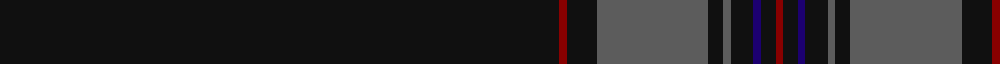

In pattern [KRKBKBKBKR](/stripes/krkbkbkbkr/).

This was sourced from tartans-authority.  It is a [10 stripe tartan](/stripes/stripes10/).

Original link http://www.tartansauthority.com/tartan-ferret/display/8058/

## Thread count
K/150 DR2 K8 N30 K4 N2 K6 DB2 K4 DR/2

## Palette
Each colour and its ΔE from the base-6 reference it is a variant of.

| Colour | Shade | Base | ΔE (OKLab) |
|---|---|---|---|
| DB | <code style="background-color:#1C0070;">#1C0070</code> `#1C0070` | B <code style="background-color:#2A418A;">#2A418A</code> | 0.14 |
| DR | <code style="background-color:#880000;">#880000</code> `#880000` | R <code style="background-color:#CC0000;">#CC0000</code> | 0.15 |
| K | <code style="background-color:#101010;">#101010</code> `#101010` | K <code style="background-color:#000000;">#000000</code> | 0.17 |
| N | <code style="background-color:#5C5C5C;">#5C5C5C</code> `#5C5C5C` | B <code style="background-color:#2A418A;">#2A418A</code> | 0.15 |

## Nearest tartans

The nearest existing variants by ΔTartan distance.

1. [Laird (Restricted)](/setts/s9/k75g2k4dp10db1dp4db1dp4k4~x2/) — ΔT 0.83
1. [Scotland's Lionheart](/setts/s9/k78y16k2n2k2y2k3r2k10~x2/) — ΔT 0.97
1. [Grassi (2009)](/setts/s14/k70n2k3n12k1o3k1n12k3n2k60o2n2dp3~x2/) — ΔT 1.05
1. [Clan Inebriated (Corporate)](/setts/s9/k75dp6o2k2o2dp6k12db2o2~x2/) — ΔT 1.11
1. [Webster, Colin Wesley (Personal)](/setts/s10/k100dp5k4dp3k2y1k2dp2k4dp5~x2/) — ΔT 1.49
1. [CI (Corporate)](/setts/s9/k100dp8o4k4o4dp8k25db10o4/) — ΔT 1.74
1. [Grassi (Personal)](/setts/s9/dp3n2o2k60n2k3n12k1o3~x2/) — ΔT 1.97
1. [Racing Stewart, Stealth (Corporate)](/setts/s10/k86n5k5n3k3n3k3dy11dr11n4~x2/) — ΔT 1.98
1. [Edinburgh Castle (Corporate?)](/setts/s13/r2k4r2k22n1k3n1k3n1k22ly1k8r1~x2/) — ΔT 2.02
1. [Magdalene](/setts/s9/ly2k4ly1k4r5k50y1k2r1~x2/) — ΔT 2.20

## Neighbour map

Every grey dot is one of 14299 variants placed by the first two principal components of the ΔTartan feature space (44% of its variance). Red is this tartan; blue dots are its nearest — click one to open its page.

<svg viewBox="0 0 640 380" role="img" style="max-width:100%;height:auto;border:1px solid #e0e0e0;border-radius:4px;display:block" xmlns="http://www.w3.org/2000/svg"><image href="/nn/cloud.v1.png" width="640" height="380"/><a href="/setts/s9/k75g2k4dp10db1dp4db1dp4k4~x2/"><circle cx="626.0" cy="131.8" r="4" fill="#3465a4"><title>Laird (Restricted)</title></circle></a><a href="/setts/s9/k78y16k2n2k2y2k3r2k10~x2/"><circle cx="626.0" cy="137.9" r="4" fill="#3465a4"><title>Scotland's Lionheart</title></circle></a><a href="/setts/s14/k70n2k3n12k1o3k1n12k3n2k60o2n2dp3~x2/"><circle cx="618.7" cy="121.1" r="4" fill="#3465a4"><title>Grassi (2009)</title></circle></a><a href="/setts/s9/k75dp6o2k2o2dp6k12db2o2~x2/"><circle cx="626.0" cy="135.9" r="4" fill="#3465a4"><title>Clan Inebriated (Corporate)</title></circle></a><a href="/setts/s10/k100dp5k4dp3k2y1k2dp2k4dp5~x2/"><circle cx="626.0" cy="148.4" r="4" fill="#3465a4"><title>Webster, Colin Wesley (Personal)</title></circle></a><a href="/setts/s9/k100dp8o4k4o4dp8k25db10o4/"><circle cx="587.5" cy="172.9" r="4" fill="#3465a4"><title>CI (Corporate)</title></circle></a><a href="/setts/s9/dp3n2o2k60n2k3n12k1o3~x2/"><circle cx="552.5" cy="115.5" r="4" fill="#3465a4"><title>Grassi (Personal)</title></circle></a><a href="/setts/s10/k86n5k5n3k3n3k3dy11dr11n4~x2/"><circle cx="568.0" cy="155.6" r="4" fill="#3465a4"><title>Racing Stewart, Stealth (Corporate)</title></circle></a><a href="/setts/s13/r2k4r2k22n1k3n1k3n1k22ly1k8r1~x2/"><circle cx="626.0" cy="173.0" r="4" fill="#3465a4"><title>Edinburgh Castle (Corporate?)</title></circle></a><a href="/setts/s9/ly2k4ly1k4r5k50y1k2r1~x2/"><circle cx="626.0" cy="106.6" r="4" fill="#3465a4"><title>Magdalene</title></circle></a><circle cx="626.0" cy="128.3" r="5" fill="#c00000"/></svg>

ID: /setts/s10/k75r1k4n15k2n1k3db1k2r1~x2/
