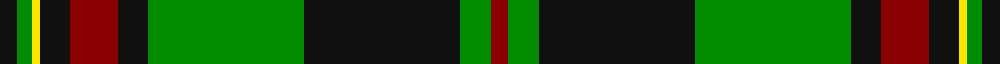

In pattern [KGYKRKGKGR](/stripes/kgykrkgkgr/).

This was sourced from register-of-tartans.  It is a [10 stripe tartan](/stripes/stripes10/).

Original link https://www.tartanregister.gov.uk/tartanDetails.aspx?ref=10555

## Attestations

This cloth appears in 2 source records; the oldest owns this page.

- 16/01/2012 — Danareth (register-of-tartans, [record](https://www.tartanregister.gov.uk/tartanDetails.aspx?ref=10555))
- 16th Jan. 2012 — Danareth (Corporate) (tartans-authority, [record](http://www.tartansauthority.com/tartan-ferret/display/10555/))

## Register references

External register numbers recorded for this tartan.

- Scottish Register of Tartans: [10555](https://www.tartanregister.gov.uk/tartanDetails.aspx?ref=10555)

## Thread count
K/7 G6 Y3 K12 DR19 K12 G62 K62 G12 DR/7

## Palette
Each colour and the base-6 reference it is a variant of.

| Colour | Shade | Base |
|---|---|---|
| DR | <code style="background-color:#8B0000;">#8B0000</code> `oklch(40.0% 0.164 29.2)` <small>#8B0000</small> | R <code style="background-color:#CC0000;">#CC0000</code> |
| G | <code style="background-color:#008B00;">#008B00</code> `oklch(55.2% 0.188 142.5)` <small>#008B00</small> | G <code style="background-color:#006100;">#006100</code> |
| K | <code style="background-color:#101010;">#101010</code> `oklch(17.3% 0.000 89.9)` <small>#101010</small> | K <code style="background-color:#000000;">#000000</code> |
| Y | <code style="background-color:#FFE600;">#FFE600</code> `oklch(91.7% 0.192 101.4)` <small>#FFE600</small> | Y <code style="background-color:#F2BF00;">#F2BF00</code> |

## Nearest tartans

The nearest existing variants by ΔTartan distance.

1. [MacHardy (Clans Originaux)](/setts/s8/g4r4k12w2k12g32r4k3~x2/) — ΔT 0.80
1. [MacMillan Ancient (a)](/setts/s12/dg2k1dg18k1dg2k1dr12dg4ly6k1ly6k1~x2/) — ΔT 0.89
1. [MacMillan Ancient](/setts/s12/dg2k1dg18k1dg2k1dr12dg4ly6k1ly6k1/) — ΔT 0.89
1. [Kiernan](/setts/s10/w2g4k6r2k2r2k3r2g20w1~x2/) — ΔT 1.11
1. [Sin-Cos (Corporate)](/setts/s10/k60g64dg5g8dg5g64k60ly8k8ly8/) — ΔT 1.14
1. [Valdres, Kvam & Vang #2](/setts/s11/k4w1r4k2g2r3k2g20r2k2r2~x2/) — ΔT 1.14
1. [Bomb Disposal](/setts/s10/k28r3ly2r3k13g28w1g3w1g16~x2/) — ΔT 1.19
1. [MacDiarmid (Clan)](/setts/s9/k12r2k28g12k1w3k1g12r4~x2/) — ΔT 1.27
1. [John Telfar, Dunbar hunting](/setts/s7/g5k2g28k10o26db4g4~x2/) — ΔT 1.32
1. [Georgia, State of](/setts/s8/g36k2g2k2g3k12t10r20~x2/) — ΔT 1.34

## Neighbour map

Every grey dot is one of 14299 variants placed by the first two principal components of the ΔTartan feature space (44% of its variance). Red is this tartan; blue dots are its nearest — click one to open its page.

<svg viewBox="0 0 640 380" role="img" style="max-width:100%;height:auto;border:1px solid #e0e0e0;border-radius:4px;display:block" xmlns="http://www.w3.org/2000/svg"><image href="/nn/cloud.v1.png" width="640" height="380"/><a href="/setts/s8/g4r4k12w2k12g32r4k3~x2/"><circle cx="296.8" cy="176.4" r="4" fill="#3465a4"><title>MacHardy (Clans Originaux)</title></circle></a><a href="/setts/s12/dg2k1dg18k1dg2k1dr12dg4ly6k1ly6k1~x2/"><circle cx="261.4" cy="141.5" r="4" fill="#3465a4"><title>MacMillan Ancient (a)</title></circle></a><a href="/setts/s12/dg2k1dg18k1dg2k1dr12dg4ly6k1ly6k1/"><circle cx="261.4" cy="141.5" r="4" fill="#3465a4"><title>MacMillan Ancient</title></circle></a><a href="/setts/s10/w2g4k6r2k2r2k3r2g20w1~x2/"><circle cx="313.1" cy="136.3" r="4" fill="#3465a4"><title>Kiernan</title></circle></a><a href="/setts/s10/k60g64dg5g8dg5g64k60ly8k8ly8/"><circle cx="282.4" cy="189.9" r="4" fill="#3465a4"><title>Sin-Cos (Corporate)</title></circle></a><a href="/setts/s11/k4w1r4k2g2r3k2g20r2k2r2~x2/"><circle cx="306.5" cy="132.0" r="4" fill="#3465a4"><title>Valdres, Kvam &amp; Vang #2</title></circle></a><a href="/setts/s10/k28r3ly2r3k13g28w1g3w1g16~x2/"><circle cx="303.6" cy="136.8" r="4" fill="#3465a4"><title>Bomb Disposal</title></circle></a><a href="/setts/s9/k12r2k28g12k1w3k1g12r4~x2/"><circle cx="343.6" cy="152.9" r="4" fill="#3465a4"><title>MacDiarmid (Clan)</title></circle></a><a href="/setts/s7/g5k2g28k10o26db4g4~x2/"><circle cx="253.5" cy="190.9" r="4" fill="#3465a4"><title>John Telfar, Dunbar hunting</title></circle></a><a href="/setts/s8/g36k2g2k2g3k12t10r20~x2/"><circle cx="273.7" cy="165.5" r="4" fill="#3465a4"><title>Georgia, State of</title></circle></a><circle cx="277.9" cy="150.7" r="5" fill="#c00000"/></svg>

ID: /setts/s10/k7g6ly3k12r19k12g62k62g12r7/
