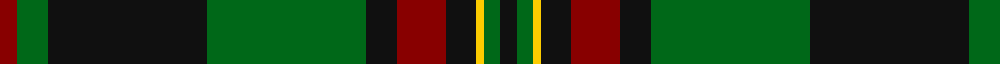

In pattern [KGYKRKGKGR](/patterns/kgykrkgkgr/).

This was sourced from tartans-authority.  It is a [10 stripes tartan](/stripes/stripes10/).

Original link http://www.tartansauthority.com/tartan-ferret/display/10555/

## Thread count
DR/7 G12 K62 G62 K12 DR19 K12 Y3 G6 K/7

## Palette
Each colour and its ΔE from the base-6 reference it is a variant of.

| Colour | Shade | Base | ΔE (OKLab) |
|---|---|---|---|
| DR | <code style="background-color:#880000;">#880000</code> `#880000` | R <code style="background-color:#CC0000;">#CC0000</code> | 0.15 |
| G | <code style="background-color:#006818;">#006818</code> `#006818` | G <code style="background-color:#006100;">#006100</code> | 0.02 |
| K | <code style="background-color:#101010;">#101010</code> `#101010` | K <code style="background-color:#000000;">#000000</code> | 0.17 |
| Y | <code style="background-color:#FCCC00;">#FCCC00</code> `#FCCC00` | Y <code style="background-color:#F2BF00;">#F2BF00</code> | 0.04 |

## Nearest tartans

The nearest existing variants by ΔTartan distance.

1. [MacHardy (Clans Originaux)](/setts/s8/g4r4k12w2k12g32r4k3~g006818-k101010-rc80000-we0e0e0~x2/) — ΔT 0.97
1. [Scottish Chieftain](/setts/s10/k19r1g3k2k3k2g2k2g20w2~g005020-k101010-rdc0000-we0e0e0~x2/) — ΔT 0.99
1. [Park](/setts/s12/g3r2g3r4g34k2g2k2g4k16b16r3~b2c2c80-g006818-k101010-rc80000~x2/) — ΔT 1.06
1. [Danareth](/setts/s10/k7g6y3k12r19k12g62k62g12r7~g008b00-k101010-r8b0000-yffe600/) — ΔT 1.10
1. [Glen Tilt #1](/setts/s10/w1b1g1b11ba6b1g14b1g1w1~b4c0000-ba1c0070-g006818-wc0c0c0~x4/) — ΔT 1.12
1. [Fort William](/setts/s11/g17b2y2b2k21b2k3g30k2b2k4~b5c8ca8-g5c6428-k101010-y9c9c00~x2/) — ΔT 1.13
1. [Sin-Cos (Corporate)](/setts/s10/k60g64ga5g8ga5g64k60y8k8y8~g006818-ga004c2c-k101010-ye8c000/) — ΔT 1.16
1. [Bomb Disposal](/setts/s10/k28r3y2r3k13g28w1g3w1g16~g006818-k101010-r880000-we0e0e0-ye8c000~x2/) — ΔT 1.17
1. [Bomb Disposal](/setts/s10/k28r3y2r3k13g28ka1g3ka1g16~g004c00-k101010-ka000000-rc80000-ye0a126~x2/) — ΔT 1.19
1. [MacDiarmid](/setts/s9/k12r2k28g12k1w3k1g12r4~g285800-k101010-rc80000-we0e0e0~x2/) — ΔT 1.20

## Neighbour map

Every grey dot is one of 15726 variants placed by the first two principal components of the ΔTartan feature space (44% of its variance). Red is this tartan; blue dots are its nearest — click one to open its page.

<svg viewBox="0 0 640 380" role="img" style="max-width:100%;height:auto;border:1px solid #e0e0e0;border-radius:4px;display:block" xmlns="http://www.w3.org/2000/svg"><image href="/nn/cloud.v1.png" width="640" height="380"/><a href="/setts/s8/g4r4k12w2k12g32r4k3~g006818-k101010-rc80000-we0e0e0~x2/"><circle cx="294.1" cy="175.9" r="4" fill="#3465a4"><title>MacHardy (Clans Originaux)</title></circle></a><a href="/setts/s10/k19r1g3k2k3k2g2k2g20w2~g005020-k101010-rdc0000-we0e0e0~x2/"><circle cx="358.5" cy="161.8" r="4" fill="#3465a4"><title>Scottish Chieftain</title></circle></a><a href="/setts/s12/g3r2g3r4g34k2g2k2g4k16b16r3~b2c2c80-g006818-k101010-rc80000~x2/"><circle cx="302.5" cy="148.7" r="4" fill="#3465a4"><title>Park</title></circle></a><a href="/setts/s10/k7g6y3k12r19k12g62k62g12r7~g008b00-k101010-r8b0000-yffe600/"><circle cx="274.9" cy="150.9" r="4" fill="#3465a4"><title>Danareth</title></circle></a><a href="/setts/s10/w1b1g1b11ba6b1g14b1g1w1~b4c0000-ba1c0070-g006818-wc0c0c0~x4/"><circle cx="265.0" cy="157.8" r="4" fill="#3465a4"><title>Glen Tilt #1</title></circle></a><a href="/setts/s11/g17b2y2b2k21b2k3g30k2b2k4~b5c8ca8-g5c6428-k101010-y9c9c00~x2/"><circle cx="337.8" cy="159.4" r="4" fill="#3465a4"><title>Fort William</title></circle></a><a href="/setts/s10/k60g64ga5g8ga5g64k60y8k8y8~g006818-ga004c2c-k101010-ye8c000/"><circle cx="279.3" cy="188.0" r="4" fill="#3465a4"><title>Sin-Cos (Corporate)</title></circle></a><a href="/setts/s10/k28r3y2r3k13g28w1g3w1g16~g006818-k101010-r880000-we0e0e0-ye8c000~x2/"><circle cx="300.7" cy="134.4" r="4" fill="#3465a4"><title>Bomb Disposal</title></circle></a><a href="/setts/s10/k28r3y2r3k13g28ka1g3ka1g16~g004c00-k101010-ka000000-rc80000-ye0a126~x2/"><circle cx="332.4" cy="147.8" r="4" fill="#3465a4"><title>Bomb Disposal</title></circle></a><a href="/setts/s9/k12r2k28g12k1w3k1g12r4~g285800-k101010-rc80000-we0e0e0~x2/"><circle cx="350.0" cy="157.6" r="4" fill="#3465a4"><title>MacDiarmid</title></circle></a><circle cx="306.1" cy="163.5" r="5" fill="#c00000"/></svg>

ID: /setts/s10/k7g6y3k12r19k12g62k62g12r7~g006818-k101010-r880000-yfccc00/
