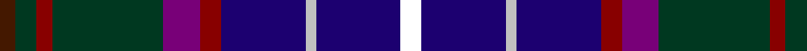

In pattern [BGRGBRBWBK](/patterns/bgrgbrbwbk/).

This was sourced from house-of-tartan.  It is a [10 stripes tartan](/stripes/stripes10/).

Original link http://www.house-of-tartan.scotland.net/house/TartanViewjs.asp?colr=Def&tnam=3184

## Thread count
DR/6 DG8 DRa6 DG42 P14 DRa8 DB32 N4 DB32 WR/8

## Palette
Each colour and its ΔE from the base-6 reference it is a variant of.

| Colour | Shade | Base | ΔE (OKLab) |
|---|---|---|---|
| DB | <code style="background-color:#1C0070;">#1C0070</code> `#1C0070` | B <code style="background-color:#2A418A;">#2A418A</code> | 0.14 |
| DG | <code style="background-color:#003820;">#003820</code> `#003820` | G <code style="background-color:#006100;">#006100</code> | 0.15 |
| DR | <code style="background-color:#441800;">#441800</code> `#441800` | B <code style="background-color:#2A418A;">#2A418A</code> | 0.23 |
| DRa | <code style="background-color:#880000;">#880000</code> `#880000` | R <code style="background-color:#CC0000;">#CC0000</code> | 0.15 |
| N | <code style="background-color:#C0C0C0;">#C0C0C0</code> `#C0C0C0` | W <code style="background-color:#F7F7F7;">#F7F7F7</code> | 0.17 |
| P | <code style="background-color:#780078;">#780078</code> `#780078` | B <code style="background-color:#2A418A;">#2A418A</code> | 0.17 |

## Nearest tartans

The nearest existing variants by ΔTartan distance.

1. [Scottish Lion (Corporate)](/setts/s10/b8ba32w4ba32r8bb14g42r6g8bc6-b680028-ba1c0070-bb780078-bc441800-g003820-r880000-wc0c0c0/) — ΔT 0.51
1. [Anne Arundel County](/setts/s8/g8b14ba66k18r4k18ra20rb8-b003c64-ba2c2c80-g006818-k101010-rb84c00-ra888888-rbc80000/) — ΔT 1.11
1. [Boxell of West Niddry, Baron (Personal)](/setts/s11/b54y4b4k24g12r4g24k24ba24ra4ba4-b440044-ba2c2c80-g006818-k101010-r9c68a4-rac80000-ye8c000/) — ΔT 1.18
1. [Robert Burns Legacy](/setts/s9/b10g42ba8bb8ba8k24ba8b71r10-b1c0070-ba2c2c80-bb2888c4-g006818-k101010-rc80000/) — ΔT 1.26
1. [Highfield Hunting (Name)](/setts/s11/b40k8g8r8g8k8ba8k8ga16k4gb8-b1c0070-ba441800-g006818-ga603800-gb8c7038-k101010-r880000/) — ΔT 1.27
1. [Churchill (Personal)](/setts/s11/b48k4ba8k4bb36k28bc8k8bc8y4ka8-b202060-ba5c8ca8-bb2c2c80-bc780078-k101010-ka000000-ye8c000/) — ΔT 1.29
1. [Crieff Highland Gathering Corporate Tartan Tartan Number: 11108. Earliest known date: 2013 The colours selected for the Crieff Highland Gathering tartan, deep blue, green and purple have been used in the CHG logo for many years. They are also long established within the traditions of the Gathering, established in 1874, which runs the Crieff Highland Games. The blue relates to the Earn, the main river running through the town of Crieff and the Strathearn region. The green depicts the trees around the town. Crieff's name originates from the Scottish Gaelic word 'Craoibh' meaning 'tree'; whilst another common meaning is 'town in the valley of the trees'. The tartan's vibrant purple reflects the colour of the thistle. Thistles were incorporated into the Games as an ancient Celtic 'symbol of notability of character'. The thistle is also considered of 'high chivalric order' and Scotland's National Emblem. The Games are used by the Chieftain of the Games (in the past a Clans Chieftain) to highlight the fastest and strongest people in the area. See products available Copyright © Blair Urquhart, Comrie, 2015](/setts/s9/k6b32g10b6r4b4k24ba46w4-b3c104c-ba141c50-g043828-k000000-r905888-we8e8e8/) — ΔT 1.29
1. [Churchill (Personal)](/setts/s11/b48k4ba8k4bb36k28bc8k8bc8y4r8-b202060-ba5c8ca8-bb2c2c80-bc780078-k101010-rc80000-ye8c000/) — ΔT 1.29
1. [Creiff Highland Gathering](/setts/s9/k6b32g10b6ba4b4k24bb46w4-b780078-ba9058d8-bb003c64-g006818-k101010-wfcfcfc/) — ΔT 1.33
1. [Leung (Personal)](/setts/s9/b8ba14b4ba50k38w4g46k4y6-b5a008c-ba080848-g003c14-k101010-we0e0e0-yc89600/) — ΔT 1.34

## Neighbour map

Every grey dot is one of 15726 variants placed by the first two principal components of the ΔTartan feature space (44% of its variance). Red is this tartan; blue dots are its nearest — click one to open its page.

<svg viewBox="0 0 640 380" role="img" style="max-width:100%;height:auto;border:1px solid #e0e0e0;border-radius:4px;display:block" xmlns="http://www.w3.org/2000/svg"><image href="/nn/cloud.v1.png" width="640" height="380"/><a href="/setts/s10/b8ba32w4ba32r8bb14g42r6g8bc6-b680028-ba1c0070-bb780078-bc441800-g003820-r880000-wc0c0c0/"><circle cx="181.1" cy="164.8" r="4" fill="#3465a4"><title>Scottish Lion (Corporate)</title></circle></a><a href="/setts/s8/g8b14ba66k18r4k18ra20rb8-b003c64-ba2c2c80-g006818-k101010-rb84c00-ra888888-rbc80000/"><circle cx="190.4" cy="137.6" r="4" fill="#3465a4"><title>Anne Arundel County</title></circle></a><a href="/setts/s11/b54y4b4k24g12r4g24k24ba24ra4ba4-b440044-ba2c2c80-g006818-k101010-r9c68a4-rac80000-ye8c000/"><circle cx="133.0" cy="134.5" r="4" fill="#3465a4"><title>Boxell of West Niddry, Baron (Personal)</title></circle></a><a href="/setts/s9/b10g42ba8bb8ba8k24ba8b71r10-b1c0070-ba2c2c80-bb2888c4-g006818-k101010-rc80000/"><circle cx="187.6" cy="170.5" r="4" fill="#3465a4"><title>Robert Burns Legacy</title></circle></a><a href="/setts/s11/b40k8g8r8g8k8ba8k8ga16k4gb8-b1c0070-ba441800-g006818-ga603800-gb8c7038-k101010-r880000/"><circle cx="114.6" cy="154.4" r="4" fill="#3465a4"><title>Highfield Hunting (Name)</title></circle></a><a href="/setts/s11/b48k4ba8k4bb36k28bc8k8bc8y4ka8-b202060-ba5c8ca8-bb2c2c80-bc780078-k101010-ka000000-ye8c000/"><circle cx="130.9" cy="141.5" r="4" fill="#3465a4"><title>Churchill (Personal)</title></circle></a><a href="/setts/s9/k6b32g10b6r4b4k24ba46w4-b3c104c-ba141c50-g043828-k000000-r905888-we8e8e8/"><circle cx="172.0" cy="166.3" r="4" fill="#3465a4"><title>Crieff Highland Gathering Corporate Tartan Tartan Number: 11108. Earliest known date: 2013 The colours selected for the Crieff Highland Gathering tartan, deep blue, green and purple have been used in the CHG logo for many years. They are also long established within the traditions of the Gathering, established in 1874, which runs the Crieff Highland Games. The blue relates to the Earn, the main river running through the town of Crieff and the Strathearn region. The green depicts the trees around the town. Crieff's name originates from the Scottish Gaelic word 'Craoibh' meaning 'tree'; whilst another common meaning is 'town in the valley of the trees'. The tartan's vibrant purple reflects the colour of the thistle. Thistles were incorporated into the Games as an ancient Celtic 'symbol of notability of character'. The thistle is also considered of 'high chivalric order' and Scotland's National Emblem. The Games are used by the Chieftain of the Games (in the past a Clans Chieftain) to highlight the fastest and strongest people in the area. See products available Copyright © Blair Urquhart, Comrie, 2015</title></circle></a><a href="/setts/s11/b48k4ba8k4bb36k28bc8k8bc8y4r8-b202060-ba5c8ca8-bb2c2c80-bc780078-k101010-rc80000-ye8c000/"><circle cx="130.6" cy="138.3" r="4" fill="#3465a4"><title>Churchill (Personal)</title></circle></a><a href="/setts/s9/k6b32g10b6ba4b4k24bb46w4-b780078-ba9058d8-bb003c64-g006818-k101010-wfcfcfc/"><circle cx="163.0" cy="155.0" r="4" fill="#3465a4"><title>Creiff Highland Gathering</title></circle></a><a href="/setts/s9/b8ba14b4ba50k38w4g46k4y6-b5a008c-ba080848-g003c14-k101010-we0e0e0-yc89600/"><circle cx="189.4" cy="169.4" r="4" fill="#3465a4"><title>Leung (Personal)</title></circle></a><circle cx="167.9" cy="160.5" r="5" fill="#c00000"/></svg>

ID: /setts/s10/k8b32w4b32r8ba14g42r6g8bb6-b1c0070-ba780078-bb441800-g003820-k000000-r880000-wc0c0c0/
