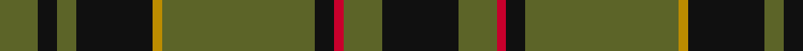

In pattern [GKGKYGKRGK](/patterns/gkgkygkrgk/).

This was sourced from register-of-tartans.  It is a [10 stripes tartan](/stripes/stripes10/).

Original link https://www.tartanregister.gov.uk/tartanDetails.aspx?ref=10454

## Attestations

This cloth appears in 2 source records; the oldest owns this page.

- 09/06/2011 — Manitoba Cue Sports (register-of-tartans, [record](https://www.tartanregister.gov.uk/tartanDetails.aspx?ref=10454))
- 9th June 2011 — Manitoba Cue (Corporate) (tartans-authority, [record](http://www.tartansauthority.com/tartan-ferret/display/10454/))

## Thread count
G/16 K8 G8 K32 DY4 G64 K8 R4 G16 K/32

## Palette
Each colour and its ΔE from the base-6 reference it is a variant of.

| Colour | Shade | Base | ΔE (OKLab) |
|---|---|---|---|
| DY | <code style="background-color:#BC8C00;">#BC8C00</code> `#BC8C00` | Y <code style="background-color:#F2BF00;">#F2BF00</code> | 0.16 |
| G | <code style="background-color:#5C6428;">#5C6428</code> `#5C6428` | G <code style="background-color:#006100;">#006100</code> | 0.10 |
| K | <code style="background-color:#101010;">#101010</code> `#101010` | K <code style="background-color:#000000;">#000000</code> | 0.17 |
| R | <code style="background-color:#C8002C;">#C8002C</code> `#C8002C` | R <code style="background-color:#CC0000;">#CC0000</code> | 0.03 |

## Nearest tartans

The nearest existing variants by ΔTartan distance.

1. [MacArthur-Fox Green](/setts/s10/r4g4k2g31k10y3g5k11g6k3x2~g00643c-k101010-rc80000-yfccc00/) — ΔT 0.91
1. [Fort William](/setts/s11/g17b2y2b2k21b2k3g30k2b2k4x2~b5c8ca8-g5c6428-k101010-y9c9c00/) — ΔT 0.97
1. [Hopetoun](/setts/s11/g13k2g2k11y1k2y1k11g2b1g11x4~b3850c8-g006818-k101010-yd0cc74/) — ΔT 1.15
1. [Glendronach Distillery](/setts/s10/g22r2w1y3r1g6r22y3r1g10x4~g103010-r70000c-wc4c4c4-yfcac00/) — ΔT 1.19
1. [MacArthur-Fox 2000 (Personal)](/setts/s10/g5k2g30r2k10g5k2g5k10r2x2~g5c6428-k101010-rc80000/) — ΔT 1.21
1. [Danareth (Corporate)](/setts/s10/k7g6y3k12r19k12g62k62g12r7~g006818-k101010-r880000-yfccc00/) — ΔT 1.22
1. [MacKinross](/setts/s7/k6b1k6g4k10g20r2x2~b2c2c80-g006818-k101010-rc80000/) — ΔT 1.23
1. [Childers](/setts/s10/k4g13k4ga8k44ga8k4g13k4w3x2~g006818-ga408060-k101010-we0e0e0/) — ΔT 1.23
1. [MacAuley Hunting Clan Tartan Tartan Number: 827. Earliest known date: 1950 This shorter version tallies with the count published by M'Intyre North in 1881 as having been given him by Logan. There are two Clans of the name associated with districts as far apart as Dumbarton and Lewis and they have no family connection with each other. They are the MacAulays of Ardencaple associated with the MacGregors and the MacAulays of Lewis who are associated with the MacLeods. This sett in its shortened form begins to resemble the MacGregor tartan. See products available Copyright © Blair Urquhart, Comrie, 2015](/setts/s8/g6k16w1k16g8k4g12r2x2~g006818-k101010-rc80000-we0e0e0/) — ΔT 1.24
1. [MacHardy (Clans Originaux)](/setts/s8/g4r4k12w2k12g32r4k3x2~g006818-k101010-rc80000-we0e0e0/) — ΔT 1.25

## Neighbour map

Every grey dot is one of 15726 variants placed by the first two principal components of the ΔTartan feature space (44% of its variance). Red is this tartan; blue dots are its nearest — click one to open its page.

<svg viewBox="0 0 640 380" role="img" style="max-width:100%;height:auto;border:1px solid #e0e0e0;border-radius:4px;display:block" xmlns="http://www.w3.org/2000/svg"><image href="/nn/cloud.v1.png" width="640" height="380"/><a href="/setts/s10/r4g4k2g31k10y3g5k11g6k3x2~g00643c-k101010-rc80000-yfccc00/"><circle cx="347.2" cy="174.9" r="4" fill="#3465a4"><title>MacArthur-Fox Green</title></circle></a><a href="/setts/s11/g17b2y2b2k21b2k3g30k2b2k4x2~b5c8ca8-g5c6428-k101010-y9c9c00/"><circle cx="337.8" cy="159.4" r="4" fill="#3465a4"><title>Fort William</title></circle></a><a href="/setts/s11/g13k2g2k11y1k2y1k11g2b1g11x4~b3850c8-g006818-k101010-yd0cc74/"><circle cx="300.5" cy="186.8" r="4" fill="#3465a4"><title>Hopetoun</title></circle></a><a href="/setts/s10/g22r2w1y3r1g6r22y3r1g10x4~g103010-r70000c-wc4c4c4-yfcac00/"><circle cx="359.3" cy="153.6" r="4" fill="#3465a4"><title>Glendronach Distillery</title></circle></a><a href="/setts/s10/g5k2g30r2k10g5k2g5k10r2x2~g5c6428-k101010-rc80000/"><circle cx="413.2" cy="190.0" r="4" fill="#3465a4"><title>MacArthur-Fox 2000 (Personal)</title></circle></a><a href="/setts/s10/k7g6y3k12r19k12g62k62g12r7~g006818-k101010-r880000-yfccc00/"><circle cx="306.1" cy="163.5" r="4" fill="#3465a4"><title>Danareth (Corporate)</title></circle></a><a href="/setts/s7/k6b1k6g4k10g20r2x2~b2c2c80-g006818-k101010-rc80000/"><circle cx="330.4" cy="201.2" r="4" fill="#3465a4"><title>MacKinross</title></circle></a><a href="/setts/s10/k4g13k4ga8k44ga8k4g13k4w3x2~g006818-ga408060-k101010-we0e0e0/"><circle cx="326.5" cy="170.0" r="4" fill="#3465a4"><title>Childers</title></circle></a><a href="/setts/s8/g6k16w1k16g8k4g12r2x2~g006818-k101010-rc80000-we0e0e0/"><circle cx="327.2" cy="216.7" r="4" fill="#3465a4"><title>MacAuley Hunting Clan Tartan Tartan Number: 827. Earliest known date: 1950 This shorter version tallies with the count published by M'Intyre North in 1881 as having been given him by Logan. There are two Clans of the name associated with districts as far apart as Dumbarton and Lewis and they have no family connection with each other. They are the MacAulays of Ardencaple associated with the MacGregors and the MacAulays of Lewis who are associated with the MacLeods. This sett in its shortened form begins to resemble the MacGregor tartan. See products available Copyright © Blair Urquhart, Comrie, 2015</title></circle></a><a href="/setts/s8/g4r4k12w2k12g32r4k3x2~g006818-k101010-rc80000-we0e0e0/"><circle cx="294.1" cy="175.9" r="4" fill="#3465a4"><title>MacHardy (Clans Originaux)</title></circle></a><circle cx="348.7" cy="182.9" r="5" fill="#c00000"/></svg>

ID: /setts/s10/k8g4r1k2g16y1k8g2k2g4x4~g5c6428-k101010-rc8002c-ybc8c00/
