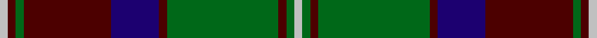

In pattern [WBGBBBGBGW](/stripes/wbgbbbgbgw/).

This was sourced from register-of-tartans.  It is a [10 stripe tartan](/stripes/stripes10/).

Original link https://www.tartanregister.gov.uk/tartanDetails.aspx?ref=1399

## Attestations

This cloth appears in 2 source records; the oldest owns this page.

- 01/01/1800 — Glen Tilt #1 (register-of-tartans, [record](https://www.tartanregister.gov.uk/tartanDetails.aspx?ref=1399))
- pre 1800 — Glen Tilt #1 (District) (tartans-authority, [record](http://www.tartansauthority.com/tartan-ferret/display/2076/))

## Register references

External register numbers recorded for this tartan.

- Scottish Register of Tartans: [1399](https://www.tartanregister.gov.uk/tartanDetails.aspx?ref=1399)
- Scottish Tartans Authority (ITI): 2076
- Scottish Tartans World Register: 2076

## Thread count
N/4 DR4 G4 DR44 DB24 DR4 G56 DR4 G4 N/4

## Palette
Each colour and the base-6 reference it is a variant of.

| Colour | Shade | Base |
|---|---|---|
| DB | <code style="background-color:#1C0070;">#1C0070</code> `oklch(26.3% 0.162 277.1)` <small>#1C0070</small> | B <code style="background-color:#2A418A;">#2A418A</code> |
| DR | <code style="background-color:#4C0000;">#4C0000</code> `oklch(26.2% 0.107 29.2)` <small>#4C0000</small> | B <code style="background-color:#2A418A;">#2A418A</code> |
| G | <code style="background-color:#006818;">#006818</code> `oklch(45.0% 0.142 145.0)` <small>#006818</small> | G <code style="background-color:#006100;">#006100</code> |
| N | <code style="background-color:#C0C0C0;">#C0C0C0</code> `oklch(80.8% 0.000 89.9)` <small>#C0C0C0</small> | W <code style="background-color:#F7F7F7;">#F7F7F7</code> |

## Nearest tartans

The nearest existing variants by ΔTartan distance.

1. [Durie (Clan)](/setts/s9/db12r1db1r1db1r4g12ly1g2~x4/) — ΔT 0.78
1. [Glen Tilt #2](/setts/s10/w1r1g1r11t6r1g14r1g1w1~x4/) — ΔT 0.99
1. [Greater St Louis Area Firefighters Highland Guard](/setts/s9/n3r3k38n25ly3n6r7n3ly2~x2/) — ΔT 1.00
1. [Nunavut (District)](/setts/s10/k6t2n2t3n2t2n30k20w6k4~x2/) — ΔT 1.01
1. [Park](/setts/s12/r3db16k16g4k2g2k2g34r4g3r2g3~x2/) — ΔT 1.04
1. [Rourke-Frew Hunting](/setts/s11/db6k3r2k3dg31k6dg2k6lo13k2dg2~x2/) — ΔT 1.05
1. [Sardar Chadha (Personal)](/setts/s10/lo6g34db4g4k32g4db34g4db2g5/) — ΔT 1.05
1. [Scottish Tourist Board (1981) (Corp)](/setts/s11/db30k2db2k2db2k32g15r2g4r4g30~x2/) — ΔT 1.07
1. [Cape Breton University Chemistry Society](/setts/s10/db4o17db4y4db2y4db4y27db4ly4~x2/) — ΔT 1.10
1. [Georgia, State of](/setts/s8/g36k2g2k2g3k12t10r20~x2/) — ΔT 1.13

## Neighbour map

Every grey dot is one of 14299 variants placed by the first two principal components of the ΔTartan feature space (44% of its variance). Red is this tartan; blue dots are its nearest — click one to open its page.

<svg viewBox="0 0 640 380" role="img" style="max-width:100%;height:auto;border:1px solid #e0e0e0;border-radius:4px;display:block" xmlns="http://www.w3.org/2000/svg"><image href="/nn/cloud.v1.png" width="640" height="380"/><a href="/setts/s9/db12r1db1r1db1r4g12ly1g2~x4/"><circle cx="267.4" cy="182.6" r="4" fill="#3465a4"><title>Durie (Clan)</title></circle></a><a href="/setts/s10/w1r1g1r11t6r1g14r1g1w1~x4/"><circle cx="267.0" cy="153.6" r="4" fill="#3465a4"><title>Glen Tilt #2</title></circle></a><a href="/setts/s9/n3r3k38n25ly3n6r7n3ly2~x2/"><circle cx="271.1" cy="144.6" r="4" fill="#3465a4"><title>Greater St Louis Area Firefighters Highland Guard</title></circle></a><a href="/setts/s10/k6t2n2t3n2t2n30k20w6k4~x2/"><circle cx="263.2" cy="150.6" r="4" fill="#3465a4"><title>Nunavut (District)</title></circle></a><a href="/setts/s12/r3db16k16g4k2g2k2g34r4g3r2g3~x2/"><circle cx="305.3" cy="152.5" r="4" fill="#3465a4"><title>Park</title></circle></a><a href="/setts/s11/db6k3r2k3dg31k6dg2k6lo13k2dg2~x2/"><circle cx="250.4" cy="140.1" r="4" fill="#3465a4"><title>Rourke-Frew Hunting</title></circle></a><a href="/setts/s10/lo6g34db4g4k32g4db34g4db2g5/"><circle cx="246.3" cy="172.1" r="4" fill="#3465a4"><title>Sardar Chadha (Personal)</title></circle></a><a href="/setts/s11/db30k2db2k2db2k32g15r2g4r4g30~x2/"><circle cx="254.1" cy="171.2" r="4" fill="#3465a4"><title>Scottish Tourist Board (1981) (Corp)</title></circle></a><a href="/setts/s10/db4o17db4y4db2y4db4y27db4ly4~x2/"><circle cx="280.9" cy="175.4" r="4" fill="#3465a4"><title>Cape Breton University Chemistry Society</title></circle></a><a href="/setts/s8/g36k2g2k2g3k12t10r20~x2/"><circle cx="273.7" cy="165.5" r="4" fill="#3465a4"><title>Georgia, State of</title></circle></a><circle cx="267.7" cy="160.3" r="5" fill="#c00000"/></svg>

ID: /setts/s10/lb1dr1g1dr11db6dr1g14dr1g1lb1~x4/
