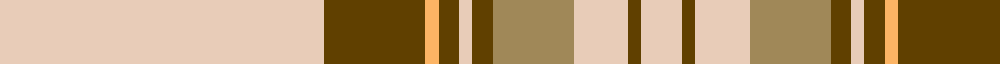

**Bands:** [WGYGWGYWGW](/stripes/wgygwgywgw/) · **Stripes:** [LB DY LO DY LB DY LO LB DY LB](/stripes/stripes10/) LB DY LO DY LB DY LO LB DY LB

This was sourced from tartans-authority.  It is a [10 band tartan](/bands/bands10/).

Original link http://www.tartansauthority.com/tartan-ferret/display/8973/

## Thread count
LR/96 T30 LG4 T6 LR4 T6 LT24 LR16 T4 LR/12

## Palette
Each colour and its ΔE from the base-6 reference it is a variant of.

| Colour | Shade | Base | ΔE (OKLab) |
|---|---|---|---|
| LG | <code style="background-color:#FCB464;">#FCB464</code> `#FCB464` | Y <code style="background-color:#F2BF00;">#F2BF00</code> | 0.07 |
| LR | <code style="background-color:#E8CCB8;">#E8CCB8</code> `#E8CCB8` | W <code style="background-color:#F7F7F7;">#F7F7F7</code> | 0.12 |
| LT | <code style="background-color:#A08858;">#A08858</code> `#A08858` | Y <code style="background-color:#F2BF00;">#F2BF00</code> | 0.21 |
| T | <code style="background-color:#604000;">#604000</code> `#604000` | G <code style="background-color:#006100;">#006100</code> | 0.14 |

## Nearest tartans

The nearest existing variants by ΔTartan distance.

1. [Shaw of Tordarroch, Mrs (Personal)](/setts/s11/o8lb46db4lb4db4lb5y7lb7y7lb4db2~x2/) — ΔT 0.68
1. [Elvan](/setts/s11/lr42dy10db2dy2lb2dy2lr10lb6dy2lb3lr2~x2/) — ΔT 0.69
1. [Anthony Plaid Ecru](/setts/s9/lr18k1ly3k1lr2r2k2r2lr2~x4/) — ΔT 1.17
1. [Australian, dress](/setts/s9/w50o4lo2k2lo2o4lo10o15t2~x2/) — ΔT 1.45
1. [McBrayer Dress](/setts/s8/w57k1r12w1g12r14w1r2~x2/) — ΔT 1.51
1. [MMK 1777](/setts/s7/w30k1r7dg7r8w1r2~x4/) — ΔT 1.54
1. [Grant of Acharrow](/setts/s12/w9r4w40g9db1w3k3w20r18g4r6w3~x2/) — ΔT 1.54
1. [Unidentified, Blanket](/setts/s8/w50k1r12w1g12r13w1r2~x2/) — ΔT 1.59
1. [Irn Bru Corporate Tartan Tartan Number: 2395. Earliest known date: Sep 1998 Irn Bru (Iron Brew) was first produced in 1901 by A.G. Barr and has been Scotland's favourite fizzy drink ever since. The colours are based on the brand label. Irn Bru was famously advertised on TV as 'being made in Scotland . . . from GIRDERS!" which was the subject of a complaint to the Advertising Standards Authority because it was 'untrue' !!! See products available Copyright © Blair Urquhart, Comrie, 2015](/setts/s8/lo49db16k2w3db2w2db3lo2~x2/) — ΔT 1.59
1. [Glen Moy Tartan Tartan Number: 1293. Earliest known date: pre 1986 A colour variation of the Royal Stewart woven by Edgars, Pitlochry around 1986, named after the place in Angus described as follows: Its mainly Sheep farming in Glen Moy. Off the beaten track, its a very quiet area of the Angus glens close to Cortachy castle and great for walking if you like it to yourself! See products available Copyright © Blair Urquhart, Comrie, 2015](/setts/s12/lb98n12k16w5k5w5k5n28lb16k5lb16w6/) — ΔT 1.62

## Neighbour map

Every grey dot is one of 14299 variants placed by the first two principal components of the ΔTartan feature space (44% of its variance). Red is this tartan; blue dots are its nearest — click one to open its page.

<svg viewBox="0 0 640 380" role="img" style="max-width:100%;height:auto;border:1px solid #e0e0e0;border-radius:4px;display:block" xmlns="http://www.w3.org/2000/svg"><image href="/nn/cloud.v1.png" width="640" height="380"/><a href="/setts/s11/o8lb46db4lb4db4lb5y7lb7y7lb4db2~x2/"><circle cx="396.7" cy="100.2" r="4" fill="#3465a4"><title>Shaw of Tordarroch, Mrs (Personal)</title></circle></a><a href="/setts/s11/lr42dy10db2dy2lb2dy2lr10lb6dy2lb3lr2~x2/"><circle cx="408.5" cy="107.3" r="4" fill="#3465a4"><title>Elvan</title></circle></a><a href="/setts/s9/lr18k1ly3k1lr2r2k2r2lr2~x4/"><circle cx="383.3" cy="115.6" r="4" fill="#3465a4"><title>Anthony Plaid Ecru</title></circle></a><a href="/setts/s9/w50o4lo2k2lo2o4lo10o15t2~x2/"><circle cx="319.0" cy="83.9" r="4" fill="#3465a4"><title>Australian, dress</title></circle></a><a href="/setts/s8/w57k1r12w1g12r14w1r2~x2/"><circle cx="391.9" cy="74.0" r="4" fill="#3465a4"><title>McBrayer Dress</title></circle></a><a href="/setts/s7/w30k1r7dg7r8w1r2~x4/"><circle cx="332.2" cy="107.5" r="4" fill="#3465a4"><title>MMK 1777</title></circle></a><a href="/setts/s12/w9r4w40g9db1w3k3w20r18g4r6w3~x2/"><circle cx="349.0" cy="70.9" r="4" fill="#3465a4"><title>Grant of Acharrow</title></circle></a><a href="/setts/s8/w50k1r12w1g12r13w1r2~x2/"><circle cx="364.0" cy="76.7" r="4" fill="#3465a4"><title>Unidentified, Blanket</title></circle></a><a href="/setts/s8/lo49db16k2w3db2w2db3lo2~x2/"><circle cx="413.9" cy="102.6" r="4" fill="#3465a4"><title>Irn Bru Corporate Tartan Tartan Number: 2395. Earliest known date: Sep 1998 Irn Bru (Iron Brew) was first produced in 1901 by A.G. Barr and has been Scotland's favourite fizzy drink ever since. The colours are based on the brand label. Irn Bru was famously advertised on TV as 'being made in Scotland . . . from GIRDERS!&quot; which was the subject of a complaint to the Advertising Standards Authority because it was 'untrue' !!! See products available Copyright © Blair Urquhart, Comrie, 2015</title></circle></a><a href="/setts/s12/lb98n12k16w5k5w5k5n28lb16k5lb16w6/"><circle cx="330.9" cy="101.3" r="4" fill="#3465a4"><title>Glen Moy Tartan Tartan Number: 1293. Earliest known date: pre 1986 A colour variation of the Royal Stewart woven by Edgars, Pitlochry around 1986, named after the place in Angus described as follows: Its mainly Sheep farming in Glen Moy. Off the beaten track, its a very quiet area of the Angus glens close to Cortachy castle and great for walking if you like it to yourself! See products available Copyright © Blair Urquhart, Comrie, 2015</title></circle></a><circle cx="389.6" cy="107.8" r="5" fill="#c00000"/></svg>

ID: /setts/s10/lb48dy15lo2dy3lb2dy3lo12lb8dy2lb6~x2/
