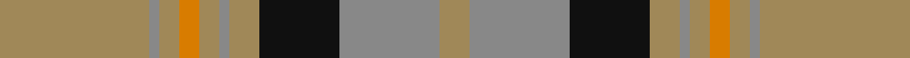

In pattern [YRKYRYYYRY](/stripes/yrkyryyyry/).

This was sourced from house-of-tartan.  It is a [10 stripe tartan](/stripes/stripes10/).

Original link http://www.house-of-tartan.scotland.net/house/TartanViewjs.asp?colr=Def&tnam=1742

## Thread count
LT/60 N4 LT8 O8 LT8 N4 LT12 K32 N40 LT/12

## Palette
Each colour and the base-6 reference it is a variant of.

| Colour | Shade | Base |
|---|---|---|
| K | <code style="background-color:#101010;">#101010</code> `oklch(17.3% 0.000 89.9)` <small>#101010</small> | K <code style="background-color:#000000;">#000000</code> |
| LT | <code style="background-color:#A08858;">#A08858</code> `oklch(63.7% 0.071 84.0)` <small>#A08858</small> | Y <code style="background-color:#F2BF00;">#F2BF00</code> |
| N | <code style="background-color:#888888;">#888888</code> `oklch(62.7% 0.000 89.9)` <small>#888888</small> | R <code style="background-color:#CC0000;">#CC0000</code> |
| O | <code style="background-color:#D87C00;">#D87C00</code> `oklch(67.3% 0.155 61.8)` <small>#D87C00</small> | Y <code style="background-color:#F2BF00;">#F2BF00</code> |

## Nearest tartans

The nearest existing variants by ΔTartan distance.

1. [Annan](/setts/s10/o15y1o2r2o2y1o3k8y10o3~x4/) — ΔT 0.87
1. [Rice (Welsh Name)](/setts/s10/dt4lo21dt1lo21y8db4y5db4y4dt4/) — ΔT 0.97
1. [Dublin Irish County Tartan Tartan Number: 2250. Earliest known date: 1996 One of a series of Irish District tartans designed by Polly Wittering of the House of Edgar, with colours reminiscent of the Country with soft warm colours dominating. See products available Copyright © Blair Urquhart, Comrie, 2015](/setts/s12/r3lg8r2lg18dp5lg3o3lg3o16lg3o3lg3~x2/) — ΔT 1.20
1. [Sonsub](/setts/s10/n30k5n19k5n2lr20ly2lr20k5ly4~x2/) — ΔT 1.22
1. [Shieldhall (Fashion)](/setts/s12/do12r1do2r1do2lb2do3o9r1o2r1o3~x4/) — ΔT 1.23
1. [Unidentified Plaid 6](/setts/s10/r4t3r32db30r4g32r3g32r3g3~x2/) — ΔT 1.25
1. [Glenfinnan (Clan?)](/setts/s10/n28r26w2n5w2r26lg28r5w2r5~x2/) — ΔT 1.28
1. [MacDonald of Kingsburgh](/setts/s9/r3g3lo2r18w2g21lo2g2lo3~x2/) — ΔT 1.39
1. [MacKillop](/setts/s10/g3r2db2r13t1db4r2g7r2db2~x2/) — ΔT 1.40
1. [Cape Breton University Chemistry Society](/setts/s10/db4o17db4y4db2y4db4y27db4ly4~x2/) — ΔT 1.41

## Neighbour map

Every grey dot is one of 14299 variants placed by the first two principal components of the ΔTartan feature space (44% of its variance). Red is this tartan; blue dots are its nearest — click one to open its page.

<svg viewBox="0 0 640 380" role="img" style="max-width:100%;height:auto;border:1px solid #e0e0e0;border-radius:4px;display:block" xmlns="http://www.w3.org/2000/svg"><image href="/nn/cloud.v1.png" width="640" height="380"/><a href="/setts/s10/o15y1o2r2o2y1o3k8y10o3~x4/"><circle cx="308.7" cy="162.3" r="4" fill="#3465a4"><title>Annan</title></circle></a><a href="/setts/s10/dt4lo21dt1lo21y8db4y5db4y4dt4/"><circle cx="323.8" cy="160.1" r="4" fill="#3465a4"><title>Rice (Welsh Name)</title></circle></a><a href="/setts/s12/r3lg8r2lg18dp5lg3o3lg3o16lg3o3lg3~x2/"><circle cx="300.1" cy="189.2" r="4" fill="#3465a4"><title>Dublin Irish County Tartan Tartan Number: 2250. Earliest known date: 1996 One of a series of Irish District tartans designed by Polly Wittering of the House of Edgar, with colours reminiscent of the Country with soft warm colours dominating. See products available Copyright © Blair Urquhart, Comrie, 2015</title></circle></a><a href="/setts/s10/n30k5n19k5n2lr20ly2lr20k5ly4~x2/"><circle cx="256.2" cy="173.4" r="4" fill="#3465a4"><title>Sonsub</title></circle></a><a href="/setts/s12/do12r1do2r1do2lb2do3o9r1o2r1o3~x4/"><circle cx="303.9" cy="168.6" r="4" fill="#3465a4"><title>Shieldhall (Fashion)</title></circle></a><a href="/setts/s10/r4t3r32db30r4g32r3g32r3g3~x2/"><circle cx="261.3" cy="183.0" r="4" fill="#3465a4"><title>Unidentified Plaid 6</title></circle></a><a href="/setts/s10/n28r26w2n5w2r26lg28r5w2r5~x2/"><circle cx="273.7" cy="167.7" r="4" fill="#3465a4"><title>Glenfinnan (Clan?)</title></circle></a><a href="/setts/s9/r3g3lo2r18w2g21lo2g2lo3~x2/"><circle cx="296.6" cy="168.2" r="4" fill="#3465a4"><title>MacDonald of Kingsburgh</title></circle></a><a href="/setts/s10/g3r2db2r13t1db4r2g7r2db2~x2/"><circle cx="292.2" cy="172.3" r="4" fill="#3465a4"><title>MacKillop</title></circle></a><a href="/setts/s10/db4o17db4y4db2y4db4y27db4ly4~x2/"><circle cx="280.9" cy="175.4" r="4" fill="#3465a4"><title>Cape Breton University Chemistry Society</title></circle></a><circle cx="311.1" cy="171.1" r="5" fill="#c00000"/></svg>

ID: /setts/s10/lo15o1lo2lo2lo2o1lo3k8o10lo3~x4/
