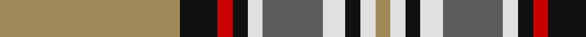

**Bands:** [YKRKWBWKWY](/stripes/ykrkwbwkwy/) · **Stripes:** [LO K R K W N W K W LO](/stripes/stripes10/) LO K R K W N W K W LO

This was sourced from house-of-tartan.  It is a [10 band tartan](/bands/bands10/).

Original link http://www.house-of-tartan.scotland.net/house/TartanViewjs.asp?colr=Def&tnam=1738

## Thread count
LT/48 K10 R4 K4 LN4 N16 LN6 K4 LN4 LT/4

## Palette
Each colour and its ΔE from the base-6 reference it is a variant of.

| Colour | Shade | Base | ΔE (OKLab) |
|---|---|---|---|
| K | <code style="background-color:#101010;">#101010</code> `#101010` | K <code style="background-color:#000000;">#000000</code> | 0.17 |
| LN | <code style="background-color:#E0E0E0;">#E0E0E0</code> `#E0E0E0` | W <code style="background-color:#F7F7F7;">#F7F7F7</code> | 0.07 |
| LT | <code style="background-color:#A08858;">#A08858</code> `#A08858` | Y <code style="background-color:#F2BF00;">#F2BF00</code> | 0.21 |
| N | <code style="background-color:#5C5C5C;">#5C5C5C</code> `#5C5C5C` | B <code style="background-color:#2A418A;">#2A418A</code> | 0.15 |
| R | <code style="background-color:#C80000;">#C80000</code> `#C80000` | R <code style="background-color:#CC0000;">#CC0000</code> | 0.01 |

## Nearest tartans

The nearest existing variants by ΔTartan distance.

1. [Stuart/Stewart Fawn](/setts/s10/o24k5r2k2w2n8w3k2w2o2~x2/) — ΔT 0.68
1. [Stevens #5](/setts/s11/o53ly6k10w3k3ly4k10r8k3r6w3/) — ΔT 0.89
1. [Glen Nevis](/setts/s12/o22w2o2w2o4k5o5k5y5m2y13w2~x2/) — ΔT 1.01
1. [MacKellar Dress, Maroon (Dance)](/setts/s11/dy27w2dy3lo4dy3w2dy5k13n2w26n3~x2/) — ΔT 1.03
1. [Dinwiddie](/setts/s10/ly7o2k2o41k12g22o6k2r4k2~x2/) — ΔT 1.13
1. [Falkirk (District)](/setts/s9/k4lb4k2lb4k2lb22o27ly2r3~x2/) — ΔT 1.15
1. [MacKinnon 1](/setts/s12/r3r4g3p3r11g30r3p7g3r2r4w2~x2/) — ΔT 1.18
1. [Courtet-Meyer (Personal)](/setts/s14/k15w1k1w1k1w1k1g15r1g15lo2r5lo2w3~x2/) — ΔT 1.26
1. [Dinwiddie Clan Tartan Tartan Number: 3212. Earliest known date: 2001 The registered tartan of the Dinwiddie Clan. Dinwiddies are normally associated with the Maxwells, but Lord Lyon stated, in 1988, that Dinwiddies were a sept of no other clan. See products available Copyright © Blair Urquhart, Comrie, 2015](/setts/s10/ly4o2k2o42k13g25o6k2r4k2~x2/) — ΔT 1.27
1. [Eidart 1990 (Fashion)](/setts/s12/n4r20k2r2k2r3k6o26w3o2w2o4~x2/) — ΔT 1.27

## Neighbour map

Every grey dot is one of 14313 variants placed by the first two principal components of the ΔTartan feature space (44% of its variance). Red is this tartan; blue dots are its nearest — click one to open its page.

<svg viewBox="0 0 640 380" role="img" style="max-width:100%;height:auto;border:1px solid #e0e0e0;border-radius:4px;display:block" xmlns="http://www.w3.org/2000/svg"><image href="/nn/cloud.v1.png" width="640" height="380"/><a href="/setts/s10/o24k5r2k2w2n8w3k2w2o2~x2/"><circle cx="242.6" cy="117.5" r="4" fill="#3465a4"><title>Stuart/Stewart Fawn</title></circle></a><a href="/setts/s11/o53ly6k10w3k3ly4k10r8k3r6w3/"><circle cx="247.6" cy="92.3" r="4" fill="#3465a4"><title>Stevens #5</title></circle></a><a href="/setts/s12/o22w2o2w2o4k5o5k5y5m2y13w2~x2/"><circle cx="213.0" cy="135.8" r="4" fill="#3465a4"><title>Glen Nevis</title></circle></a><a href="/setts/s11/dy27w2dy3lo4dy3w2dy5k13n2w26n3~x2/"><circle cx="189.2" cy="113.8" r="4" fill="#3465a4"><title>MacKellar Dress, Maroon (Dance)</title></circle></a><a href="/setts/s10/ly7o2k2o41k12g22o6k2r4k2~x2/"><circle cx="256.1" cy="115.6" r="4" fill="#3465a4"><title>Dinwiddie</title></circle></a><a href="/setts/s9/k4lb4k2lb4k2lb22o27ly2r3~x2/"><circle cx="226.6" cy="127.7" r="4" fill="#3465a4"><title>Falkirk (District)</title></circle></a><a href="/setts/s12/r3r4g3p3r11g30r3p7g3r2r4w2~x2/"><circle cx="266.3" cy="120.7" r="4" fill="#3465a4"><title>MacKinnon 1</title></circle></a><a href="/setts/s14/k15w1k1w1k1w1k1g15r1g15lo2r5lo2w3~x2/"><circle cx="214.7" cy="101.5" r="4" fill="#3465a4"><title>Courtet-Meyer (Personal)</title></circle></a><a href="/setts/s10/ly4o2k2o42k13g25o6k2r4k2~x2/"><circle cx="267.5" cy="115.2" r="4" fill="#3465a4"><title>Dinwiddie Clan Tartan Tartan Number: 3212. Earliest known date: 2001 The registered tartan of the Dinwiddie Clan. Dinwiddies are normally associated with the Maxwells, but Lord Lyon stated, in 1988, that Dinwiddies were a sept of no other clan. See products available Copyright © Blair Urquhart, Comrie, 2015</title></circle></a><a href="/setts/s12/n4r20k2r2k2r3k6o26w3o2w2o4~x2/"><circle cx="225.1" cy="120.0" r="4" fill="#3465a4"><title>Eidart 1990 (Fashion)</title></circle></a><circle cx="242.3" cy="123.0" r="5" fill="#c00000"/></svg>

ID: /setts/s10/lo24k5r2k2w2n8w3k2w2lo2~x2/
