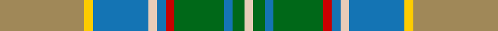

**Bands:** [YYBWBRGBGW](/stripes/yybwbrgbgw/) · **Stripes:** [LO LY B LB B R G B G LB](/stripes/stripes10/) LO LY B LB B R G B G LB

This was sourced from tartans-authority.  It is a [10 band tartan](/bands/bands10/).

Original link http://www.tartansauthority.com/tartan-ferret/display/8911/

## Thread count
LT/58 Y6 B38 LR6 B6 R6 G34 B6 G8 LR/6

## Palette
Each colour and its ΔE from the base-6 reference it is a variant of.

| Colour | Shade | Base | ΔE (OKLab) |
|---|---|---|---|
| B | <code style="background-color:#1474B4;">#1474B4</code> `#1474B4` | B <code style="background-color:#2A418A;">#2A418A</code> | 0.15 |
| G | <code style="background-color:#006818;">#006818</code> `#006818` | G <code style="background-color:#006100;">#006100</code> | 0.02 |
| LR | <code style="background-color:#E8CCB8;">#E8CCB8</code> `#E8CCB8` | W <code style="background-color:#F7F7F7;">#F7F7F7</code> | 0.12 |
| LT | <code style="background-color:#A08858;">#A08858</code> `#A08858` | Y <code style="background-color:#F2BF00;">#F2BF00</code> | 0.21 |
| R | <code style="background-color:#C80000;">#C80000</code> `#C80000` | R <code style="background-color:#CC0000;">#CC0000</code> | 0.01 |
| Y | <code style="background-color:#FCCC00;">#FCCC00</code> `#FCCC00` | Y <code style="background-color:#F2BF00;">#F2BF00</code> | 0.04 |

## Nearest tartans

The nearest existing variants by ΔTartan distance.

1. [Royal Pharmaceutical, Society](/setts/s9/o3lb2g19lb6g2lb6o14m4w2~x2/) — ΔT 0.93
1. [Royal Pharmaceutical Society (Corp)](/setts/s9/dy2o2dg19o6dg2o6lo14r4w2~x2/) — ΔT 1.15
1. [Paisley](/setts/s12/g7r2g3r5g17ly2k15ly2t22g3w2t7~x2/) — ΔT 1.17
1. [Royal Pharmaceutical Society](/setts/s9/dy3o2dg19o6dg2o6lo14r4w2~x2/) — ΔT 1.17
1. [Gallagher Irish Fashion Tartan Tartan Number: 4053. Earliest known date: 2001 February See products available Copyright © Blair Urquhart, Comrie, 2015](/setts/s9/db4dg41lo4g4lo4g9o18lo4w4~x2/) — ΔT 1.18
1. [Gallagher Ancient](/setts/s9/db4dg41lo4g4lo4g9r18lo4w4~x2/) — ΔT 1.21
1. [Isle of Man (District)](/setts/s13/r2t22lo4w3g7ly2g4w2g9m6ly2m4w2~x2/) — ΔT 1.23
1. [Cossar (Personal)](/setts/s11/w4t5lo3t22ly4k3g16lo7k2lo7ly2~x2/) — ΔT 1.24
1. [State Seal of Florida (Fashion)](/setts/s10/r3lo21r14lb3db11g36do3db3do4lo3~x2/) — ΔT 1.32
1. [Royal Pharmaceutical Society Commemorative Tartan Tartan Number: 2091. Earliest known date: 1991 Created by Kinloch Anderson of Edinburgh for the 150th Anniversary of the Royal Pharmaceutical Society of Great Britain which was held at Scone Palace, Perthshire in 1991. See products available Copyright © Blair Urquhart, Comrie, 2015](/setts/s10/do3db2g19db6g2db6lo14w2dp4w2~x2/) — ΔT 1.35

## Neighbour map

Every grey dot is one of 14299 variants placed by the first two principal components of the ΔTartan feature space (44% of its variance). Red is this tartan; blue dots are its nearest — click one to open its page.

<svg viewBox="0 0 640 380" role="img" style="max-width:100%;height:auto;border:1px solid #e0e0e0;border-radius:4px;display:block" xmlns="http://www.w3.org/2000/svg"><image href="/nn/cloud.v1.png" width="640" height="380"/><a href="/setts/s9/o3lb2g19lb6g2lb6o14m4w2~x2/"><circle cx="155.0" cy="164.4" r="4" fill="#3465a4"><title>Royal Pharmaceutical, Society</title></circle></a><a href="/setts/s9/dy2o2dg19o6dg2o6lo14r4w2~x2/"><circle cx="157.6" cy="162.1" r="4" fill="#3465a4"><title>Royal Pharmaceutical Society (Corp)</title></circle></a><a href="/setts/s12/g7r2g3r5g17ly2k15ly2t22g3w2t7~x2/"><circle cx="145.1" cy="146.4" r="4" fill="#3465a4"><title>Paisley</title></circle></a><a href="/setts/s9/dy3o2dg19o6dg2o6lo14r4w2~x2/"><circle cx="151.8" cy="164.6" r="4" fill="#3465a4"><title>Royal Pharmaceutical Society</title></circle></a><a href="/setts/s9/db4dg41lo4g4lo4g9o18lo4w4~x2/"><circle cx="209.7" cy="147.0" r="4" fill="#3465a4"><title>Gallagher Irish Fashion Tartan Tartan Number: 4053. Earliest known date: 2001 February See products available Copyright © Blair Urquhart, Comrie, 2015</title></circle></a><a href="/setts/s9/db4dg41lo4g4lo4g9r18lo4w4~x2/"><circle cx="203.4" cy="143.4" r="4" fill="#3465a4"><title>Gallagher Ancient</title></circle></a><a href="/setts/s13/r2t22lo4w3g7ly2g4w2g9m6ly2m4w2~x2/"><circle cx="108.1" cy="114.5" r="4" fill="#3465a4"><title>Isle of Man (District)</title></circle></a><a href="/setts/s11/w4t5lo3t22ly4k3g16lo7k2lo7ly2~x2/"><circle cx="123.0" cy="136.5" r="4" fill="#3465a4"><title>Cossar (Personal)</title></circle></a><a href="/setts/s10/r3lo21r14lb3db11g36do3db3do4lo3~x2/"><circle cx="164.8" cy="142.4" r="4" fill="#3465a4"><title>State Seal of Florida (Fashion)</title></circle></a><a href="/setts/s10/do3db2g19db6g2db6lo14w2dp4w2~x2/"><circle cx="129.1" cy="151.6" r="4" fill="#3465a4"><title>Royal Pharmaceutical Society Commemorative Tartan Tartan Number: 2091. Earliest known date: 1991 Created by Kinloch Anderson of Edinburgh for the 150th Anniversary of the Royal Pharmaceutical Society of Great Britain which was held at Scone Palace, Perthshire in 1991. See products available Copyright © Blair Urquhart, Comrie, 2015</title></circle></a><circle cx="159.9" cy="153.6" r="5" fill="#c00000"/></svg>

ID: /setts/s10/lo29ly3b19lb3b3r3g17b3g4lb3~x2/
