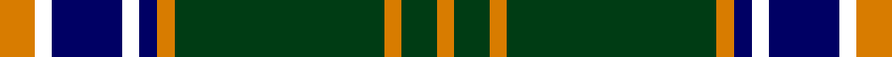

In pattern [YGYGYBWBWY](/stripes/ygygybwbwy/).

This was sourced from register-of-tartans.  It is a [10 stripe tartan](/stripes/stripes10/).

Original link https://www.tartanregister.gov.uk/tartanDetails.aspx?ref=11600

## Register references

External register numbers recorded for this tartan.

- Scottish Register of Tartans: [11600](https://www.tartanregister.gov.uk/tartanDetails.aspx?ref=11600)

## Thread count
O/8 W4 DB16 W4 DB4 O4 DG48 O4 DG8 O/4

## Palette
Each colour and the base-6 reference it is a variant of.

| Colour | Shade | Base |
|---|---|---|
| DB | <code style="background-color:#000064;">#000064</code> `oklch(22.7% 0.158 264.1)` <small>#000064</small> | B <code style="background-color:#2A418A;">#2A418A</code> |
| DG | <code style="background-color:#003C14;">#003C14</code> `oklch(31.1% 0.089 148.5)` <small>#003C14</small> | G <code style="background-color:#006100;">#006100</code> |
| O | <code style="background-color:#D87C00;">#D87C00</code> `oklch(67.3% 0.155 61.8)` <small>#D87C00</small> | Y <code style="background-color:#F2BF00;">#F2BF00</code> |
| W | <code style="background-color:#FFFFFF;">#FFFFFF</code> `oklch(100.0% 0.000 89.9)` <small>#FFFFFF</small> | W <code style="background-color:#F7F7F7;">#F7F7F7</code> |

## Nearest tartans

The nearest existing variants by ΔTartan distance.

1. [Clan Iain Mhor (Name)](/setts/s13/dg22w2dg2dr3dt2w2dt19w2dt2dr3dt2w2dt19~x2/) — ΔT 0.87
1. [Scruffy Wallace](/setts/s10/w6k3g24lg16k6lg6k6lg6k60lg6/) — ΔT 0.94
1. [Bro-Leon](/setts/s9/k4lo17k2lo2g7k2lo2k22db4~x2/) — ΔT 1.07
1. [Gordon Dress (MacGregor-Hastie)](/setts/s9/w4k2w16k4w4k37dg12k4ly4~x2/) — ΔT 1.07
1. [Kiernan](/setts/s10/w2g4k6r2k2r2k3r2g20w1~x2/) — ΔT 1.12
1. [Hudson Hunting (Personal)](/setts/s11/db4t2k2db12t4g6k6g28k2t2g3~x2/) — ΔT 1.19
1. [St Andrews University Corporate Tartan Tartan Number: 2398. Earliest known date: pre 1998 Originally named St. Andrews International. Apparently a Gordon Paton MD, bought the company from North East Fife Enterprise Trust in 1997, the aim being to brand quality Scottish products for export worldwide. The company intended to set up a membership scheme but the company went into liquidation. The intended venue belonged to St Andrews University and it appears that the ownership of the tartan has fallen to the University and its name has been changed from 'International' to 'University' (Deirdre Kinloch Anderson, Aug 2004).No thread count given so this entry is based on an estimate from a small computer graphic. Has since been corrected to conform to the SRT (Scottish Register of Tartans) See products available Copyright © Blair Urquhart, Comrie, 2015](/setts/s10/k3db2ly3k2ly5db18g3k3g2db3~x2/) — ΔT 1.21
1. [Glen Grant Distillery](/setts/s15/g1k1g1db10g1db1g1k4g1ly1g10k1g1k1g1~x4/) — ΔT 1.24
1. [Rowan](/setts/s9/db1k1db8ly1g12ly1db8k1db1~x2/) — ΔT 1.26
1. [Liberty Square](/setts/s12/w12lb2k5lb2k10lb2k15lb2k20lb2y25lb2~x2/) — ΔT 1.26

## Neighbour map

Every grey dot is one of 14299 variants placed by the first two principal components of the ΔTartan feature space (44% of its variance). Red is this tartan; blue dots are its nearest — click one to open its page.

<svg viewBox="0 0 640 380" role="img" style="max-width:100%;height:auto;border:1px solid #e0e0e0;border-radius:4px;display:block" xmlns="http://www.w3.org/2000/svg"><image href="/nn/cloud.v1.png" width="640" height="380"/><a href="/setts/s13/dg22w2dg2dr3dt2w2dt19w2dt2dr3dt2w2dt19~x2/"><circle cx="283.0" cy="151.6" r="4" fill="#3465a4"><title>Clan Iain Mhor (Name)</title></circle></a><a href="/setts/s10/w6k3g24lg16k6lg6k6lg6k60lg6/"><circle cx="286.6" cy="133.7" r="4" fill="#3465a4"><title>Scruffy Wallace</title></circle></a><a href="/setts/s9/k4lo17k2lo2g7k2lo2k22db4~x2/"><circle cx="249.0" cy="168.6" r="4" fill="#3465a4"><title>Bro-Leon</title></circle></a><a href="/setts/s9/w4k2w16k4w4k37dg12k4ly4~x2/"><circle cx="276.2" cy="136.0" r="4" fill="#3465a4"><title>Gordon Dress (MacGregor-Hastie)</title></circle></a><a href="/setts/s10/w2g4k6r2k2r2k3r2g20w1~x2/"><circle cx="313.1" cy="136.3" r="4" fill="#3465a4"><title>Kiernan</title></circle></a><a href="/setts/s11/db4t2k2db12t4g6k6g28k2t2g3~x2/"><circle cx="261.1" cy="154.7" r="4" fill="#3465a4"><title>Hudson Hunting (Personal)</title></circle></a><a href="/setts/s10/k3db2ly3k2ly5db18g3k3g2db3~x2/"><circle cx="246.7" cy="172.6" r="4" fill="#3465a4"><title>St Andrews University Corporate Tartan Tartan Number: 2398. Earliest known date: pre 1998 Originally named St. Andrews International. Apparently a Gordon Paton MD, bought the company from North East Fife Enterprise Trust in 1997, the aim being to brand quality Scottish products for export worldwide. The company intended to set up a membership scheme but the company went into liquidation. The intended venue belonged to St Andrews University and it appears that the ownership of the tartan has fallen to the University and its name has been changed from 'International' to 'University' (Deirdre Kinloch Anderson, Aug 2004).No thread count given so this entry is based on an estimate from a small computer graphic. Has since been corrected to conform to the SRT (Scottish Register of Tartans) See products available Copyright © Blair Urquhart, Comrie, 2015</title></circle></a><a href="/setts/s15/g1k1g1db10g1db1g1k4g1ly1g10k1g1k1g1~x4/"><circle cx="243.0" cy="144.7" r="4" fill="#3465a4"><title>Glen Grant Distillery</title></circle></a><a href="/setts/s9/db1k1db8ly1g12ly1db8k1db1~x2/"><circle cx="297.3" cy="177.1" r="4" fill="#3465a4"><title>Rowan</title></circle></a><a href="/setts/s12/w12lb2k5lb2k10lb2k15lb2k20lb2y25lb2~x2/"><circle cx="222.6" cy="145.3" r="4" fill="#3465a4"><title>Liberty Square</title></circle></a><circle cx="274.9" cy="147.7" r="5" fill="#c00000"/></svg>

ID: /setts/s10/lo2w1db4w1db1lo1dg12lo1dg2lo1~x4/
