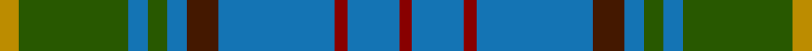

This page is one **sett** — a single exact thread-count. It belongs to the [tartan](/tartans/dy3g17b3g3b3dr5b18dra2b8dra2/)
(the same proportion at any scale), whose colour order is pattern [RBRBBBGBGY](/stripes/rbrbbbgbgy/).

Sourced from register-of-tartans.  It is a [10 stripe tartan](/stripes/stripes10/).

Original link https://www.tartanregister.gov.uk/tartanDetails.aspx?ref=950

2 attestations — the source records this cloth was collapsed from (oldest owns this page)

<ul>
<li>01/01/1996 — Donegal, County (register-of-tartans, <a href="https://www.tartanregister.gov.uk/tartanDetails.aspx?ref=950">record</a>)</li>
<li>1996 — Donegal, County (District) (tartans-authority, <a href="http://www.tartansauthority.com/tartan-ferret/display/2247/">record</a>)</li>
</ul>

## Register references

External register numbers recorded for this tartan.

- Scottish Register of Tartans: [950](https://www.tartanregister.gov.uk/tartanDetails.aspx?ref=950)
- Scottish Tartans Authority (ITI): 2247
- Scottish Tartans World Register: 2247

## Thread count
DY/6 G34 B6 G6 B6 DR10 B36 DRa4 B16 DRa/4

## Palette
Each colour and the base-6 reference it is a variant of.

| Colour | Shade | Base |
|---|---|---|
| B | <code style="background-color:#1474B4;">#1474B4</code> `oklch(54.0% 0.129 245.1)` <small>#1474B4</small> | B <code style="background-color:#2A418A;">#2A418A</code> |
| DR | <code style="background-color:#441800;">#441800</code> `oklch(27.3% 0.076 46.3)` <small>#441800</small> | B <code style="background-color:#2A418A;">#2A418A</code> |
| DRa | <code style="background-color:#880000;">#880000</code> `oklch(39.4% 0.162 29.2)` <small>#880000</small> | R <code style="background-color:#CC0000;">#CC0000</code> |
| DY | <code style="background-color:#BC8C00;">#BC8C00</code> `oklch(66.8% 0.137 84.1)` <small>#BC8C00</small> | Y <code style="background-color:#F2BF00;">#F2BF00</code> |
| G | <code style="background-color:#285800;">#285800</code> `oklch(41.0% 0.122 135.8)` <small>#285800</small> | G <code style="background-color:#006100;">#006100</code> |

## Nearest tartans

The nearest existing variants by ΔTartan distance, with this tartan at the top so the swatches line up against it.

ΔTartan

Tartan

Sett

—

<a href="/ttd/edit/#slug=lo3dg17b3dg3b3do5b18r2b8r2~x2">Donegal, County</a> <a class="nn-out" href="/setts/s10/lo3dg17b3dg3b3do5b18r2b8r2~x2/" title="open its dictionary page">↗</a>

0.55

<a href="/ttd/edit/#slug=db2y18db2y2db20r3db18g2db2g18w2">American Society of Travel Agents, The</a> <a class="nn-out" href="/setts/s11/db2y18db2y2db20r3db18g2db2g18w2/" title="open its dictionary page">↗</a>

0.61

<a href="/ttd/edit/#slug=y3g17db3g3db3dr5db18r2db8r2~x2">Donegal</a> <a class="nn-out" href="/setts/s10/y3g17db3g3db3dr5db18r2db8r2~x2/" title="open its dictionary page">↗</a>

0.73

<a href="/ttd/edit/#slug=dr3g3dt3g14dt3g3dt3t5dt18ly2dt8ly2~x2">California Burns (Personal)</a> <a class="nn-out" href="/setts/s12/dr3g3dt3g14dt3g3dt3t5dt18ly2dt8ly2~x2/" title="open its dictionary page">↗</a>

0.77

<a href="/ttd/edit/#slug=lo3g17n3g3n3k5n18r2n8r2~x2">Donegal Irish County Tartan Tartan Number: 2247. Earliest known date: 1996 One of a series of Irish District tartans designed by Polly Wittering of the House of Edgar, with colours reminiscent of the Country with soft warm colours dominating. See products available Copyright © Blair Urquhart, Comrie, 2015</a> <a class="nn-out" href="/setts/s10/lo3g17n3g3n3k5n18r2n8r2~x2/" title="open its dictionary page">↗</a>

0.94

<a href="/ttd/edit/#slug=dg21db4w4db32dg12ly4dg8r4dg6db12">Harkness Hunting</a> <a class="nn-out" href="/setts/s10/dg21db4w4db32dg12ly4dg8r4dg6db12/" title="open its dictionary page">↗</a>

1.04

<a href="/ttd/edit/#slug=w2n4dy3dt3dy3dt20dy3n16dt8lt2~x2">Sverker</a> <a class="nn-out" href="/setts/s10/w2n4dy3dt3dy3dt20dy3n16dt8lt2~x2/" title="open its dictionary page">↗</a>

1.06

<a href="/ttd/edit/#slug=k2r2k4lo3g24k2g16b17r2~x2">Shanahan (Corporate)</a> <a class="nn-out" href="/setts/s9/k2r2k4lo3g24k2g16b17r2~x2/" title="open its dictionary page">↗</a>

1.09

<a href="/ttd/edit/#slug=g54dt14ly7r14k7dt14r6~x2">Gloucester County Pipe Band (Corp)</a> <a class="nn-out" href="/setts/s7/g54dt14ly7r14k7dt14r6~x2/" title="open its dictionary page">↗</a>

1.11

<a href="/ttd/edit/#slug=r2db10w1m1dg1r1dg6m1dg10w1~x2">Tennessee</a> <a class="nn-out" href="/setts/s10/r2db10w1m1dg1r1dg6m1dg10w1~x2/" title="open its dictionary page">↗</a>

1.11

<a href="/ttd/edit/#slug=n8ly2n22dg6r2lb10dg12n3~x2">Bahamas</a> <a class="nn-out" href="/setts/s8/n8ly2n22dg6r2lb10dg12n3~x2/" title="open its dictionary page">↗</a>

## Neighbour map

Every grey dot is one of 14299 variants placed by the first two principal components of the ΔTartan feature space (44% of its variance). Red is this tartan; blue dots are its nearest — click one to open its page.

<svg viewBox="0 0 640 380" role="img" style="max-width:100%;height:auto;border:1px solid #e0e0e0;border-radius:4px;display:block" xmlns="http://www.w3.org/2000/svg"><image href="/nn/cloud.v1.png" width="640" height="380"/><a href="/setts/s11/db2y18db2y2db20r3db18g2db2g18w2/"><circle cx="263.8" cy="178.8" r="4" fill="#3465a4"><title>American Society of Travel Agents, The</title></circle></a><a href="/setts/s10/y3g17db3g3db3dr5db18r2db8r2~x2/"><circle cx="259.1" cy="190.8" r="4" fill="#3465a4"><title>Donegal</title></circle></a><a href="/setts/s12/dr3g3dt3g14dt3g3dt3t5dt18ly2dt8ly2~x2/"><circle cx="265.7" cy="191.1" r="4" fill="#3465a4"><title>California Burns (Personal)</title></circle></a><a href="/setts/s10/lo3g17n3g3n3k5n18r2n8r2~x2/"><circle cx="249.0" cy="184.4" r="4" fill="#3465a4"><title>Donegal Irish County Tartan Tartan Number: 2247. Earliest known date: 1996 One of a series of Irish District tartans designed by Polly Wittering of the House of Edgar, with colours reminiscent of the Country with soft warm colours dominating. See products available Copyright © Blair Urquhart, Comrie, 2015</title></circle></a><a href="/setts/s10/dg21db4w4db32dg12ly4dg8r4dg6db12/"><circle cx="240.6" cy="203.2" r="4" fill="#3465a4"><title>Harkness Hunting</title></circle></a><a href="/setts/s10/w2n4dy3dt3dy3dt20dy3n16dt8lt2~x2/"><circle cx="255.6" cy="183.7" r="4" fill="#3465a4"><title>Sverker</title></circle></a><a href="/setts/s9/k2r2k4lo3g24k2g16b17r2~x2/"><circle cx="320.7" cy="191.8" r="4" fill="#3465a4"><title>Shanahan (Corporate)</title></circle></a><a href="/setts/s7/g54dt14ly7r14k7dt14r6~x2/"><circle cx="240.0" cy="201.0" r="4" fill="#3465a4"><title>Gloucester County Pipe Band (Corp)</title></circle></a><a href="/setts/s10/r2db10w1m1dg1r1dg6m1dg10w1~x2/"><circle cx="262.2" cy="170.6" r="4" fill="#3465a4"><title>Tennessee</title></circle></a><a href="/setts/s8/n8ly2n22dg6r2lb10dg12n3~x2/"><circle cx="249.2" cy="195.7" r="4" fill="#3465a4"><title>Bahamas</title></circle></a><circle cx="266.3" cy="196.2" r="5" fill="#c00000"/></svg>

ID: /setts/s10/lo3dg17b3dg3b3do5b18r2b8r2~x2/
