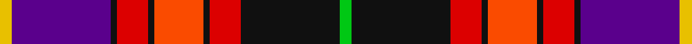

In pattern [YBKRKRKRKY](/stripes/ybkrkrkrky/).

This was sourced from register-of-tartans.  It is a [10 stripe tartan](/stripes/stripes10/).

Original link https://www.tartanregister.gov.uk/tartanDetails.aspx?ref=5453

## Register references

External register numbers recorded for this tartan.

- Scottish Register of Tartans: [5453](https://www.tartanregister.gov.uk/tartanDetails.aspx?ref=5453)
- Scottish Tartans World Register: 2953

## Thread count
Y/8 P64 K4 R20 K4 Ra32 K4 R20 K64 G/8

## Palette
Each colour and the base-6 reference it is a variant of.

| Colour | Shade | Base |
|---|---|---|
| G | <code style="background-color:#00C814;">#00C814</code> `oklch(72.2% 0.242 142.9)` <small>#00C814</small> | Y <code style="background-color:#F2BF00;">#F2BF00</code> |
| K | <code style="background-color:#101010;">#101010</code> `oklch(17.3% 0.000 89.9)` <small>#101010</small> | K <code style="background-color:#000000;">#000000</code> |
| P | <code style="background-color:#5A008C;">#5A008C</code> `oklch(37.0% 0.191 306.3)` <small>#5A008C</small> | B <code style="background-color:#2A418A;">#2A418A</code> |
| R | <code style="background-color:#DC0000;">#DC0000</code> `oklch(56.2% 0.230 29.2)` <small>#DC0000</small> | R <code style="background-color:#CC0000;">#CC0000</code> |
| Ra | <code style="background-color:#FA4B00;">#FA4B00</code> `oklch(65.7% 0.220 36.9)` <small>#FA4B00</small> | R <code style="background-color:#CC0000;">#CC0000</code> |
| Y | <code style="background-color:#E8C000;">#E8C000</code> `oklch(81.9% 0.168 93.7)` <small>#E8C000</small> | Y <code style="background-color:#F2BF00;">#F2BF00</code> |

## Nearest tartans

The nearest existing variants by ΔTartan distance, with this tartan at the top so the swatches line up against it.

ΔTartan

Tartan

Sett

—

<a href="/ttd/edit/#slug=ly2dp16k1r5k1r8k1r5k16lg2~x4">Tribal</a> <a class="nn-out" href="/setts/s10/ly2dp16k1r5k1r8k1r5k16lg2~x4/" title="open its dictionary page">↗</a>

0.73

<a href="/ttd/edit/#slug=dp45k12ly4k4w6k4dg50r57dp4r10k4~x2">MacLean Variation</a> <a class="nn-out" href="/setts/s11/dp45k12ly4k4w6k4dg50r57dp4r10k4~x2/" title="open its dictionary page">↗</a>

0.74

<a href="/ttd/edit/#slug=g2k16r5k1o8k1r5k1dp16ly2~x4">Tribal #2</a> <a class="nn-out" href="/setts/s10/g2k16r5k1o8k1r5k1dp16ly2~x4/" title="open its dictionary page">↗</a>

0.89

<a href="/ttd/edit/#slug=db4ly3db22o6w2k6w2r26k3r4~x2">Asman Red (Personal)</a> <a class="nn-out" href="/setts/s10/db4ly3db22o6w2k6w2r26k3r4~x2/" title="open its dictionary page">↗</a>

0.98

<a href="/ttd/edit/#slug=p45k12ly4k4w6k4g50r57p4r10k4~x2">MacLean, Variation</a> <a class="nn-out" href="/setts/s11/p45k12ly4k4w6k4g50r57p4r10k4~x2/" title="open its dictionary page">↗</a>

1.00

<a href="/ttd/edit/#slug=w3g2r21k26db18k2db3ly3~x2">Loch Etive</a> <a class="nn-out" href="/setts/s8/w3g2r21k26db18k2db3ly3~x2/" title="open its dictionary page">↗</a>

1.00

<a href="/ttd/edit/#slug=db4ly3db22o6w2k6w2r6r20k3r4~x2">Asman Dress Family Tartan Tartan Number: 2552. Earliest known date: 1989 Designed for David I Asman by Dr. Philip D. Smith, 1989. David Asman was an English armiger and lived at one time in New jersey, USA. The tartan was first woven by Peter MacDonald in the weaving shed at the Scottish Tartan Society's Comrie museum in the 1989. See products available Copyright © Blair Urquhart, Comrie, 2015</a> <a class="nn-out" href="/setts/s11/db4ly3db22o6w2k6w2r6r20k3r4~x2/" title="open its dictionary page">↗</a>

1.05

<a href="/ttd/edit/#slug=ly3db3k2db18k26r21g2lb3~x2">Loch Etive</a> <a class="nn-out" href="/setts/s8/ly3db3k2db18k26r21g2lb3~x2/" title="open its dictionary page">↗</a>

1.05

<a href="/ttd/edit/#slug=k6r2db18lo2g2lo2g10r20db2lb1db6~x2">Aberdeen Asset Management (Corp)</a> <a class="nn-out" href="/setts/s11/k6r2db18lo2g2lo2g10r20db2lb1db6~x2/" title="open its dictionary page">↗</a>

1.06

<a href="/ttd/edit/#slug=r6k7r45m14k10o4k3m6k20m23lr5m6">Sweetheart, The</a> <a class="nn-out" href="/setts/s12/r6k7r45m14k10o4k3m6k20m23lr5m6/" title="open its dictionary page">↗</a>

1.11

<a href="/ttd/edit/#slug=r30w4ly2w4db16dg8dp3dg8k10r3k4~x2">Filipino American</a> <a class="nn-out" href="/setts/s11/r30w4ly2w4db16dg8dp3dg8k10r3k4~x2/" title="open its dictionary page">↗</a>

## Neighbour map

Every grey dot is one of 14299 variants placed by the first two principal components of the ΔTartan feature space (44% of its variance). Red is this tartan; blue dots are its nearest — click one to open its page.

<svg viewBox="0 0 640 380" role="img" style="max-width:100%;height:auto;border:1px solid #e0e0e0;border-radius:4px;display:block" xmlns="http://www.w3.org/2000/svg"><image href="/nn/cloud.v1.png" width="640" height="380"/><a href="/setts/s11/dp45k12ly4k4w6k4dg50r57dp4r10k4~x2/"><circle cx="153.1" cy="104.6" r="4" fill="#3465a4"><title>MacLean Variation</title></circle></a><a href="/setts/s10/g2k16r5k1o8k1r5k1dp16ly2~x4/"><circle cx="159.7" cy="119.2" r="4" fill="#3465a4"><title>Tribal #2</title></circle></a><a href="/setts/s10/db4ly3db22o6w2k6w2r26k3r4~x2/"><circle cx="169.1" cy="111.3" r="4" fill="#3465a4"><title>Asman Red (Personal)</title></circle></a><a href="/setts/s11/p45k12ly4k4w6k4g50r57p4r10k4~x2/"><circle cx="142.1" cy="98.6" r="4" fill="#3465a4"><title>MacLean, Variation</title></circle></a><a href="/setts/s8/w3g2r21k26db18k2db3ly3~x2/"><circle cx="153.5" cy="132.2" r="4" fill="#3465a4"><title>Loch Etive</title></circle></a><a href="/setts/s11/db4ly3db22o6w2k6w2r6r20k3r4~x2/"><circle cx="153.4" cy="121.0" r="4" fill="#3465a4"><title>Asman Dress Family Tartan Tartan Number: 2552. Earliest known date: 1989 Designed for David I Asman by Dr. Philip D. Smith, 1989. David Asman was an English armiger and lived at one time in New jersey, USA. The tartan was first woven by Peter MacDonald in the weaving shed at the Scottish Tartan Society's Comrie museum in the 1989. See products available Copyright © Blair Urquhart, Comrie, 2015</title></circle></a><a href="/setts/s8/ly3db3k2db18k26r21g2lb3~x2/"><circle cx="158.4" cy="136.0" r="4" fill="#3465a4"><title>Loch Etive</title></circle></a><a href="/setts/s11/k6r2db18lo2g2lo2g10r20db2lb1db6~x2/"><circle cx="171.6" cy="106.4" r="4" fill="#3465a4"><title>Aberdeen Asset Management (Corp)</title></circle></a><a href="/setts/s12/r6k7r45m14k10o4k3m6k20m23lr5m6/"><circle cx="159.4" cy="113.2" r="4" fill="#3465a4"><title>Sweetheart, The</title></circle></a><a href="/setts/s11/r30w4ly2w4db16dg8dp3dg8k10r3k4~x2/"><circle cx="115.5" cy="96.0" r="4" fill="#3465a4"><title>Filipino American</title></circle></a><circle cx="138.8" cy="108.4" r="5" fill="#c00000"/></svg>

ID: /setts/s10/ly2dp16k1r5k1r8k1r5k16lg2~x4/
