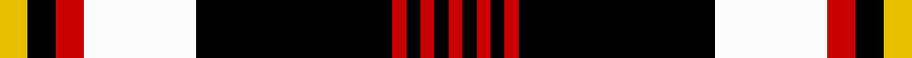

In pattern [RKRKRKWRKY](/stripes/rkrkrkwrky/).

This was sourced from tartans-authority.  It is a [10 stripe tartan](/stripes/stripes10/).

Original link http://www.tartansauthority.com/tartan-ferret/display/1607/

## Also known as

This cloth is also recorded under:

- Barbecue, Plaid

## Attestations

This cloth appears in 3 source records; the oldest owns this page.

- pre 1964 — Barbecue Plaid (Fashion) (tartans-authority, [record](http://www.tartansauthority.com/tartan-ferret/display/1607/))
- undated — Barbecue, Plaid (weddslist, [record](http://www.weddslist.com/cgi-bin/tartans/pg.pl?source=sts))
- undated — Barbecue Plaid Tartan Tartan Number: 1607. Earliest known date: pre 1964 From STS member, Alex Lumsden in Toronto, Canada. See products available Copyright © Blair Urquhart, Comrie, 2015 (house-of-tartan, [record](http://www.house-of-tartan.scotland.net/house/TartanViewjs.asp?colr=Def&tnam=1607))

## Thread count
Y/4 K4 R4 W16 K28 R2 K2 R2 K2 R/2

## Palette
Each colour and the base-6 reference it is a variant of.

| Colour | Shade | Base |
|---|---|---|
| K | <code style="background-color:#000000;">#000000</code> `oklch(0.0% 0.000 0.0)` <small>#000000</small> | K <code style="background-color:#000000;">#000000</code> |
| R | <code style="background-color:#C80000;">#C80000</code> `oklch(52.3% 0.215 29.2)` <small>#C80000</small> | R <code style="background-color:#CC0000;">#CC0000</code> |
| W | <code style="background-color:#FCFCFC;">#FCFCFC</code> `oklch(99.1% 0.000 89.9)` <small>#FCFCFC</small> | W <code style="background-color:#F7F7F7;">#F7F7F7</code> |
| Y | <code style="background-color:#E8C000;">#E8C000</code> `oklch(81.9% 0.168 93.7)` <small>#E8C000</small> | Y <code style="background-color:#F2BF00;">#F2BF00</code> |

## Nearest tartans

The nearest existing variants by ΔTartan distance.

1. [Meg Merrilees, New (1831)](/setts/s9/t5r5k58r5t5r5w25r5t4/) — ΔT 1.10
1. [Cunard o' the Clyde](/setts/s8/r10k3w1k15ly1w3k3ly1~x4/) — ΔT 1.10
1. [Woodberry Forest School (Corporate)](/setts/s10/r6k3w3k3w3k34r6g5r6k5~x2/) — ΔT 1.12
1. [Gordon, dress 1](/setts/s9/w4k2w16k4w4k37g12k4ly4~x2/) — ΔT 1.19
1. [Phantom](/setts/s7/w3o10k38w11o6k2w3~x2/) — ΔT 1.23
1. [Wcwm 972-2](/setts/s13/lb7k1k1o2k18lb2k1k2k1lb6k1k1lb1~x4/) — ΔT 1.23
1. [Braemar, or Blair Atholl](/setts/s10/o1w2k5o3k1o5k1o11k1o1~x4/) — ΔT 1.25
1. [Gordon Dress (MacGregor-Hastie)](/setts/s9/w4k2w16k4w4k37dg12k4ly4~x2/) — ΔT 1.25
1. [Freger](/setts/s13/w1ly2k8dp6k15ly1k1w1k15dp5w8ly1w1~x2/) — ΔT 1.28
1. [Good Conduct (USA)](/setts/s10/db5r12k38r4w2r2w2r2w2r4~x2/) — ΔT 1.29

## Neighbour map

Every grey dot is one of 14299 variants placed by the first two principal components of the ΔTartan feature space (44% of its variance). Red is this tartan; blue dots are its nearest — click one to open its page.

<svg viewBox="0 0 640 380" role="img" style="max-width:100%;height:auto;border:1px solid #e0e0e0;border-radius:4px;display:block" xmlns="http://www.w3.org/2000/svg"><image href="/nn/cloud.v1.png" width="640" height="380"/><a href="/setts/s9/t5r5k58r5t5r5w25r5t4/"><circle cx="248.3" cy="122.7" r="4" fill="#3465a4"><title>Meg Merrilees, New (1831)</title></circle></a><a href="/setts/s8/r10k3w1k15ly1w3k3ly1~x4/"><circle cx="303.3" cy="152.0" r="4" fill="#3465a4"><title>Cunard o' the Clyde</title></circle></a><a href="/setts/s10/r6k3w3k3w3k34r6g5r6k5~x2/"><circle cx="325.5" cy="150.1" r="4" fill="#3465a4"><title>Woodberry Forest School (Corporate)</title></circle></a><a href="/setts/s9/w4k2w16k4w4k37g12k4ly4~x2/"><circle cx="271.0" cy="137.7" r="4" fill="#3465a4"><title>Gordon, dress 1</title></circle></a><a href="/setts/s7/w3o10k38w11o6k2w3~x2/"><circle cx="286.7" cy="140.2" r="4" fill="#3465a4"><title>Phantom</title></circle></a><a href="/setts/s13/lb7k1k1o2k18lb2k1k2k1lb6k1k1lb1~x4/"><circle cx="275.0" cy="107.5" r="4" fill="#3465a4"><title>Wcwm 972-2</title></circle></a><a href="/setts/s10/o1w2k5o3k1o5k1o11k1o1~x4/"><circle cx="270.3" cy="159.4" r="4" fill="#3465a4"><title>Braemar, or Blair Atholl</title></circle></a><a href="/setts/s9/w4k2w16k4w4k37dg12k4ly4~x2/"><circle cx="276.2" cy="136.0" r="4" fill="#3465a4"><title>Gordon Dress (MacGregor-Hastie)</title></circle></a><a href="/setts/s13/w1ly2k8dp6k15ly1k1w1k15dp5w8ly1w1~x2/"><circle cx="296.9" cy="137.4" r="4" fill="#3465a4"><title>Freger</title></circle></a><a href="/setts/s10/db5r12k38r4w2r2w2r2w2r4~x2/"><circle cx="304.6" cy="103.5" r="4" fill="#3465a4"><title>Good Conduct (USA)</title></circle></a><circle cx="271.3" cy="127.0" r="5" fill="#c00000"/></svg>

ID: /setts/s10/ly2k2r2w8k14r1k1r1k1r1~x2/
