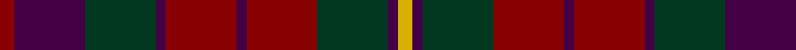

**Bands:** [RBGBRBRGBY](/stripes/rbgbrbrgby/) · **Stripes:** [R DP DG DP R DP R DG DP LY](/stripes/stripes10/) R DP DG DP R DP R DG DP LY

This was sourced from register-of-tartans.  It is a [10 band tartan](/bands/bands10/).

Original link https://www.tartanregister.gov.uk/tartanDetails.aspx?ref=664

## Attestations

This cloth appears in 2 source records; the oldest owns this page.

- 01/01/1996 — Clare, County (register-of-tartans, [record](https://www.tartanregister.gov.uk/tartanDetails.aspx?ref=664))
- 1996 — Clare, County (District) (tartans-authority, [record](http://www.tartansauthority.com/tartan-ferret/display/2248/))

## Register references

External register numbers recorded for this tartan.

- Scottish Register of Tartans: [664](https://www.tartanregister.gov.uk/tartanDetails.aspx?ref=664)
- Scottish Tartans Authority (ITI): 2248
- Scottish Tartans World Register: 2248

## Thread count
DR/6 DP28 DG28 DP4 DR28 DP4 DR28 DG28 DP4 Y/6

## Palette
Each colour and its ΔE from the base-6 reference it is a variant of.

| Colour | Shade | Base | ΔE (OKLab) |
|---|---|---|---|
| DG | <code style="background-color:#003820;">#003820</code> `#003820` | G <code style="background-color:#006100;">#006100</code> | 0.15 |
| DP | <code style="background-color:#440044;">#440044</code> `#440044` | B <code style="background-color:#2A418A;">#2A418A</code> | 0.18 |
| DR | <code style="background-color:#880000;">#880000</code> `#880000` | R <code style="background-color:#CC0000;">#CC0000</code> | 0.15 |
| Y | <code style="background-color:#D8B000;">#D8B000</code> `#D8B000` | Y <code style="background-color:#F2BF00;">#F2BF00</code> | 0.06 |

## Nearest tartans

The nearest existing variants by ΔTartan distance.

1. [Ruben Delanghe (Personal)](/setts/s10/dg14k5db2r21dg18k4db18r9k2r12/) — ΔT 0.89
1. [McCall/MacCall](/setts/s11/dr8k5dr8dg27dr13dg3dr13o27dr8o3dr3~x2/) — ΔT 0.92
1. [Hueg (Munich) Hunting (Personal)](/setts/s11/r10do10r4dg2r2do2r4dg12dp12dg3dp4~x2/) — ΔT 0.98
1. [Clare Irish County Tartan Tartan Number: 2248. Earliest known date: 1995 One of a series of Irish District tartans designed by Polly Wittering of the House of Edgar, with colours reminiscent of the Country with soft warm colours dominating. See products available Copyright © Blair Urquhart, Comrie, 2015](/setts/s11/lo3db2g14db2r14db2r14db2g14db14r3~x2/) — ΔT 1.03
1. [Orban-Prentice (Personal)](/setts/s12/dg25db4r24db21dy25db4dg3db4dy25db21r24db4~x2/) — ΔT 1.15
1. [Ferguson Britt](/setts/s10/k12r1do12dy12do2dy12do12r1k12dy2~x6/) — ΔT 1.31
1. [Roscommon](/setts/s10/r5o3r19dr6o5dr6n12n5n12n3~x2/) — ΔT 1.31
1. [Monaghan Irish County Tartan Tartan Number: 2267. Earliest known date: 1996 One of a series of Irish District tartans designed by Polly Wittering of the House of Edgar, with colours reminiscent of the Country with soft warm colours dominating. See products available Copyright © Blair Urquhart, Comrie, 2015](/setts/s9/lo3dy2o14dg17dy14lo8o14dy2lo3~x2/) — ΔT 1.32
1. [Glenmorangie #2](/setts/s11/dy6m2dy2m4dy13dy12o13m4o2m2o6~x2/) — ΔT 1.34
1. [Edinburgh International Conference Centre, The](/setts/s6/dy4dt20dy3k20o24dt3~x2/) — ΔT 1.40

## Neighbour map

Every grey dot is one of 14313 variants placed by the first two principal components of the ΔTartan feature space (44% of its variance). Red is this tartan; blue dots are its nearest — click one to open its page.

<svg viewBox="0 0 640 380" role="img" style="max-width:100%;height:auto;border:1px solid #e0e0e0;border-radius:4px;display:block" xmlns="http://www.w3.org/2000/svg"><image href="/nn/cloud.v1.png" width="640" height="380"/><a href="/setts/s10/dg14k5db2r21dg18k4db18r9k2r12/"><circle cx="242.8" cy="231.7" r="4" fill="#3465a4"><title>Ruben Delanghe (Personal)</title></circle></a><a href="/setts/s11/dr8k5dr8dg27dr13dg3dr13o27dr8o3dr3~x2/"><circle cx="265.7" cy="214.5" r="4" fill="#3465a4"><title>McCall/MacCall</title></circle></a><a href="/setts/s11/r10do10r4dg2r2do2r4dg12dp12dg3dp4~x2/"><circle cx="175.0" cy="238.7" r="4" fill="#3465a4"><title>Hueg (Munich) Hunting (Personal)</title></circle></a><a href="/setts/s11/lo3db2g14db2r14db2r14db2g14db14r3~x2/"><circle cx="206.9" cy="216.3" r="4" fill="#3465a4"><title>Clare Irish County Tartan Tartan Number: 2248. Earliest known date: 1995 One of a series of Irish District tartans designed by Polly Wittering of the House of Edgar, with colours reminiscent of the Country with soft warm colours dominating. See products available Copyright © Blair Urquhart, Comrie, 2015</title></circle></a><a href="/setts/s12/dg25db4r24db21dy25db4dg3db4dy25db21r24db4~x2/"><circle cx="174.3" cy="220.1" r="4" fill="#3465a4"><title>Orban-Prentice (Personal)</title></circle></a><a href="/setts/s10/k12r1do12dy12do2dy12do12r1k12dy2~x6/"><circle cx="236.1" cy="233.9" r="4" fill="#3465a4"><title>Ferguson Britt</title></circle></a><a href="/setts/s10/r5o3r19dr6o5dr6n12n5n12n3~x2/"><circle cx="232.4" cy="235.7" r="4" fill="#3465a4"><title>Roscommon</title></circle></a><a href="/setts/s9/lo3dy2o14dg17dy14lo8o14dy2lo3~x2/"><circle cx="187.0" cy="221.2" r="4" fill="#3465a4"><title>Monaghan Irish County Tartan Tartan Number: 2267. Earliest known date: 1996 One of a series of Irish District tartans designed by Polly Wittering of the House of Edgar, with colours reminiscent of the Country with soft warm colours dominating. See products available Copyright © Blair Urquhart, Comrie, 2015</title></circle></a><a href="/setts/s11/dy6m2dy2m4dy13dy12o13m4o2m2o6~x2/"><circle cx="182.0" cy="225.0" r="4" fill="#3465a4"><title>Glenmorangie #2</title></circle></a><a href="/setts/s6/dy4dt20dy3k20o24dt3~x2/"><circle cx="217.6" cy="255.6" r="4" fill="#3465a4"><title>Edinburgh International Conference Centre, The</title></circle></a><circle cx="232.1" cy="236.2" r="5" fill="#c00000"/></svg>

ID: /setts/s10/ly3dp2dg14r14dp2r14dp2dg14dp14r3~x2/
