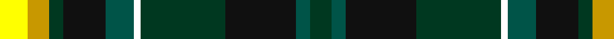

This page is one **sett** — a single exact thread-count. It belongs to the [tartan](/tartans/y4dy3dg2k6g4w1dg12k10g2dg3/)
(the same proportion at any scale), whose colour order is pattern [GGKGWGKGYY](/stripes/ggkgwgkgyy/).

Sourced from register-of-tartans.  It is a [10 stripe tartan](/stripes/stripes10/).

Original link https://www.tartanregister.gov.uk/tartanDetails.aspx?ref=10903

## Register references

External register numbers recorded for this tartan.

- Scottish Register of Tartans: [10903](https://www.tartanregister.gov.uk/tartanDetails.aspx?ref=10903)

## Thread count
Y/8 DY6 DG4 K12 G8 W2 DG24 K20 G4 DG/6

## Palette
Each colour and the base-6 reference it is a variant of.

| Colour | Shade | Base |
|---|---|---|
| DG | <code style="background-color:#003820;">#003820</code> `oklch(30.0% 0.070 158.3)` <small>#003820</small> | G <code style="background-color:#006100;">#006100</code> |
| DY | <code style="background-color:#C89800;">#C89800</code> `oklch(70.6% 0.144 85.9)` <small>#C89800</small> | Y <code style="background-color:#F2BF00;">#F2BF00</code> |
| G | <code style="background-color:#005448;">#005448</code> `oklch(39.9% 0.073 178.8)` <small>#005448</small> | G <code style="background-color:#006100;">#006100</code> |
| K | <code style="background-color:#101010;">#101010</code> `oklch(17.3% 0.000 89.9)` <small>#101010</small> | K <code style="background-color:#000000;">#000000</code> |
| W | <code style="background-color:#FFFFFF;">#FFFFFF</code> `oklch(100.0% 0.000 89.9)` <small>#FFFFFF</small> | W <code style="background-color:#F7F7F7;">#F7F7F7</code> |
| Y | <code style="background-color:#FFFF00;">#FFFF00</code> `oklch(96.8% 0.211 109.8)` <small>#FFFF00</small> | Y <code style="background-color:#F2BF00;">#F2BF00</code> |

## Nearest tartans

The nearest existing variants by ΔTartan distance, with this tartan at the top so the swatches line up against it.

ΔTartan

Tartan

Sett

—

<a href="/ttd/edit/#slug=ly4ly3dg2k6dg4w1dg12k10dg2dg3~x2">Noble (South Africa) (Personal)</a> <a class="nn-out" href="/setts/s10/ly4ly3dg2k6dg4w1dg12k10dg2dg3~x2/" title="open its dictionary page">↗</a>

0.22

<a href="/ttd/edit/#slug=ly4ly3dg2k6g4w1dg12k10g2dg3~x2">Noble (South Africa) (Personal)</a> <a class="nn-out" href="/setts/s10/ly4ly3dg2k6g4w1dg12k10g2dg3~x2/" title="open its dictionary page">↗</a>

0.77

<a href="/ttd/edit/#slug=k6g20t2r5t2k20ly3db20g26r3db5~x2">Stephenson</a> <a class="nn-out" href="/setts/s11/k6g20t2r5t2k20ly3db20g26r3db5~x2/" title="open its dictionary page">↗</a>

0.81

<a href="/ttd/edit/#slug=lr3k15k10dy10k1g5k1ly10k10g8k1k2~x2">Blue Castlefield (Fashion)</a> <a class="nn-out" href="/setts/s12/lr3k15k10dy10k1g5k1ly10k10g8k1k2~x2/" title="open its dictionary page">↗</a>

0.93

<a href="/ttd/edit/#slug=db7w2g3db18ly2k15ly2g17r5g3r2g7~x2">Paisley</a> <a class="nn-out" href="/setts/s12/db7w2g3db18ly2k15ly2g17r5g3r2g7~x2/" title="open its dictionary page">↗</a>

0.95

<a href="/ttd/edit/#slug=r3k1g12k12db12t3db12k12g12k1ly3~x2">Smith</a> <a class="nn-out" href="/setts/s11/r3k1g12k12db12t3db12k12g12k1ly3~x2/" title="open its dictionary page">↗</a>

0.96

<a href="/ttd/edit/#slug=k6g14t2r3t2k16ly2b16g16r3~x2">Unnamed 4</a> <a class="nn-out" href="/setts/s10/k6g14t2r3t2k16ly2b16g16r3~x2/" title="open its dictionary page">↗</a>

0.97

<a href="/ttd/edit/#slug=g2dp2g10k6r2k6t10k1lb2~x2">Birch (Personal) (Estimated threadcount)</a> <a class="nn-out" href="/setts/s9/g2dp2g10k6r2k6t10k1lb2~x2/" title="open its dictionary page">↗</a>

1.02

<a href="/ttd/edit/#slug=db3ly1db12k4ly2k4g8r2g8r1~x2">MacMillan, hunting</a> <a class="nn-out" href="/setts/s10/db3ly1db12k4ly2k4g8r2g8r1~x2/" title="open its dictionary page">↗</a>

1.03

<a href="/ttd/edit/#slug=g30w3g4ly5g4w3g6k14t3k14db18w4~x2">MacKellar</a> <a class="nn-out" href="/setts/s12/g30w3g4ly5g4w3g6k14t3k14db18w4~x2/" title="open its dictionary page">↗</a>

1.04

<a href="/ttd/edit/#slug=k6g20t2r6t2k20ly3db20g26r3db6~x2">Stevenson</a> <a class="nn-out" href="/setts/s11/k6g20t2r6t2k20ly3db20g26r3db6~x2/" title="open its dictionary page">↗</a>

## Neighbour map

Every grey dot is one of 14299 variants placed by the first two principal components of the ΔTartan feature space (44% of its variance). Red is this tartan; blue dots are its nearest — click one to open its page.

<svg viewBox="0 0 640 380" role="img" style="max-width:100%;height:auto;border:1px solid #e0e0e0;border-radius:4px;display:block" xmlns="http://www.w3.org/2000/svg"><image href="/nn/cloud.v1.png" width="640" height="380"/><a href="/setts/s10/ly4ly3dg2k6g4w1dg12k10g2dg3~x2/"><circle cx="118.4" cy="158.6" r="4" fill="#3465a4"><title>Noble (South Africa) (Personal)</title></circle></a><a href="/setts/s11/k6g20t2r5t2k20ly3db20g26r3db5~x2/"><circle cx="140.2" cy="137.3" r="4" fill="#3465a4"><title>Stephenson</title></circle></a><a href="/setts/s12/lr3k15k10dy10k1g5k1ly10k10g8k1k2~x2/"><circle cx="107.7" cy="141.5" r="4" fill="#3465a4"><title>Blue Castlefield (Fashion)</title></circle></a><a href="/setts/s12/db7w2g3db18ly2k15ly2g17r5g3r2g7~x2/"><circle cx="102.1" cy="143.1" r="4" fill="#3465a4"><title>Paisley</title></circle></a><a href="/setts/s11/r3k1g12k12db12t3db12k12g12k1ly3~x2/"><circle cx="83.4" cy="160.0" r="4" fill="#3465a4"><title>Smith</title></circle></a><a href="/setts/s10/k6g14t2r3t2k16ly2b16g16r3~x2/"><circle cx="92.1" cy="157.3" r="4" fill="#3465a4"><title>Unnamed 4</title></circle></a><a href="/setts/s9/g2dp2g10k6r2k6t10k1lb2~x2/"><circle cx="76.7" cy="158.2" r="4" fill="#3465a4"><title>Birch (Personal) (Estimated threadcount)</title></circle></a><a href="/setts/s10/db3ly1db12k4ly2k4g8r2g8r1~x2/"><circle cx="131.6" cy="165.4" r="4" fill="#3465a4"><title>MacMillan, hunting</title></circle></a><a href="/setts/s12/g30w3g4ly5g4w3g6k14t3k14db18w4~x2/"><circle cx="127.9" cy="139.2" r="4" fill="#3465a4"><title>MacKellar</title></circle></a><a href="/setts/s11/k6g20t2r6t2k20ly3db20g26r3db6~x2/"><circle cx="140.9" cy="138.9" r="4" fill="#3465a4"><title>Stevenson</title></circle></a><circle cx="117.3" cy="158.7" r="5" fill="#c00000"/></svg>

ID: /setts/s10/ly4ly3dg2k6dg4w1dg12k10dg2dg3~x2/
