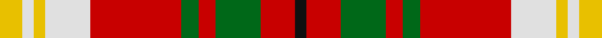

This page is one **sett** — a single exact thread-count. It belongs to the [tartan](/tartans/ly4w2ly2w8r16g3r3g8r6k2/)
(the same proportion at any scale), whose colour order is pattern [KRGRGRWYWY](/stripes/krgrgrwywy/).

Sourced from register-of-tartans.  It is a [10 stripe tartan](/stripes/stripes10/).

Original link https://www.tartanregister.gov.uk/tartanDetails.aspx?ref=2911

## Also known as

This cloth is also recorded under:

- Carolyn, Melieres
- Melieres, Carolyn

4 attestations — the source records this cloth was collapsed from (oldest owns this page)

<ul>
<li>01/01/1990 — Melieres, Carolyn (Personal) (register-of-tartans, <a href="https://www.tartanregister.gov.uk/tartanDetails.aspx?ref=2911">record</a>)</li>
<li>pre 1990 — Melieres, Carolyn (Personal) (tartans-authority, <a href="http://www.tartansauthority.com/tartan-ferret/display/1171/">record</a>)</li>
<li>undated — Carolyn, Melieres (weddslist, <a href="http://www.weddslist.com/cgi-bin/tartans/pg.pl?source=sts">record</a>)</li>
<li>undated — Carolyn Melieres Family Tartan Tartan Number: 1171. Earliest known date: 1966 A sample of this tartan was recorded by the Scottish Tartans Society during the period 1970 to 1990. See products available Copyright © Blair Urquhart, Comrie, 2015 (house-of-tartan, <a href="http://www.house-of-tartan.scotland.net/house/TartanViewjs.asp?colr=Def&tnam=1171">record</a>)</li>
</ul>

## Register references

External register numbers recorded for this tartan.

- Scottish Register of Tartans: [2911](https://www.tartanregister.gov.uk/tartanDetails.aspx?ref=2911)
- Scottish Tartans Authority (ITI): 1171
- Scottish Tartans World Register: 1171

## Thread count
Y/8 LN4 Y4 LN16 R32 G6 R6 G16 R12 K/4

## Palette

Palette: <strong>Tartan Register</strong>
<table><thead><tr><th>Colour</th><th>Threads</th><th>Shade</th><th>Base</th><th>OKLCh</th></tr></thead><tbody><tr><td>Y/</td><td style="text-align:right;font-variant-numeric:tabular-nums">8</td><td><code style="background-color:#E8C000;">#E8C000</code> <small style="color:#888">#E8C000</small></td><td>Y <code style="background-color:#F2BF00;">#F2BF00</code></td><td><small style="color:#888">oklch(81.9% 0.168 93.7)</small></td></tr><tr><td>LN</td><td style="text-align:right;font-variant-numeric:tabular-nums">4</td><td><code style="background-color:#E0E0E0;">#E0E0E0</code> <small style="color:#888">#E0E0E0</small></td><td>W <code style="background-color:#F7F7F7;">#F7F7F7</code></td><td><small style="color:#888">oklch(90.7% 0.000 89.9)</small></td></tr><tr><td>Y</td><td style="text-align:right;font-variant-numeric:tabular-nums">4</td><td><code style="background-color:#E8C000;">#E8C000</code> <small style="color:#888">#E8C000</small></td><td>Y <code style="background-color:#F2BF00;">#F2BF00</code></td><td><small style="color:#888">oklch(81.9% 0.168 93.7)</small></td></tr><tr><td>LN</td><td style="text-align:right;font-variant-numeric:tabular-nums">16</td><td><code style="background-color:#E0E0E0;">#E0E0E0</code> <small style="color:#888">#E0E0E0</small></td><td>W <code style="background-color:#F7F7F7;">#F7F7F7</code></td><td><small style="color:#888">oklch(90.7% 0.000 89.9)</small></td></tr><tr><td>R</td><td style="text-align:right;font-variant-numeric:tabular-nums">32</td><td><code style="background-color:#C80000;">#C80000</code> <small style="color:#888">#C80000</small></td><td>R <code style="background-color:#CC0000;">#CC0000</code></td><td><small style="color:#888">oklch(52.3% 0.215 29.2)</small></td></tr><tr><td>G</td><td style="text-align:right;font-variant-numeric:tabular-nums">6</td><td><code style="background-color:#006818;">#006818</code> <small style="color:#888">#006818</small></td><td>G <code style="background-color:#006100;">#006100</code></td><td><small style="color:#888">oklch(45.0% 0.142 145.0)</small></td></tr><tr><td>R</td><td style="text-align:right;font-variant-numeric:tabular-nums">6</td><td><code style="background-color:#C80000;">#C80000</code> <small style="color:#888">#C80000</small></td><td>R <code style="background-color:#CC0000;">#CC0000</code></td><td><small style="color:#888">oklch(52.3% 0.215 29.2)</small></td></tr><tr><td>G</td><td style="text-align:right;font-variant-numeric:tabular-nums">16</td><td><code style="background-color:#006818;">#006818</code> <small style="color:#888">#006818</small></td><td>G <code style="background-color:#006100;">#006100</code></td><td><small style="color:#888">oklch(45.0% 0.142 145.0)</small></td></tr><tr><td>R</td><td style="text-align:right;font-variant-numeric:tabular-nums">12</td><td><code style="background-color:#C80000;">#C80000</code> <small style="color:#888">#C80000</small></td><td>R <code style="background-color:#CC0000;">#CC0000</code></td><td><small style="color:#888">oklch(52.3% 0.215 29.2)</small></td></tr><tr><td>K/</td><td style="text-align:right;font-variant-numeric:tabular-nums">4</td><td><code style="background-color:#101010;">#101010</code> <small style="color:#888">#101010</small></td><td>K <code style="background-color:#000000;">#000000</code></td><td><small style="color:#888">oklch(17.3% 0.000 89.9)</small></td></tr></tbody></table>

## Nearest tartans

The nearest existing variants by ΔTartan distance, with this tartan at the top so the swatches line up against it.

ΔTartan

Tartan

Sett

—

<a href="/ttd/edit/#slug=ly4w2ly2w8r16g3r3g8r6k2~x2">Melieres, Carolyn (Personal)</a> <a class="nn-out" href="/setts/s10/ly4w2ly2w8r16g3r3g8r6k2~x2/" title="open its dictionary page">↗</a>

1.06

<a href="/ttd/edit/#slug=r16k2r9g12lo2g10b3k2b3k2b3r10~x2">Highland Spring (1985)</a> <a class="nn-out" href="/setts/s12/r16k2r9g12lo2g10b3k2b3k2b3r10~x2/" title="open its dictionary page">↗</a>

1.22

<a href="/ttd/edit/#slug=dy18ly4t10w2r20ly5r2w2dy6~x2">Satchidananda (Personal)</a> <a class="nn-out" href="/setts/s9/dy18ly4t10w2r20ly5r2w2dy6~x2/" title="open its dictionary page">↗</a>

1.25

<a href="/ttd/edit/#slug=w6r18k2r6g7k8ly6~x4">Thirkill (Dalgliesh)</a> <a class="nn-out" href="/setts/s7/w6r18k2r6g7k8ly6~x4/" title="open its dictionary page">↗</a>

1.28

<a href="/setts/s8/w24r8dy2r8dy2r8dyi15dg2~x2/">Unidentified from Winnipeg</a>

1.29

<a href="/ttd/edit/#slug=y16k4w2k4y6lo11y2lo16~x2">Sidney, (Nova Scotia)</a> <a class="nn-out" href="/setts/s8/y16k4w2k4y6lo11y2lo16~x2/" title="open its dictionary page">↗</a>

1.29

<a href="/ttd/edit/#slug=y4r1y4ly1k1r6w1r4w1r6k1ly1y4w1~x8">Ogilvie (D.C. Stewart)</a> <a class="nn-out" href="/setts/s14/y4r1y4ly1k1r6w1r4w1r6k1ly1y4w1~x8/" title="open its dictionary page">↗</a>

1.33

<a href="/ttd/edit/#slug=w15g8k12g14r64k12r16k10ly8k14">Carlow County Crest (Fashion)</a> <a class="nn-out" href="/setts/s10/w15g8k12g14r64k12r16k10ly8k14/" title="open its dictionary page">↗</a>

1.36

<a href="/ttd/edit/#slug=r20k5g5r5w5lr3g3~x4">Mangles, Peter and Annette Family/Personal Tartan Tartan Number: 10844. Earliest known date: 02/05/2013 The colours were chosen to represent the organisation and the location where Peter and Annette first met in Liverpool. In addition the red is representative of the city of Aberdeen (Scotland) and the black and grey is representative of the granite used extensively throughout Aberdeen See products available Copyright © Blair Urquhart, Comrie, 2015</a> <a class="nn-out" href="/setts/s7/r20k5g5r5w5lr3g3~x4/" title="open its dictionary page">↗</a>

1.37

<a href="/ttd/edit/#slug=r12w2lo3w2r3k5r2lo18w2~x2">Ballater Trade or 'Fancy' Tartan Tartan Number: 1708. Earliest known date: Modern Many new designs have been given district names to promote their Scottish connections. However, these names should not be confused with the District tartans which have earned their title through 'use and wont' and not a little history. See products available Copyright © Blair Urquhart, Comrie, 2015</a> <a class="nn-out" href="/setts/s9/r12w2lo3w2r3k5r2lo18w2~x2/" title="open its dictionary page">↗</a>

1.38

<a href="/ttd/edit/#slug=lb4r1lb4ly1k1r6lb1r4lb1r6k1ly1lb4lr1~x2">Ogilvy D</a> <a class="nn-out" href="/setts/s14/lb4r1lb4ly1k1r6lb1r4lb1r6k1ly1lb4lr1~x2/" title="open its dictionary page">↗</a>

## Neighbour map

Every grey dot is one of 14359 variants placed by the first two principal components of the ΔTartan feature space (44% of its variance). Red is this tartan; blue dots are its nearest — click one to open its page.

<svg viewBox="0 0 640 380" role="img" style="max-width:100%;height:auto;border:1px solid #e0e0e0;border-radius:4px;display:block" xmlns="http://www.w3.org/2000/svg"><image href="/nn/cloud.v1.png" width="640" height="380"/><a href="/setts/s12/r16k2r9g12lo2g10b3k2b3k2b3r10~x2/"><circle cx="193.4" cy="164.2" r="4" fill="#3465a4"><title>Highland Spring (1985)</title></circle></a><a href="/setts/s9/dy18ly4t10w2r20ly5r2w2dy6~x2/"><circle cx="151.5" cy="154.8" r="4" fill="#3465a4"><title>Satchidananda (Personal)</title></circle></a><a href="/setts/s7/w6r18k2r6g7k8ly6~x4/"><circle cx="148.6" cy="181.3" r="4" fill="#3465a4"><title>Thirkill (Dalgliesh)</title></circle></a><a href="/setts/s8/w24r8dy2r8dy2r8dyi15dg2~x2/"><circle cx="152.4" cy="142.6" r="4" fill="#3465a4"><title>Unidentified from Winnipeg</title></circle></a><a href="/setts/s8/y16k4w2k4y6lo11y2lo16~x2/"><circle cx="198.5" cy="188.3" r="4" fill="#3465a4"><title>Sidney, (Nova Scotia)</title></circle></a><a href="/setts/s14/y4r1y4ly1k1r6w1r4w1r6k1ly1y4w1~x8/"><circle cx="196.4" cy="168.4" r="4" fill="#3465a4"><title>Ogilvie (D.C. Stewart)</title></circle></a><a href="/setts/s10/w15g8k12g14r64k12r16k10ly8k14/"><circle cx="189.0" cy="150.9" r="4" fill="#3465a4"><title>Carlow County Crest (Fashion)</title></circle></a><a href="/setts/s7/r20k5g5r5w5lr3g3~x4/"><circle cx="226.6" cy="172.3" r="4" fill="#3465a4"><title>Mangles, Peter and Annette Family/Personal Tartan Tartan Number: 10844. Earliest known date: 02/05/2013 The colours were chosen to represent the organisation and the location where Peter and Annette first met in Liverpool. In addition the red is representative of the city of Aberdeen (Scotland) and the black and grey is representative of the granite used extensively throughout Aberdeen See products available Copyright © Blair Urquhart, Comrie, 2015</title></circle></a><a href="/setts/s9/r12w2lo3w2r3k5r2lo18w2~x2/"><circle cx="229.0" cy="165.7" r="4" fill="#3465a4"><title>Ballater Trade or 'Fancy' Tartan Tartan Number: 1708. Earliest known date: Modern Many new designs have been given district names to promote their Scottish connections. However, these names should not be confused with the District tartans which have earned their title through 'use and wont' and not a little history. See products available Copyright © Blair Urquhart, Comrie, 2015</title></circle></a><a href="/setts/s14/lb4r1lb4ly1k1r6lb1r4lb1r6k1ly1lb4lr1~x2/"><circle cx="180.0" cy="150.9" r="4" fill="#3465a4"><title>Ogilvy D</title></circle></a><circle cx="173.1" cy="157.2" r="5" fill="#c00000"/></svg>

ID: /setts/s10/ly4w2ly2w8r16g3r3g8r6k2~x2/
