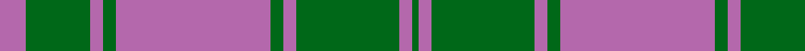

In pattern [GRGRGRGRGR](/stripes/grgrgrgrgr/).

This was sourced from tartans-authority.  It is a [10 stripe tartan](/stripes/stripes10/).

Original link http://www.tartansauthority.com/tartan-ferret/display/3940/

## Thread count
P/8 G20 Pa4 G4 Pa48 Gb4 Pa4 Gb32 Pa4 Ga/2

## Palette
Each colour and its ΔE from the base-6 reference it is a variant of.

| Colour | Shade | Base | ΔE (OKLab) |
|---|---|---|---|
| G | <code style="background-color:#006818;">#006818</code> `#006818` | G <code style="background-color:#006100;">#006100</code> | 0.02 |
| Ga | <code style="background-color:#006818;">#006818</code> `#006818` | G <code style="background-color:#006100;">#006100</code> | 0.02 |
| Gb | <code style="background-color:#006818;">#006818</code> `#006818` | G <code style="background-color:#006100;">#006100</code> | 0.02 |
| P | <code style="background-color:#B468AC;">#B468AC</code> `#B468AC` | R <code style="background-color:#CC0000;">#CC0000</code> | 0.21 |
| Pa | <code style="background-color:#B468AC;">#B468AC</code> `#B468AC` | R <code style="background-color:#CC0000;">#CC0000</code> | 0.21 |

## Nearest tartans

The nearest existing variants by ΔTartan distance.

1. [Spens/Spence (Clan)](/setts/s9/r26t1t10t1g32r11t8w3t1~x2/) — ΔT 0.89
1. [Ailsa, Grey (Fashion)](/setts/s9/o9w9o9n25o1w1o1w1g3~x2/) — ΔT 1.15
1. [Hebridean Granite (Fashion)](/setts/s8/o3lr4o4k4o18k3n36w3~x2/) — ΔT 1.20
1. [Willsher Wedding (Personal)](/setts/s9/do8o4w2o4do1o12dg9do24r4~x2/) — ΔT 1.20
1. [King (Personal)](/setts/s11/r3y2k1y2n26k12n4y15k1n1ly3~x2/) — ΔT 1.22
1. [Tasmanian](/setts/s11/m2lr1dg12y1dg1y1dg3y4m3y4ly2~x4/) — ΔT 1.25
1. [Hand Name Tartan Tartan Number: 10640. Earliest known date: 2012 James Hand designed this tartan to celebrate his marriage to Miss Gail Wheatley. Colours: green for the Hand family name which originates from Ireland; blue and purple to signify a Scottish connection; charcoal and granite, colours which reflect a modern tartan. Weavers note: the granite and charcoal colours are woven with melange (blended) yarns of grey and black. Developed for weaving by House of Tartan. See products available Copyright © Blair Urquhart, Comrie, 2015](/setts/s12/dg1n8lr5n23lr5db3lr5dp3lr5dg5lr3w1~x2/) — ΔT 1.25
1. [Hebridean Granite Fashion Tartan Tartan Number: 6821. Earliest known date: 2005 For a new House of Edgar collection. Intended to emulate the gray morning suit perhaps. See products available Copyright © Blair Urquhart, Comrie, 2015](/setts/s8/o3lr4o4do4o18do3n36w3~x2/) — ΔT 1.26
1. [Knockando Woolmill (Corporate)](/setts/s9/t16k1r7k1r7k1t7y24lo4~x2/) — ΔT 1.28
1. [The Climb (Fashion)](/setts/s8/y2dg9r16r2b30y3dg6lb1~x2/) — ΔT 1.30

## Neighbour map

Every grey dot is one of 14299 variants placed by the first two principal components of the ΔTartan feature space (44% of its variance). Red is this tartan; blue dots are its nearest — click one to open its page.

<svg viewBox="0 0 640 380" role="img" style="max-width:100%;height:auto;border:1px solid #e0e0e0;border-radius:4px;display:block" xmlns="http://www.w3.org/2000/svg"><image href="/nn/cloud.v1.png" width="640" height="380"/><a href="/setts/s9/r26t1t10t1g32r11t8w3t1~x2/"><circle cx="275.1" cy="131.7" r="4" fill="#3465a4"><title>Spens/Spence (Clan)</title></circle></a><a href="/setts/s9/o9w9o9n25o1w1o1w1g3~x2/"><circle cx="297.7" cy="148.6" r="4" fill="#3465a4"><title>Ailsa, Grey (Fashion)</title></circle></a><a href="/setts/s8/o3lr4o4k4o18k3n36w3~x2/"><circle cx="291.6" cy="166.8" r="4" fill="#3465a4"><title>Hebridean Granite (Fashion)</title></circle></a><a href="/setts/s9/do8o4w2o4do1o12dg9do24r4~x2/"><circle cx="285.8" cy="156.6" r="4" fill="#3465a4"><title>Willsher Wedding (Personal)</title></circle></a><a href="/setts/s11/r3y2k1y2n26k12n4y15k1n1ly3~x2/"><circle cx="293.8" cy="134.8" r="4" fill="#3465a4"><title>King (Personal)</title></circle></a><a href="/setts/s11/m2lr1dg12y1dg1y1dg3y4m3y4ly2~x4/"><circle cx="268.3" cy="168.4" r="4" fill="#3465a4"><title>Tasmanian</title></circle></a><a href="/setts/s12/dg1n8lr5n23lr5db3lr5dp3lr5dg5lr3w1~x2/"><circle cx="288.9" cy="136.0" r="4" fill="#3465a4"><title>Hand Name Tartan Tartan Number: 10640. Earliest known date: 2012 James Hand designed this tartan to celebrate his marriage to Miss Gail Wheatley. Colours: green for the Hand family name which originates from Ireland; blue and purple to signify a Scottish connection; charcoal and granite, colours which reflect a modern tartan. Weavers note: the granite and charcoal colours are woven with melange (blended) yarns of grey and black. Developed for weaving by House of Tartan. See products available Copyright © Blair Urquhart, Comrie, 2015</title></circle></a><a href="/setts/s8/o3lr4o4do4o18do3n36w3~x2/"><circle cx="303.0" cy="173.3" r="4" fill="#3465a4"><title>Hebridean Granite Fashion Tartan Tartan Number: 6821. Earliest known date: 2005 For a new House of Edgar collection. Intended to emulate the gray morning suit perhaps. See products available Copyright © Blair Urquhart, Comrie, 2015</title></circle></a><a href="/setts/s9/t16k1r7k1r7k1t7y24lo4~x2/"><circle cx="248.2" cy="153.4" r="4" fill="#3465a4"><title>Knockando Woolmill (Corporate)</title></circle></a><a href="/setts/s8/y2dg9r16r2b30y3dg6lb1~x2/"><circle cx="266.9" cy="127.7" r="4" fill="#3465a4"><title>The Climb (Fashion)</title></circle></a><circle cx="295.6" cy="135.2" r="5" fill="#c00000"/></svg>

ID: /setts/s10/m4g10m2g2m24g2m2g16m2g1~x2/
