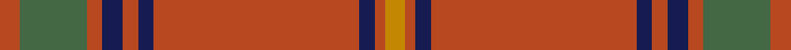

This page is one **sett** — a single exact thread-count. It belongs to the [tartan](/tartans/do4n13do3db4do3db3do40db3do2dy4/)
(the same proportion at any scale), whose colour order is pattern [RGRBRBRBRY](/stripes/rgrbrbrbry/).

Sourced from house-of-tartan.  It is a [10 stripe tartan](/stripes/stripes10/).

Original link http://www.house-of-tartan.scotland.net/house/TartanViewjs.asp?colr=Def&tnam=2254

## Thread count
DO/8 N26 DO6 DB8 DO6 DB6 DO80 DB6 DO4 DY/8

## Palette
Each colour and the base-6 reference it is a variant of.

| Colour | Shade | Base |
|---|---|---|
| DB | <code style="background-color:#141C50;">#141C50</code> `oklch(25.6% 0.095 271.3)` <small>#141C50</small> | B <code style="background-color:#2A418A;">#2A418A</code> |
| DO | <code style="background-color:#B84820;">#B84820</code> `oklch(54.7% 0.154 38.7)` <small>#B84820</small> | R <code style="background-color:#CC0000;">#CC0000</code> |
| DY | <code style="background-color:#C48800;">#C48800</code> `oklch(67.0% 0.140 77.5)` <small>#C48800</small> | Y <code style="background-color:#F2BF00;">#F2BF00</code> |
| N | <code style="background-color:#446844;">#446844</code> `oklch(48.0% 0.070 144.4)` <small>#446844</small> | G <code style="background-color:#006100;">#006100</code> |

## Nearest tartans

The nearest existing variants by ΔTartan distance, with this tartan at the top so the swatches line up against it.

ΔTartan

Tartan

Sett

—

<a href="/ttd/edit/#slug=o4y13o3db4o3db3o40db3o2lo4~x2">Galway Irish County Tartan Tartan Number: 2254. Earliest known date: 1995 One of a series of Irish District tartans designed by Polly Wittering of the House of Edgar, with colours reminiscent of the Country with soft warm colours dominating. See products available Copyright © Blair Urquhart, Comrie, 2015</a> <a class="nn-out" href="/setts/s10/o4y13o3db4o3db3o40db3o2lo4~x2/" title="open its dictionary page">↗</a>

1.12

<a href="/ttd/edit/#slug=r15k1r1n5r1g1r1g1lo1~x8">Oliver Dress (Red)</a> <a class="nn-out" href="/setts/s9/r15k1r1n5r1g1r1g1lo1~x8/" title="open its dictionary page">↗</a>

1.14

<a href="/ttd/edit/#slug=k3r48g6r6g12ly3g2k3~x2">Oakhall (Corporate)</a> <a class="nn-out" href="/setts/s8/k3r48g6r6g12ly3g2k3~x2/" title="open its dictionary page">↗</a>

1.14

<a href="/ttd/edit/#slug=r4dg13r3dp4r3dp3r40dp3r2lo4~x2">Galway, County</a> <a class="nn-out" href="/setts/s10/r4dg13r3dp4r3dp3r40dp3r2lo4~x2/" title="open its dictionary page">↗</a>

1.20

<a href="/ttd/edit/#slug=o24lb2o7lb3k2n4k2lb1o4lb1~x2">Vemma (Corporate) XXXXXXXXX</a> <a class="nn-out" href="/setts/s10/o24lb2o7lb3k2n4k2lb1o4lb1~x2/" title="open its dictionary page">↗</a>

1.21

<a href="/ttd/edit/#slug=r48g6r6g12ly3g2k3g2ly3g12r6g6r48k3~x2">Oakhall</a> <a class="nn-out" href="/setts/s14/r48g6r6g12ly3g2k3g2ly3g12r6g6r48k3~x2/" title="open its dictionary page">↗</a>

1.24

<a href="/ttd/edit/#slug=g2r2db1r24t1db6r3g12r4db1~x2">MacDonell of Keppoch</a> <a class="nn-out" href="/setts/s10/g2r2db1r24t1db6r3g12r4db1~x2/" title="open its dictionary page">↗</a>

1.29

<a href="/ttd/edit/#slug=dg2r2db1r24t1db6r3dg12r4db1~x2">MacDonell of Keppoch</a> <a class="nn-out" href="/setts/s10/dg2r2db1r24t1db6r3dg12r4db1~x2/" title="open its dictionary page">↗</a>

1.39

<a href="/ttd/edit/#slug=r7w2r36b6g3b3g3b3g12r4~x2">Chisholm of Strathglass (Clan)</a> <a class="nn-out" href="/setts/s10/r7w2r36b6g3b3g3b3g12r4~x2/" title="open its dictionary page">↗</a>

1.40

<a href="/ttd/edit/#slug=r6lr1r24n6dg2n1dg2n1dg12r1~x2">Chisholm D</a> <a class="nn-out" href="/setts/s10/r6lr1r24n6dg2n1dg2n1dg12r1~x2/" title="open its dictionary page">↗</a>

1.40

<a href="/ttd/edit/#slug=r6lr1r24n6dg2n1dg2n1dg12r1">Chisholm D</a> <a class="nn-out" href="/setts/s10/r6lr1r24n6dg2n1dg2n1dg12r1/" title="open its dictionary page">↗</a>

## Neighbour map

Every grey dot is one of 14299 variants placed by the first two principal components of the ΔTartan feature space (44% of its variance). Red is this tartan; blue dots are its nearest — click one to open its page.

<svg viewBox="0 0 640 380" role="img" style="max-width:100%;height:auto;border:1px solid #e0e0e0;border-radius:4px;display:block" xmlns="http://www.w3.org/2000/svg"><image href="/nn/cloud.v1.png" width="640" height="380"/><a href="/setts/s9/r15k1r1n5r1g1r1g1lo1~x8/"><circle cx="458.6" cy="147.3" r="4" fill="#3465a4"><title>Oliver Dress (Red)</title></circle></a><a href="/setts/s8/k3r48g6r6g12ly3g2k3~x2/"><circle cx="458.8" cy="141.9" r="4" fill="#3465a4"><title>Oakhall (Corporate)</title></circle></a><a href="/setts/s10/r4dg13r3dp4r3dp3r40dp3r2lo4~x2/"><circle cx="474.3" cy="145.3" r="4" fill="#3465a4"><title>Galway, County</title></circle></a><a href="/setts/s10/o24lb2o7lb3k2n4k2lb1o4lb1~x2/"><circle cx="469.4" cy="125.3" r="4" fill="#3465a4"><title>Vemma (Corporate) XXXXXXXXX</title></circle></a><a href="/setts/s14/r48g6r6g12ly3g2k3g2ly3g12r6g6r48k3~x2/"><circle cx="469.4" cy="124.5" r="4" fill="#3465a4"><title>Oakhall</title></circle></a><a href="/setts/s10/g2r2db1r24t1db6r3g12r4db1~x2/"><circle cx="395.6" cy="130.2" r="4" fill="#3465a4"><title>MacDonell of Keppoch</title></circle></a><a href="/setts/s10/dg2r2db1r24t1db6r3dg12r4db1~x2/"><circle cx="400.5" cy="130.5" r="4" fill="#3465a4"><title>MacDonell of Keppoch</title></circle></a><a href="/setts/s10/r7w2r36b6g3b3g3b3g12r4~x2/"><circle cx="380.5" cy="134.9" r="4" fill="#3465a4"><title>Chisholm of Strathglass (Clan)</title></circle></a><a href="/setts/s10/r6lr1r24n6dg2n1dg2n1dg12r1~x2/"><circle cx="418.9" cy="153.6" r="4" fill="#3465a4"><title>Chisholm D</title></circle></a><a href="/setts/s10/r6lr1r24n6dg2n1dg2n1dg12r1/"><circle cx="418.9" cy="153.6" r="4" fill="#3465a4"><title>Chisholm D</title></circle></a><circle cx="462.8" cy="142.6" r="5" fill="#c00000"/></svg>

ID: /setts/s10/o4y13o3db4o3db3o40db3o2lo4~x2/
