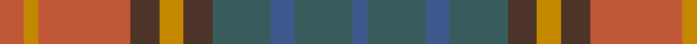

This page is one **sett** — a single exact thread-count. It belongs to the [tartan](/tartans/o5lo3o19do6lo5do6dg12n5dg12n3/)
(the same proportion at any scale), whose colour order is pattern [BGBGBYBRYR](/stripes/bgbgbybryr/).

Sourced from house-of-tartan.  It is a [10 stripe tartan](/stripes/stripes10/).

Original link http://www.house-of-tartan.scotland.net/house/TartanViewjs.asp?colr=Def&tnam=2246

## Thread count
DO/10 DY6 DO38 T12 DY10 T12 N24 B10 N24 B/6

## Palette

Palette: <strong>Tartan Register</strong> <small style="color:#888">(1 of 5 colours)</small>
<table><thead><tr><th>Colour</th><th>Threads</th><th>Shade</th><th>Base</th><th>OKLCh</th></tr></thead><tbody><tr><td>DO/</td><td style="text-align:right;font-variant-numeric:tabular-nums">10</td><td><code style="background-color:#C05838;">#C05838</code> <small style="color:#888">#C05838</small></td><td>R <code style="background-color:#CC0000;">#CC0000</code></td><td><small style="color:#888">oklch(58.4% 0.142 37.7)</small></td></tr><tr><td>DY</td><td style="text-align:right;font-variant-numeric:tabular-nums">6</td><td><code style="background-color:#C48800;">#C48800</code> <small style="color:#888">#C48800</small></td><td>Y <code style="background-color:#F2BF00;">#F2BF00</code></td><td><small style="color:#888">oklch(67.0% 0.140 77.5)</small></td></tr><tr><td>DO</td><td style="text-align:right;font-variant-numeric:tabular-nums">38</td><td><code style="background-color:#C05838;">#C05838</code> <small style="color:#888">#C05838</small></td><td>R <code style="background-color:#CC0000;">#CC0000</code></td><td><small style="color:#888">oklch(58.4% 0.142 37.7)</small></td></tr><tr><td>T</td><td style="text-align:right;font-variant-numeric:tabular-nums">12</td><td><code style="background-color:#4C3428;">#4C3428</code> <small style="color:#888">#4C3428</small></td><td>B <code style="background-color:#2A418A;">#2A418A</code></td><td><small style="color:#888">oklch(34.9% 0.040 47.5)</small></td></tr><tr><td>DY</td><td style="text-align:right;font-variant-numeric:tabular-nums">10</td><td><code style="background-color:#C48800;">#C48800</code> <small style="color:#888">#C48800</small></td><td>Y <code style="background-color:#F2BF00;">#F2BF00</code></td><td><small style="color:#888">oklch(67.0% 0.140 77.5)</small></td></tr><tr><td>T</td><td style="text-align:right;font-variant-numeric:tabular-nums">12</td><td><code style="background-color:#4C3428;">#4C3428</code> <small style="color:#888">#4C3428</small></td><td>B <code style="background-color:#2A418A;">#2A418A</code></td><td><small style="color:#888">oklch(34.9% 0.040 47.5)</small></td></tr><tr><td>N</td><td style="text-align:right;font-variant-numeric:tabular-nums">24</td><td><code style="background-color:#385C5C;">#385C5C</code> <small style="color:#888">#385C5C</small></td><td>G <code style="background-color:#006100;">#006100</code></td><td><small style="color:#888">oklch(44.8% 0.041 195.8)</small></td></tr><tr><td>B</td><td style="text-align:right;font-variant-numeric:tabular-nums">10</td><td><code style="background-color:#3C588C;">#3C588C</code> <small style="color:#888">#3C588C</small></td><td>B <code style="background-color:#2A418A;">#2A418A</code></td><td><small style="color:#888">oklch(46.3% 0.092 262.0)</small></td></tr><tr><td>N</td><td style="text-align:right;font-variant-numeric:tabular-nums">24</td><td><code style="background-color:#385C5C;">#385C5C</code> <small style="color:#888">#385C5C</small></td><td>G <code style="background-color:#006100;">#006100</code></td><td><small style="color:#888">oklch(44.8% 0.041 195.8)</small></td></tr><tr><td>B/</td><td style="text-align:right;font-variant-numeric:tabular-nums">6</td><td><code style="background-color:#3C588C;">#3C588C</code> <small style="color:#888">#3C588C</small></td><td>B <code style="background-color:#2A418A;">#2A418A</code></td><td><small style="color:#888">oklch(46.3% 0.092 262.0)</small></td></tr></tbody></table>

## Nearest tartans

The nearest existing variants by ΔTartan distance, with this tartan at the top so the swatches line up against it.

ΔTartan

Tartan

Sett

—

<a href="/ttd/edit/#slug=o5lo3o19do6lo5do6dg12n5dg12n3~x2">Roscommon Irish County Tartan Tartan Number: 2246. Earliest known date: 1996 One of a series of Irish District tartans designed by Polly Wittering of the House of Edgar, with colours reminiscent of the Country with soft warm colours dominating. See products available Copyright © Blair Urquhart, Comrie, 2015</a> <a class="nn-out" href="/setts/s10/o5lo3o19do6lo5do6dg12n5dg12n3~x2/" title="open its dictionary page">↗</a>

0.79

<a href="/ttd/edit/#slug=r5lr1r1lri1r1n5o6r1o6n5lri5r1~x4">Lakin (Personal)</a> <a class="nn-out" href="/setts/s12/r5lr1r1lri1r1n5o6r1o6n5lri5r1~x4/" title="open its dictionary page">↗</a>

1.17

<a href="/ttd/edit/#slug=n12dy2ly2dy2n2dy10y12dy3y12dy10n11r2ly2~x2">MacVicar, McVicar, McVicker</a> <a class="nn-out" href="/setts/s13/n12dy2ly2dy2n2dy10y12dy3y12dy10n11r2ly2~x2/" title="open its dictionary page">↗</a>

1.33

<a href="/ttd/edit/#slug=do6lo4do3dt2do5dt2do3dt2y14r3dt2~x2">Limerick, County</a> <a class="nn-out" href="/setts/s11/do6lo4do3dt2do5dt2do3dt2y14r3dt2~x2/" title="open its dictionary page">↗</a>

1.34

<a href="/ttd/edit/#slug=r15g3r3g19dy6y6o6g19r3g3r15y13~x2">Maple Leaf (District)</a> <a class="nn-out" href="/setts/s12/r15g3r3g19dy6y6o6g19r3g3r15y13~x2/" title="open its dictionary page">↗</a>

1.46

<a href="/ttd/edit/#slug=n6db1n1db1n3lr2r1lr2y3db1y1db1y6~x4">McCulloch, Grant (Personal)</a> <a class="nn-out" href="/setts/s13/n6db1n1db1n3lr2r1lr2y3db1y1db1y6~x4/" title="open its dictionary page">↗</a>

1.51

<a href="/ttd/edit/#slug=g4lr2g8do8o2do8o16k2do5lr2o5ly2~x2">Blaylock Hunting</a> <a class="nn-out" href="/setts/s12/g4lr2g8do8o2do8o16k2do5lr2o5ly2~x2/" title="open its dictionary page">↗</a>

1.55

<a href="/ttd/edit/#slug=db5k3db18dg6k6dg6dy12r5dy12r3~x2">Longford, County</a> <a class="nn-out" href="/setts/s10/db5k3db18dg6k6dg6dy12r5dy12r3~x2/" title="open its dictionary page">↗</a>

1.56

<a href="/ttd/edit/#slug=dr2lo12dr3lo3dr12yi12n12y12yi1ly2~x2">Auld Scotland</a> <a class="nn-out" href="/setts/s10/dr2lo12dr3lo3dr12yi12n12y12yi1ly2~x2/" title="open its dictionary page">↗</a>

1.57

<a href="/ttd/edit/#slug=r3o23gi8g6gi8t6gi10t12gi3~x2">Lawrence's Seven Pillars of Khaki</a> <a class="nn-out" href="/setts/s9/r3o23gi8g6gi8t6gi10t12gi3~x2/" title="open its dictionary page">↗</a>

1.58

<a href="/setts/s10/dy2lr1dy5k4do5o1~x4/">Huntly #3</a>

## Neighbour map

Every grey dot is one of 14359 variants placed by the first two principal components of the ΔTartan feature space (44% of its variance). Red is this tartan; blue dots are its nearest — click one to open its page.

<svg viewBox="0 0 640 380" role="img" style="max-width:100%;height:auto;border:1px solid #e0e0e0;border-radius:4px;display:block" xmlns="http://www.w3.org/2000/svg"><image href="/nn/cloud.v1.png" width="640" height="380"/><a href="/setts/s12/r5lr1r1lri1r1n5o6r1o6n5lri5r1~x4/"><circle cx="156.3" cy="216.3" r="4" fill="#3465a4"><title>Lakin (Personal)</title></circle></a><a href="/setts/s13/n12dy2ly2dy2n2dy10y12dy3y12dy10n11r2ly2~x2/"><circle cx="200.9" cy="232.5" r="4" fill="#3465a4"><title>MacVicar, McVicar, McVicker</title></circle></a><a href="/setts/s11/do6lo4do3dt2do5dt2do3dt2y14r3dt2~x2/"><circle cx="224.7" cy="228.9" r="4" fill="#3465a4"><title>Limerick, County</title></circle></a><a href="/setts/s12/r15g3r3g19dy6y6o6g19r3g3r15y13~x2/"><circle cx="228.4" cy="239.1" r="4" fill="#3465a4"><title>Maple Leaf (District)</title></circle></a><a href="/setts/s13/n6db1n1db1n3lr2r1lr2y3db1y1db1y6~x4/"><circle cx="192.2" cy="219.7" r="4" fill="#3465a4"><title>McCulloch, Grant (Personal)</title></circle></a><a href="/setts/s12/g4lr2g8do8o2do8o16k2do5lr2o5ly2~x2/"><circle cx="174.1" cy="186.6" r="4" fill="#3465a4"><title>Blaylock Hunting</title></circle></a><a href="/setts/s10/db5k3db18dg6k6dg6dy12r5dy12r3~x2/"><circle cx="155.0" cy="248.1" r="4" fill="#3465a4"><title>Longford, County</title></circle></a><a href="/setts/s10/dr2lo12dr3lo3dr12yi12n12y12yi1ly2~x2/"><circle cx="129.5" cy="189.8" r="4" fill="#3465a4"><title>Auld Scotland</title></circle></a><a href="/setts/s9/r3o23gi8g6gi8t6gi10t12gi3~x2/"><circle cx="198.4" cy="237.3" r="4" fill="#3465a4"><title>Lawrence's Seven Pillars of Khaki</title></circle></a><a href="/setts/s10/dy2lr1dy5k4do5o1~x4/"><circle cx="167.3" cy="261.4" r="4" fill="#3465a4"><title>Huntly #3</title></circle></a><circle cx="166.8" cy="234.8" r="5" fill="#c00000"/></svg>

ID: /setts/s10/o5lo3o19do6lo5do6dg12n5dg12n3~x2/
