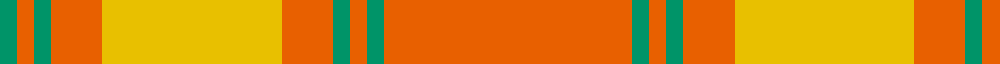

In pattern [GRGRYRGRGR](/patterns/grgryrgrgr/).

This was sourced from house-of-tartan.  It is a [10 stripes tartan](/stripes/stripes10/).

Original link http://www.house-of-tartan.scotland.net/house/TartanViewjs.asp?colr=Def&tnam=6812

## Thread count
B/8 Oa8 B8 Oa24 Ya84 Oa24 B8 Oa8 B8 Oa/116

## Palette
Each colour and its ΔE from the base-6 reference it is a variant of.

| Colour | Shade | Base | ΔE (OKLab) |
|---|---|---|---|
| B | <code style="background-color:#009468;">#009468</code> `#009468` | G <code style="background-color:#006400;">#006400</code> | 0.16 |
| DO | <code style="background-color:#B84C00;">#B84C00</code> `#B84C00` | R <code style="background-color:#C80000;">#C80000</code> | 0.08 |
| DY | <code style="background-color:#BC8C00;">#BC8C00</code> `#BC8C00` | Y <code style="background-color:#E8C000;">#E8C000</code> | 0.16 |
| G | <code style="background-color:#00643C;">#00643C</code> `#00643C` | G <code style="background-color:#006400;">#006400</code> | 0.06 |
| N | <code style="background-color:#406054;">#406054</code> `#406054` | G <code style="background-color:#006400;">#006400</code> | 0.11 |
| O | <code style="background-color:#EC8048;">#EC8048</code> `#EC8048` | Y <code style="background-color:#E8C000;">#E8C000</code> | 0.17 |
| Oa | <code style="background-color:#E86000;">#E86000</code> `#E86000` | R <code style="background-color:#C80000;">#C80000</code> | 0.14 |
| Y | <code style="background-color:#D8B000;">#D8B000</code> `#D8B000` | Y <code style="background-color:#E8C000;">#E8C000</code> | 0.05 |
| Ya | <code style="background-color:#E8C000;">#E8C000</code> `#E8C000` | Y <code style="background-color:#E8C000;">#E8C000</code> | 0.00 |

## Nearest tartans

The nearest existing variants by ΔTartan distance.

1. [Donachie of Brockloch Ancient Hunting](/setts/s10/g40k4g4r72g44k4g4k4g4r40-g757547-k101010-rcc7a00/) — ΔT 1.97
1. [Wolfe (Name)](/setts/s7/g8r8g26r26g8r72y8-g00643c-re86000-ydc943c/) — ΔT 2.01
1. [Maguire, Black (Name)](/setts/s6/r116g8r8g8r24y84-g00643c-rd0002c-ybc8c00/) — ΔT 2.03
1. [Prince David #1 (Royal)](/setts/s7/g6y4g36y42y4g6y4-g604000-yd87c00/) — ΔT 2.08
1. [Antigua & Barbuda](/setts/s14/r60g6y6g6y6g6y6g6y6g6y6g6y20r10-g289c18-rc80000-yd87c00/) — ΔT 2.14
1. [Unidentified Lindley #5](/setts/s10/g4r4y28r28g4y4g4r28y28r4-g604000-rc80000-ybc8c00/) — ΔT 2.25
1. [Wolfe](/setts/s12/r72g8r26g26r8g8r8g26r26g8r72y8-g00643c-re86000-ydc943c/) — ΔT 2.27
1. [Unnamed Brown (Teddy Bear)](/setts/s5/r2g14ra50g14r2-g503c14-rdc0000-rabe7832/) — ΔT 2.34
1. [MacColl](/setts/s14/r24ra2r2g16r4ra2r2b6r2ra2r24g2r2g8-b304080-g008000-rc00000-ra806050/) — ΔT 2.41
1. [MacColl](/setts/s14/r24g2r2ra16r4ra2r2b6r2ra2r24g2r2g8-b304080-g008000-rc00000-ra806050/) — ΔT 2.43

## Neighbour map

Every grey dot is one of 15726 variants placed by the first two principal components of the ΔTartan feature space (44% of its variance). Red is this tartan; blue dots are its nearest — click one to open its page.

<svg viewBox="0 0 640 380" role="img" style="max-width:100%;height:auto;border:1px solid #e0e0e0;border-radius:4px;display:block" xmlns="http://www.w3.org/2000/svg"><image href="/nn/cloud.v1.png" width="640" height="380"/><a href="/setts/s10/g40k4g4r72g44k4g4k4g4r40-g757547-k101010-rcc7a00/"><circle cx="419.9" cy="191.7" r="4" fill="#3465a4"><title>Donachie of Brockloch Ancient Hunting</title></circle></a><a href="/setts/s7/g8r8g26r26g8r72y8-g00643c-re86000-ydc943c/"><circle cx="450.8" cy="215.0" r="4" fill="#3465a4"><title>Wolfe (Name)</title></circle></a><a href="/setts/s6/r116g8r8g8r24y84-g00643c-rd0002c-ybc8c00/"><circle cx="456.3" cy="204.6" r="4" fill="#3465a4"><title>Maguire, Black (Name)</title></circle></a><a href="/setts/s7/g6y4g36y42y4g6y4-g604000-yd87c00/"><circle cx="364.1" cy="210.0" r="4" fill="#3465a4"><title>Prince David #1 (Royal)</title></circle></a><a href="/setts/s14/r60g6y6g6y6g6y6g6y6g6y6g6y20r10-g289c18-rc80000-yd87c00/"><circle cx="321.2" cy="160.6" r="4" fill="#3465a4"><title>Antigua &amp; Barbuda</title></circle></a><a href="/setts/s10/g4r4y28r28g4y4g4r28y28r4-g604000-rc80000-ybc8c00/"><circle cx="350.7" cy="225.2" r="4" fill="#3465a4"><title>Unidentified Lindley #5</title></circle></a><a href="/setts/s12/r72g8r26g26r8g8r8g26r26g8r72y8-g00643c-re86000-ydc943c/"><circle cx="464.6" cy="197.5" r="4" fill="#3465a4"><title>Wolfe</title></circle></a><a href="/setts/s5/r2g14ra50g14r2-g503c14-rdc0000-rabe7832/"><circle cx="476.0" cy="197.7" r="4" fill="#3465a4"><title>Unnamed Brown (Teddy Bear)</title></circle></a><a href="/setts/s14/r24ra2r2g16r4ra2r2b6r2ra2r24g2r2g8-b304080-g008000-rc00000-ra806050/"><circle cx="384.4" cy="150.4" r="4" fill="#3465a4"><title>MacColl</title></circle></a><a href="/setts/s14/r24g2r2ra16r4ra2r2b6r2ra2r24g2r2g8-b304080-g008000-rc00000-ra806050/"><circle cx="412.7" cy="162.5" r="4" fill="#3465a4"><title>MacColl</title></circle></a><circle cx="445.8" cy="169.6" r="5" fill="#c00000"/></svg>

ID: /setts/s10/r116g8r8g8r24y84r24g8r8g8-g009468-re86000-ye8c000/
