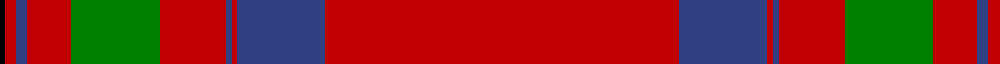

In pattern [KRBRGRBRBR](/patterns/krbrgrbrbr/).

This was sourced from weddslist.  It is a [10 stripes tartan](/stripes/stripes10/).

Original link http://www.weddslist.com/cgi-bin/tartans/pg.pl?source=sts

## Thread count
K/2 R4 B4 R16 G32 R24 B2 R2 B32 R/128

## Palette
Each colour and its ΔE from the base-6 reference it is a variant of.

| Colour | Shade | Base | ΔE (OKLab) |
|---|---|---|---|
| B | <code style="background-color:#304080;">#304080</code> `#304080` | B <code style="background-color:#2A418A;">#2A418A</code> | 0.02 |
| G | <code style="background-color:#008000;">#008000</code> `#008000` | G <code style="background-color:#006100;">#006100</code> | 0.10 |
| K | <code style="background-color:#000000;">#000000</code> `#000000` | K <code style="background-color:#000000;">#000000</code> | 0.00 |
| R | <code style="background-color:#C00000;">#C00000</code> `#C00000` | R <code style="background-color:#CC0000;">#CC0000</code> | 0.03 |

## Nearest tartans

The nearest existing variants by ΔTartan distance.

1. [Moffat (1950)](/setts/s10/r128b32r2b2r24g32r16b4r4k2-b2c2c80-g006818-k101010-rc80000/) — ΔT 0.27
1. [MacAulay of Ardincaple (Clan)](/setts/s9/r100b6g12b2r6b2g16k2w6-b2c2c80-g006818-k101010-rc80000-wc0c0c0/) — ΔT 1.06
1. [13, Legion Branch 50](/setts/s7/r136b18ba20b26y2b2y4-b304080-ba5480b0-rc00000-yf0c000/) — ΔT 1.18
1. [Lawers Estate (Corporate)](/setts/s6/r140k2b24k2g24k2-b003c64-g408060-k101010-rcc4438/) — ΔT 1.22
1. [MacAulay (MacGregor)](/setts/s9/r192b2g48b2r20b2g24k2w8-b2c4084-g005020-k101010-rdc0000-we0e0e0/) — ΔT 1.25
1. [Miyuki #2](/setts/s10/r80w2r2b16r2w2r12w2r2b16-b003c64-rc80000-we0e0e0/) — ΔT 1.26
1. [Canadian Legion Branch 50 Corporate Tartan Tartan Number: 1327. Earliest known date: pre 2003 From a study of the portrait of Lord Loudoun (c 1747) outlined in the proceedings of the STS See products available Copyright © Blair Urquhart, Comrie, 2015](/setts/s7/r136b18ba20b26y2b2y4-b2c2c80-ba5c8ca8-rc80000-ye8c000/) — ΔT 1.28
1. [Zamzam (Personal)](/setts/s8/r140b2r4g24k4g2k20w2-b1474b4-g006818-k101010-rc80000-we0e0e0/) — ΔT 1.31
1. [Hampden-Sydney College](/setts/s16/r80w2r5k10r6ra4r4k2ra6k2r10ra4r8k10r5w2-k101010-ra00000-ra888888-wfcfcfc/) — ΔT 1.38
1. [MacPherson-Grant](/setts/s11/r90k6r6k6r90g6r6g45r6k4r3-g006818-k101010-rc80000/) — ΔT 1.47

## Neighbour map

Every grey dot is one of 15726 variants placed by the first two principal components of the ΔTartan feature space (44% of its variance). Red is this tartan; blue dots are its nearest — click one to open its page.

<svg viewBox="0 0 640 380" role="img" style="max-width:100%;height:auto;border:1px solid #e0e0e0;border-radius:4px;display:block" xmlns="http://www.w3.org/2000/svg"><image href="/nn/cloud.v1.png" width="640" height="380"/><a href="/setts/s10/r128b32r2b2r24g32r16b4r4k2-b2c2c80-g006818-k101010-rc80000/"><circle cx="524.5" cy="91.7" r="4" fill="#3465a4"><title>Moffat (1950)</title></circle></a><a href="/setts/s9/r100b6g12b2r6b2g16k2w6-b2c2c80-g006818-k101010-rc80000-wc0c0c0/"><circle cx="506.0" cy="66.4" r="4" fill="#3465a4"><title>MacAulay of Ardincaple (Clan)</title></circle></a><a href="/setts/s7/r136b18ba20b26y2b2y4-b304080-ba5480b0-rc00000-yf0c000/"><circle cx="496.5" cy="106.5" r="4" fill="#3465a4"><title>13, Legion Branch 50</title></circle></a><a href="/setts/s6/r140k2b24k2g24k2-b003c64-g408060-k101010-rcc4438/"><circle cx="550.4" cy="116.4" r="4" fill="#3465a4"><title>Lawers Estate (Corporate)</title></circle></a><a href="/setts/s9/r192b2g48b2r20b2g24k2w8-b2c4084-g005020-k101010-rdc0000-we0e0e0/"><circle cx="513.5" cy="62.5" r="4" fill="#3465a4"><title>MacAulay (MacGregor)</title></circle></a><a href="/setts/s10/r80w2r2b16r2w2r12w2r2b16-b003c64-rc80000-we0e0e0/"><circle cx="547.3" cy="100.7" r="4" fill="#3465a4"><title>Miyuki #2</title></circle></a><a href="/setts/s7/r136b18ba20b26y2b2y4-b2c2c80-ba5c8ca8-rc80000-ye8c000/"><circle cx="483.8" cy="99.8" r="4" fill="#3465a4"><title>Canadian Legion Branch 50 Corporate Tartan Tartan Number: 1327. Earliest known date: pre 2003 From a study of the portrait of Lord Loudoun (c 1747) outlined in the proceedings of the STS See products available Copyright © Blair Urquhart, Comrie, 2015</title></circle></a><a href="/setts/s8/r140b2r4g24k4g2k20w2-b1474b4-g006818-k101010-rc80000-we0e0e0/"><circle cx="527.2" cy="68.4" r="4" fill="#3465a4"><title>Zamzam (Personal)</title></circle></a><a href="/setts/s16/r80w2r5k10r6ra4r4k2ra6k2r10ra4r8k10r5w2-k101010-ra00000-ra888888-wfcfcfc/"><circle cx="535.8" cy="66.8" r="4" fill="#3465a4"><title>Hampden-Sydney College</title></circle></a><a href="/setts/s11/r90k6r6k6r90g6r6g45r6k4r3-g006818-k101010-rc80000/"><circle cx="556.9" cy="129.9" r="4" fill="#3465a4"><title>MacPherson-Grant</title></circle></a><circle cx="526.8" cy="94.0" r="5" fill="#c00000"/></svg>

ID: /setts/s10/r128b32r2b2r24g32r16b4r4k2-b304080-g008000-k000000-rc00000/
